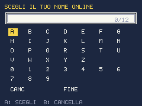
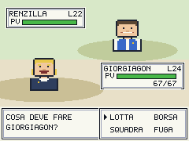
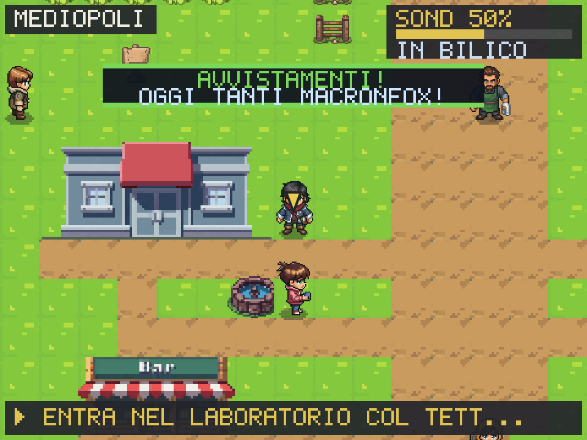

# Politicmon

*Catturali tutti, prima che ti tassino.*

Clone di Pokémon in salsa **satira politica italiana**: un RPG in stile Game Boy
che gira nel browser, scritto in TypeScript su canvas 2D puro. Mobile-first,
installabile come app (PWA), con **multiplayer peer-to-peer** gratuito.

🎮 **Gioca ora:** https://politicmon.vercel.app

<p align="center">
  
  
  
</p>

## Avvio rapido

```bash
npm install
npm run dev      # poi apri http://localhost:5173
```

| Azione | Tastiera | Touch |
|--------|----------|-------|
| Muoversi | Frecce / WASD | D-pad o **levetta analogica** |
| Conferma / Interagisci | Z, Spazio, Invio | A |
| Annulla | X, Esc | B |
| Menu pausa | P, Tab | START |

## Cosa c'è nel gioco

- **3 starter** (GIORGETTA/Destra, ELLYNA/Sinistra, RENZINO/Centro) con anteprima animata.
- **40 Politicmon** satirici, **63 mosse**, 8 tipi politici, status (INDAGATO/SCANDALO/GAFFE), battaglie a turni gen-1 con animazioni.
- **Evoluzioni** per livello, per oggetto (TESSERA DORATA) e **ramificate sui sondaggi**.
- **SONDAGGI** (0-100%): stat narrativa che muove prezzi, esperienza ("onda del consenso") e rami evolutivi.
- **GOVERNO OMBRA**: 6 ministeri assegnabili con bonus passivi.
- **DIRETTIVE DI PARTITO**: le "MT", insegnano mosse per tipo, riutilizzabili.
- **Storia in 2 atti**: 3 medaglie → PALAZZO (Presidente Ombra) → IL COLLE (Consulta + Garante) → leggendario DRAGHIMON.
- **Aree e contenuti extra**: Ponte sullo Stretto (boss IL CAPITANO), CASINÒ DI PALAZZO, veicoli (MONOPATTINO/RUSPA), incontri PG casuali, eventi morale di strada, **rivale ricorrente GIANNI**.
- **Retention**: cliffhanger post-medaglia, notifiche "BREAKING NEWS" sui sondaggi, loot a sorpresa post-vittoria.
- **Mobile/PWA**: levetta analogica, modalità guidata (freccia verso l'obiettivo), installabile offline.
- **Multiplayer P2P**: vedi gli altri giocatori muoversi sulla tua mappa, chat di zona ed emote — senza server, senza costi (WebRTC via [Trystero](https://github.com/dmotz/trystero)).

## Comandi

```bash
npm run typecheck   # tsc --noEmit (obbligatorio prima di consegnare)
npm run build       # typecheck + bundle di produzione in dist/
npm run preview     # serve la build
npx vercel --prod   # deploy (frontend statico; il multiplayer è P2P, nessun server)
node scripts/gen-icons.mjs   # rigenera le icone PNG della PWA
```

## Documentazione

| File | Per cosa |
|------|----------|
| **[docs/ARCHITETTURA.md](docs/ARCHITETTURA.md)** | Mappa dei moduli e dei flussi principali. |
| **[docs/GLOSSARIO.md](docs/GLOSSARIO.md)** | Lessico di gioco (satira) e termini tecnici. |

## Filosofia del progetto

- **Satira pungente ma di fantasia**, niente diffamazione né contenuti espliciti.
- **Grafica in pixel art** generata con [PixelLab](https://pixellab.ai) (sprite PNG in `public/sprites/`), con fallback a pixel-map testuali (`src/art/`) generate da codice per gli asset non ancora ridisegnati.
- **Zero dipendenze runtime** tranne il P2P del multiplayer.
- **Multiplayer gratis per sempre**: peer-to-peer, nessun account o server fatturabile.

I personaggi sono parodie di fantasia ispirate al dibattito pubblico italiano e
internazionale, senza intento diffamatorio.

## Licenza

[AGPL-3.0](LICENSE) — © 2026 Luca Tiengo (vedi anche [NOTICE](NOTICE)). Il codice è
**open source con copyleft forte**: puoi studiarlo, usarlo e modificarlo, ma qualsiasi
versione modificata — anche se distribuita solo come servizio in rete (es. un sito web)
— deve restare open source sotto la stessa licenza AGPL-3.0. In pratica: nessuno può
prendere questo gioco, modificarlo e richiuderlo. La satira è di chi la fa.

<!-- deploy git collegato -->
