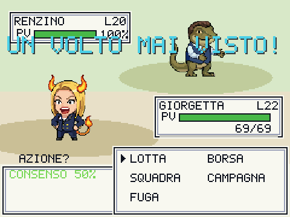

<div align="center">

# 🗳️ POLITICMON

### *Catturali tutti, prima che ti tassino.*

Un clone di **Pokémon** in salsa **satira politica italiana**. RPG stile Game Boy,
gira nel browser, scritto in **TypeScript su canvas 2D puro**. Mobile-first,
installabile come app, con **multiplayer peer-to-peer** — zero server, zero costi.

[](https://politicmon.vercel.app)


-44cc44?style=flat-square)


</div>

---

## 🎮 Guarda com'è

<div align="center">

</div>

<div align="center">


</div>

---

## ⚡ In due righe

Scegli il tuo **starter** (Destra, Sinistra o Centro), gira l'Italia caricaturale
da Borgo Urne al Palazzo, cattura 42 **Politicmon**, sfida le palestre e scala i
**SONDAGGI** — una barra 0-100% che decide prezzi, esperienza e persino **in cosa
si evolvono** le tue creature: popolare finisci al governo, impopolare finisci in
piazza a urlare.

> **La satira è di fantasia.** I personaggi sono caricature ispirate al dibattito
> pubblico, senza intento diffamatorio né contenuti espliciti.

---

## ✨ Cosa c'è dentro

| | |
|---|---|
| 🐾 **42 Politicmon, 71 mosse** | 8 tipi politici, status (INDAGATO / SCANDALO / GAFFE), battaglie a turni gen-1 con animazioni |
| 📊 **SONDAGGI (0-100%)** | La stat-firma: muove prezzi, EXP (*onda del consenso*) e **rami evolutivi** governo↔opposizione |
| 🧬 **Evoluzioni ramificate** | Per livello, per oggetto (TESSERA DORATA) e **decise dal tuo gradimento** |
| 🏛️ **GOVERNO OMBRA** | 6 ministeri assegnabili ai tuoi mostri, ognuno con un bonus passivo |
| 📜 **DIRETTIVE DI PARTITO** | Le "MT": insegnano mosse per tipo, riutilizzabili all'infinito |
| 🗺️ **Storia in 2 atti** | 3 medaglie → il PALAZZO → IL COLLE (Consulta + Garante) → il leggendario DRAGHIMON |
| 🎰 **Contenuti extra** | Ponte sullo Stretto, CASINÒ DI PALAZZO, veicoli (MONOPATTINO / RUSPA), rivale ricorrente |
| 📱 **Mobile & PWA** | Levetta analogica, modalità guidata, installabile e giocabile offline |
| 🌐 **Multiplayer P2P** | Vedi gli altri giocatori sulla tua mappa, chat di zona ed emote — **senza server** |

---

## 🛠️ Sotto il cofano (per chi guarda il codice)

Questo non è un gioco fatto con un engine. È **tutto a mano**:

- **TypeScript + Vite**, `canvas` 2D puro, risoluzione interna 240×180 scalata pixel-perfect.
- **Una sola dipendenza runtime** ([Trystero](https://github.com/dmotz/trystero), per il P2P). Il resto — rendering, audio, scene, battaglie, salvataggi — è codice del progetto.
- **Motore a stack di scene**, battaglia come coda di *step*, matematica del danno gen-1 separata e **testata** (`node:test` in CI).
- **Multiplayer 100% peer-to-peer** via WebRTC su relay pubblici gratuiti: nessun server proprio, nessun account, **nessun costo che possa mai crescere**.
- **PWA** con service worker cache-first e installazione offline.
- **Audio** sintetizzato a runtime (Web Audio), nessun file audio.
- Grafica in **pixel art** generata con [PixelLab](https://pixellab.ai), con fallback a pixel-map testuali generate da codice.

```bash
npm install
npm run dev          # http://localhost:5173
npm test             # unit test sulla logica di gioco (danno, tipi, cattura, sondaggi)
npm run build        # typecheck + bundle di produzione
```

| Azione | Tastiera | Touch |
|--------|----------|-------|
| Muoversi | Frecce / WASD | D-pad o **levetta analogica** |
| Conferma / Interagisci | Z, Spazio, Invio | A |
| Annulla | X, Esc | B |
| Menu pausa | P, Tab | START |

---

## 📚 Documentazione

| File | Per cosa |
|------|----------|
| **[docs/ARCHITETTURA.md](docs/ARCHITETTURA.md)** | Mappa dei moduli e dei flussi principali |
| **[docs/GLOSSARIO.md](docs/GLOSSARIO.md)** | Lessico di gioco (satira) e termini tecnici |

---

## 📜 Licenza

**[AGPL-3.0](LICENSE)** — © 2026 Luca Tiengo (vedi [NOTICE](NOTICE)).

Il codice è **open source con copyleft forte**: puoi studiarlo, usarlo e modificarlo,
ma qualsiasi versione modificata — anche distribuita solo come servizio di rete (un
sito web) — deve restare open source sotto la stessa licenza. In pratica: **nessuno
può prendere questo gioco, modificarlo e richiuderlo**. La satira è di chi la fa.

<div align="center">

**[▶ Gioca ora su politicmon.vercel.app](https://politicmon.vercel.app)**

</div>

<!-- deploy git collegato -->
