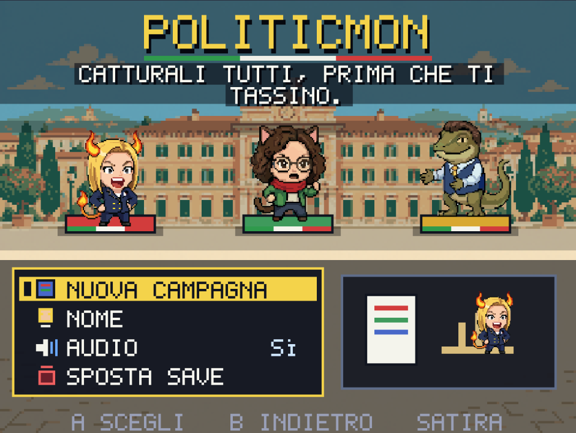
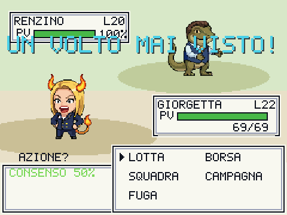
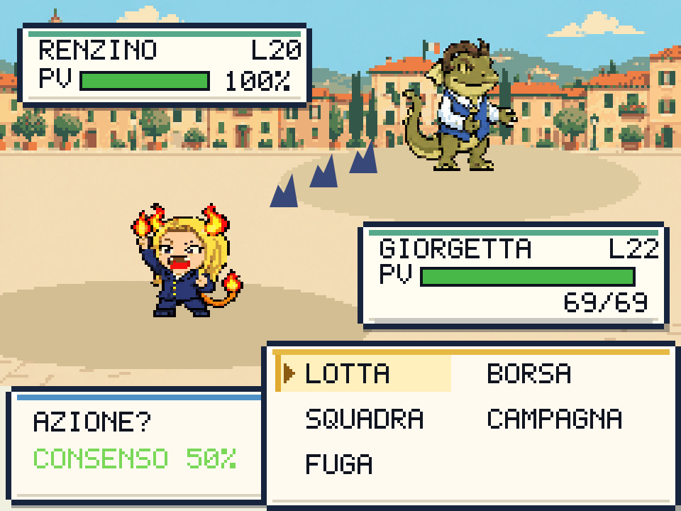
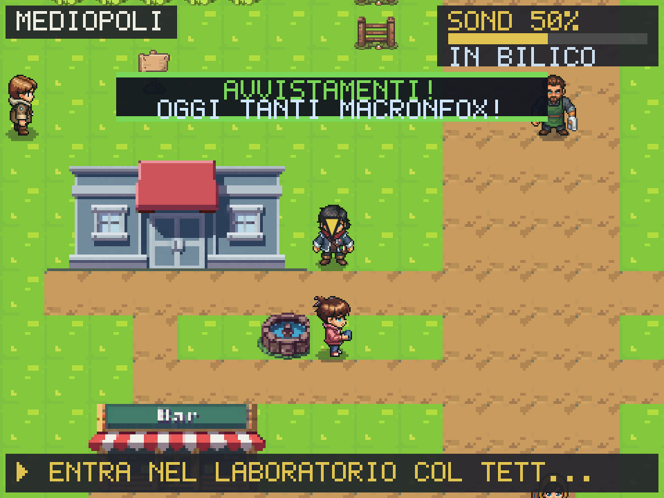

<div align="center">

# 🗳️ POLITICMON

### *Catturali tutti, prima che ti tassino.*

Un clone di **Pokémon** in salsa **satira politica italiana**. RPG con illustrazioni satiriche e interfaccia moderna,
gira nel browser, scritto in **TypeScript su canvas 2D puro**. Mobile-first,
installabile come app, con **multiplayer peer-to-peer** — zero server, zero costi.

[](https://politicmon.vercel.app)


-44cc44?style=flat-square)




</div>

---

## 🎮 Guarda com'è

<div align="center">

</div>

<div align="center">


</div>

---

## ⚡ In due righe

Scegli il tuo **starter** (Destra, Sinistra o Centro), gira l'Italia caricaturale
da Borgo Urne al Palazzo e oltre, cattura 52 **Politicmon**, sfida le palestre e scala i
**SONDAGGI** — una barra 0-100% che decide prezzi, esperienza e persino **in cosa
si evolvono** le tue creature: popolare finisci al governo, impopolare finisci in
piazza a urlare.

> **La satira è di fantasia.** I personaggi sono caricature ispirate al dibattito
> pubblico, senza intento diffamatorio né contenuti espliciti.

---

## ✨ Cosa c'è dentro

| | |
|---|---|
| 🐾 **52 Politicmon, 78 mosse** | 8 tipi politici, status (INDAGATO / SCANDALO / GAFFE), battaglie a turni con effetti per tipo e quattro pose per tutte le creature |
| 🔎 **Politicdex da campo** | Filtri, habitat accessibili, statistiche, difese, evoluzioni e mosse; cinque pagine per ogni creatura |
| 🎯 **Dossier di battaglia** | START nel menu mosse o nella scelta del cambio: stima del danno, priorità, abilità e immunità; costo del cambio esplicito, probabilità di reclutamento e ritmo normale o rapido |
| 📑 **Carriere e schede** | Cinque pagine per candidato; confronto prima delle evoluzioni, rinvio e ripresa dalla squadra, tessere consumate dopo la conferma |
| ♟️ **Boss e prove tattiche** | Tredici briefing illustrati con tipi, livelli e scelta del leader; prove facoltative fino alla Global Tower e IA che valuta danno effettivo, cure, priorità e immunità |
| 🌱 **Costruisci la squadra** | Reclutamento con EXP, bonus iniziale graduato e Divisa Equa per far crescere e apprendere mosse alla panchina viva; missioni che guidano la preparazione |
| 🤝 **Morale con conseguenze** | Fiducia modifica i prezzi, coesione modifica l'EXP; promesse finanziabili, scadenze e memoria delle scelte |
| 📊 **SONDAGGI (0-100%)** | La stat-firma: muove prezzi, EXP (*onda del consenso*) e **rami evolutivi** governo↔opposizione |
| 🧬 **Evoluzioni ramificate** | Per livello, per oggetto (TESSERA DORATA) e **decise dal tuo gradimento** |
| 🏛️ **GOVERNO OMBRA** | 6 ministeri assegnabili ai tuoi mostri, ognuno con un bonus passivo |
| 📜 **DIRETTIVE DI PARTITO** | Le "MT": insegnano mosse per tipo, riutilizzabili all'infinito |
| 🗺️ **Storia in 3 atti** | Borgo, palestre, Palazzo e Colle; poi campagna internazionale e finale che riflette anche le scelte civiche |
| 🎰 **Contenuti extra** | Ponte sullo Stretto, CASINÒ DI PALAZZO, veicoli (MONOPATTINO / RUSPA), rivale ricorrente |
| 📱 **Mobile & PWA** | Levetta analogica, modalità guidata, **3 slot di salvataggio**, installabile e giocabile offline |
| 🌐 **Multiplayer P2P** | Vedi gli altri giocatori sulla tua mappa, **duelli PvP**, **scambi di mostri**, chat di zona, dialogo 1:1 ed emote — **senza server** |

---

## 🛠️ Sotto il cofano (per chi guarda il codice)

Questo non è un gioco fatto con un engine. È **tutto a mano**:

- **TypeScript + Vite**, `canvas` 2D puro, risoluzione interna 240×180 scalata pixel-perfect.
- **Trystero** per il P2P e strumenti Vercel per le metriche. Rendering, audio, scene, battaglie e salvataggi sono codice del progetto.
- **Motore a stack di scene**, battaglia come coda di *step*, matematica del danno gen-1 separata e **testata** (`node:test` in CI).
- **Multiplayer 100% peer-to-peer** via WebRTC su relay pubblici gratuiti: nessun server proprio, nessun account, **nessun costo che possa mai crescere**.
- **PWA** con service worker cache-first e installazione offline.
- **Audio** sintetizzato a runtime (Web Audio), nessun file audio.
- **Grafica Higgsfield**: 208 pose delle creature, 62 immagini statiche coerenti, mondo e quartier generale rinnovati; supporto offline. [Epiloghi e postgame](docs/EPILOGHI-POSTGAME.md): finali personali, souvenir visibili, monumenti e ritmo accessibile. [Patti e conseguenze](docs/PATTI-CONSEGUENZE.md): cinque ambienti politici, dossier annullabili, morale e alleanze con effetti reali. [Emblemi, chat e scambi](docs/RETE-EMBLEMI.md), con prove di rete reali.
- **Morale e satira**: fiducia dei cittadini, coesione della squadra, promesse con scadenza, dialoghi che ricordano le scelte e quattro nuovi eventi ispirati a meme documentati.

```bash
npm install
npm run dev          # http://localhost:5173
npm test             # unit test sulla logica di gioco (danno, tipi, cattura, sondaggi)
npm run build        # typecheck + bundle di produzione
```

| Azione | Tastiera | Touch |
|--------|----------|-------|
| Muoversi | Frecce / WASD | D-pad o **levetta analogica** |
| Conferma / Interagisci | Z, Spazio, Invio | A |
| Annulla | X, Esc | B |
| Menu pausa | P | MENU / logo POLITICMON |
| Controlli della pagina | Tab / Shift+Tab | Pulsante ? / COMANDI |

---

## 📚 Documentazione

| File | Per cosa |
|------|----------|
| **[docs/ARCHITETTURA.md](docs/ARCHITETTURA.md)** | Mappa dei moduli e dei flussi principali |
| **[docs/GLOSSARIO.md](docs/GLOSSARIO.md)** | Lessico di gioco (satira) e termini tecnici |
| **[docs/HIGGSFIELD-ASSETS.md](docs/HIGGSFIELD-ASSETS.md)** | Ambienti di battaglia, provenienza degli asset e impiego del credito |
| **[docs/SATIRA-MORALE.md](docs/SATIRA-MORALE.md)** | Nuova storia, incontri, conseguenze del morale e fonti dei meme |
| **[docs/GAMEPLAY-DEX.md](docs/GAMEPLAY-DEX.md)** | Politicdex, dossier tattico, animazioni e verifiche del gameplay |
| **[docs/PRIMO-ATTO-GAMEPLAY.md](docs/PRIMO-ATTO-GAMEPLAY.md)** | Crescita iniziale, reclutamento, panchina, satira e partite nuove fino alla prima medaglia |
| **[docs/EUROTOWN-SCELTE.md](docs/EUROTOWN-SCELTE.md)** | Sfide volontarie, cura dei PP, satira del consenso precompilato e tre partite fino a Spread |
| **[docs/CAPITALE-PREPARAZIONE.md](docs/CAPITALE-PREPARAZIONE.md)** | Percorso 3 e Tower facoltativi, nuova satira, avvio leggero e tre partite fino a Dazio |
| **[docs/RISERVE-DIRETTIVE.md](docs/RISERVE-DIRETTIVE.md)** | Zaino tattico, acquisti per quantità, confronto delle mosse e trenta nuovi oggetti |
| **[docs/MONDO-CANTIERI.md](docs/MONDO-CANTIERI.md)** | 295 nuove risorse del mondo, otto scelte civiche e passerella persistente |
| **[docs/QUARTIER-GENERALE.md](docs/QUARTIER-GENERALE.md)** | Titolo, riserva, dossier delle 47 missioni e archivio delle campagne |
| **[docs/EVOLUZIONI-SCHEDE.md](docs/EVOLUZIONI-SCHEDE.md)** | Nuove schede, scelta dell'evoluzione e scena sul caro carburante |
| **[docs/REDESIGN-PLAN.md](docs/REDESIGN-PLAN.md)** | Redesign completo: stato verificato e lavoro ancora aperto |

---

## 📜 Licenza

**[AGPL-3.0](LICENSE)** — © 2026 Luca Tiengo (vedi [NOTICE](NOTICE)).

Il codice è **open source con copyleft forte**: puoi studiarlo, usarlo e modificarlo,
ma qualsiasi versione modificata — anche distribuita solo come servizio di rete (un
sito web) — deve restare open source sotto la stessa licenza. In pratica: **nessuno
può prendere questo gioco, modificarlo e richiuderlo**. La satira è di chi la fa.

<div align="center">

**[▶ Gioca ora su politicmon.vercel.app](https://politicmon.vercel.app)**

</div>

<!-- deploy git collegato -->

Il round [Casinò e Coppa](docs/CASINO-COPPA.md) aggiunge tre ambienti e sette
ritratti, dossier prima delle spese, morale negli inviti, leader e protezione
della squadra durante i match. 272 test e 843 viste native; redesign ancora attivo.

[Ingresso, pausa e viaggi](docs/INGRESSO-PAUSA-VIAGGI.md): dossier completi dei
tre starter, guida rileggibile, tutorial con riprova, quartier generale
scorrevole e scorta con conferma. Quattro nuovi ambienti; 276 test e
verifica su Chromium/WebKit.

La [cornice e guida ai comandi](docs/INTERFACCIA-ESTERNA.md) sostituisce la
scocca esterna: controlli da 44px, schermo intero, guida che ferma mondo e
lotte, focus tastiera e salvataggio verificati su Chromium e WebKit.
