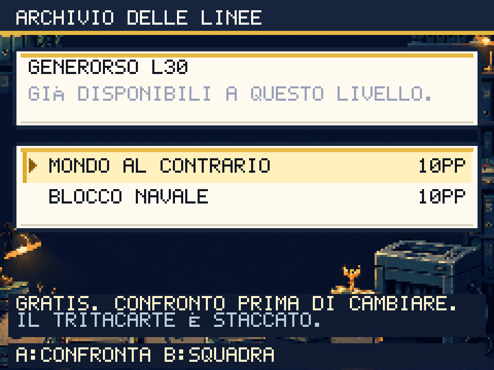
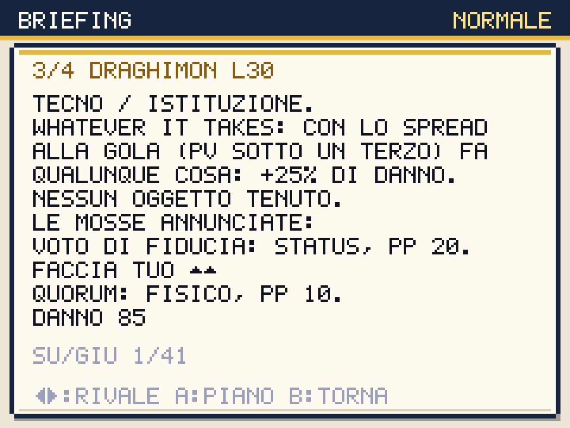

# Le linee dimenticate tornano utili

Round del 2 ottobre 2026. Il dossier della squadra ha una sesta pagina,
**ARCHIVIO DELLE LINEE**. Da **START > SQUADRA**, A apre il candidato e
scorre le pagine; START sull'archivio apre le mosse recuperabili.

Non serve aver conservato una mossa di supporto in ogni passaggio della
campagna. Puoi riprendere gratuitamente una mossa del learnset della
**forma attuale**, disponibile al livello attuale e assente dai quattro
slot. Sono esclusi livelli futuri e programmi di altri rami evolutivi.
La lista non recupera mosse esclusive di una precedente forma: questa
limitazione è esplicita nell'interfaccia.

A apre il confronto nella scena di apprendimento. Puoi leggere la mossa,
scegliere lo slot, ripensarci con B e confermare. Solo la mossa sostituita
perde i suoi PP; quella ripresa riceve i PP massimi. PV, status, oggetto,
altre mosse, esperienza, fondi e inventario restano. La scelta è salvata.
Non si possono modificare le mosse durante una lotta o nella squadra
mirror del duello. Il recupero dei PP fuori lotta è coerente con il bar
gratuito; l'archivio non rianima un candidato KO.

Lo sfondo Higgsfield mostra l'archivio delle linee accanto a un tritacarte
staccato e a una cartella salvata. La battuta è originale: per una volta
archiviare non significa far sparire. Fasce scure proteggono le istruzioni
anche sopra gli oggetti luminosi del fondale.



## Il dossier prima della sfida

Nei sedici briefing illustrati, **destra o sinistra** apre il dossier
preparazione. Le frecce scorrono tutti gli avversari; su/giù leggono il
testo. A torna al piano senza iniziare la lotta; B annulla il briefing.
START apre ancora la scelta del leader.

Il dossier legge la squadra reale costruita per quella difficoltà: mosse
e PP, abilità, oggetto tenuto e tipi. Per ogni candidato vivo mostra il
miglior danno minimo fra gli attacchi con PP e una stima senza critico,
**se il colpo va a segno**, al rimpasto. Le abilità d'ingresso vengono
calcolate su copie. Il dossier segnala KO e assenza di attacchi con PP.

Se l'avversario possiede un potenziamento di difesa, mostra anche il danno
dopo un suo uso, con la stessa mossa del giocatore. Sono stime condizionate,
non una previsione dei turni futuri. Le mosse di preparazione disponibili
in squadra sono nominate e descritte. Abilità come GARANZIA e oggetti come
il Gilet sono letti dai dati effettivi, senza assegnare vantaggi nuovi.

In questo gioco anche gli attacchi speciali usano FACCIA TOSTA, salvo
le difese specifiche delle specie. Il dossier esplicita la regola: suggerire
che una speciale annulli automaticamente VOTO DI FIDUCIA sarebbe falso.
Le statistiche del simulatore, le squadre nemiche, i livelli, l'IA e le
ricompense non sono stati indeboliti per ottenere un risultato positivo.



## Nuove partite e passaggi sicuri

Tre partite da NUOVA PARTITA, seed 20261002, normale. Il controller usa gli
input delle scene per viaggi, acquisti, evoluzioni, apprendimento,
**Pausa → Squadra → Archivio → Teach** e battaglie. Non assegna livelli,
fondi, mosse o esiti direttamente. `ARCHIVE_PLAN=support` riprende una
mossa utile disponibile per candidato, sostituendo l'attacco meno potente
solo quando ne restano altri. La politica di apprendimento successivo resta
imperfetta: può dimenticare nuovamente una linea prima del finale.

| Starter / bus | Passi | Lotte | Sconfitte totali | Palazzo, tre giudici, Garante |
|---|---:|---:|---:|---|
| Ellyna / nessuna scelta | 1.120 | 25 | 0 | Tutti vinti al primo tentativo |
| Giorgetta / promessa | 1.049 | 22 | 2 | Tutti vinti al primo tentativo; due sconfitte precedenti |
| Renzino / pagamento | 1.087 | 23 | 3 | Palazzo e giudici vinti; Garante perso due volte |

Il percorso di Giorgetta del round precedente perdeva due volte dal Garante.
Questa politica recupera IO SONO GIORGIA per Giorgiagon e Generorso; conclude
con Generorso 28, Giorgiagon 32, Telecrate 25 e Conteblob 27. Ellyna conclude
con Schleinix 31, Generorso 27, Telecrate 27 e Movimenton 29. I risultati
sono prove di questi percorsi e seed, non un certificato per ogni squadra
né per la difficoltà alta. Renzino resta una priorità del bilanciamento.

Il morale conserva il verbale reale: Ellyna non sceglie il bus; Giorgetta
lascia la promessa scaduta; Renzino la finanzia. Consultazione e recupero
delle mosse non danno fiducia, coesione o sondaggi gratuiti.

La prima prova di Ellyna ha trovato un'altra ostruzione a Capitale: dalla
cella 22,8, uno sfidante statico su 21,8 chiudeva l'unica uscita dal
corridoio del bar, mentre un pickup occupava l'alternativa. Il controllo
di comparsa ora verifica la **connettività dei passaggi** con quella
cella occupata. Rifiuta un punto che separerebbe una zona prima raggiungibile.
Restano anche le protezioni delle porte. Il replay corretto raggiunge e
vince il Garante; la regressione riproduce la strozzatura nei due motori.

I tre report finali con hash delle sorgenti, mosse, azioni di archivio,
verbale morale ed esiti sono in [archive-playtests.json](archive-playtests.json).
La prova interrotta rimane nell'artefatto locale
`archive-support-ellyna-prepared-20261002.json`; non è conteggiata come
una partita conclusa. Il tempo virtuale accelerato non misura minuti umani.

```sh
ARCHIVE_PLAN=support BASE_URL=http://127.0.0.1:5188 STARTER=giorgetta \
  RUN_PLAN=prepared EU_PLAN=tactical CAP_PLAN=prepared COURT_PLAN=prepared \
  CIVIC_PLAN=pledge END_AT=garante RUN_LABEL=archive-final \
  node scripts/play-campaign-native.mjs
```

## Risorse e verifiche

Un job `gpt_image_2_5`, **0,25 crediti**: saldo **615,47 → 615,22**,
cumulativo **270,75** dal saldo iniziale 885,97. Job
`2e1f7e58-fa0e-4c78-b473-4f68f3df9e57`, sorgente 1168×880, ritaglio
1168×876 da y=0, nearest 240×180, PNG 53.884 byte. Prompt, URL e SHA-256
sono in `scripts/higgsfield-archive.json`. Nessun job ancora in attesa.

- 283 test, typecheck e build riusciti. Test di legalità delle mosse,
  immutabilità del dossier e assenza di consumo della RNG live.
- 633 viste archivio/confronto/dossier squadra per motore, 52 specie a
  livelli 1/16/30/55, tutte le pagine scorrevoli. Chromium e WebKit:
  tastiera reale, annullamento, conferma, salvataggio e PP conservati.
- 6.605 viste dei briefing: preparazione di ogni avversario nelle due
  difficoltà con squadra da sei, in aggiunta alla matrice precedente.
  Consultazione non avvia BattleScene e non spende PP, fondi o promesse.
- Regressioni Chromium/WebKit: 86 approcci ai warp, verifica della nuova
  strozzatura, cure gratuite e catture con crescita della panchina.
- Audit statico: 48/48 scene con script di screenshot, zero clip residui.
  Action dedicate 10/52: l'archivio non cambia la copertura delle animazioni.
- Il target di build ES2022 conserva i campi di classe nativi. Bundle
  iniziale 186.823 byte gzip, totale 355.695, limite invariato 358.400:
  margine 2.705 byte. Rispetto al round precedente il totale scende di
  2.666 byte pur includendo i nuovi flussi. World/Battle/Dex p95
  18,5/18,6/18,6 ms con CPU ×4. I browser di verifica eseguono la build.
- Release locale: 428 checksum PNG e 537 asset Higgsfield PWA nei due
  motori. Reload offline Chromium; WebKit verifica precache e primo
  utilizzo offline, con il limite Playwright sul reload del service worker.

Pubblicazione **91a217e** su master: [CI 36967657420](https://github.com/Kind3rin/politicmon/actions/runs/36967657420)
e tutti e tre i deploy Vercel riusciti. Su
[politicmon.vercel.app](https://politicmon.vercel.app/) sono verificati
428 checksum PNG, codice di archivio/preparazione, 537 asset PWA, cache
aggiornata e ripresa dopo background. Sei configurazioni della cornice
esterna in Chromium/WebKit (390×844, 844×390, 1280×800) riuscite. Reload
offline Chromium; WebKit conserva la limitazione Playwright descritta sopra.

Restano la preparazione di Renzino, la campagna successiva, l'audio, la
scrittura delle altre zone e la verifica integrale del nuovo aspetto.
