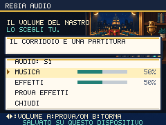
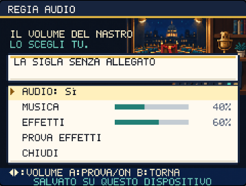

# Il volume del nastro lo scegli tu

Round del 2 ottobre 2026. Le diciannove vecchie sequenze a due oscillatori
sono sostituite da diciannove composizioni originali stereo: armonia,
basso, frase melodica, percussioni e variazione nella seconda metà.
Il circolo usa un accompagnamento leggero, il Palazzo una marcia lenta,
lo Stretto una cadenza bossa, i Feed una pulsazione più rapida. Le lotte
hanno temi distinti per selvatici, allenatori, palestre, boss e duelli.
Nessuna registrazione o melodia di terzi è incorporata.



## Un mixer raggiungibile dal gioco

AUDIO sul titolo e in PAUSA → OPZIONI apre la stessa regia. Musica ed
effetti hanno volumi separati, da 0 a 100 con passi di 10. Le frecce
regolano il canale; il tocco sulla barra imposta direttamente il volume.
PROVA EFFETTI consente di ascoltare un colpo e la cura. B ritorna alla
scena precedente. Le preferenze sono salvate sul dispositivo, con chiave
`politicmon.audio.v1`, separate dai tre slot della campagna.

Il fondale Higgsfield mostra un piccolo studio: il cursore del mixer è
legato al nastro della cerimonia, mentre il microfono celebrativo rimane
scollegato. Testi e controlli restano disegnati dal gioco.
Un job `gpt_image_2_5`, **0,25 crediti**, saldo riletto **613,72**;
spesa cumulativa **272,25**. Prompt, job, cartella, fonte e checksum in
`scripts/higgsfield-audio.json`. PNG 240×180, 43.514 byte, conversione
tecnica ripetibile con `prepare-first-campaign-assets.py --manifest
scripts/higgsfield-audio.json --asset audio <originale.png>`.

## Riproduzione e feedback

La musica viene richiesta solo dopo un input dell'utente. Il tema conserva
la propria identità durante il mixer: riattivare l'audio in una lotta
riprende la lotta. Passare in background sospende il contesto e cancella
anche gli effetti programmati. Il ritorno ricostruisce la riproduzione;
un errore temporaneo di caricamento permette una nuova richiesta.

Le tracce AAC stereo occupano complessivamente **3.973.617 byte**, oltre
al catalogo. Sono precaricate dalla PWA per l'uso offline. Il motore
carica e decodifica la traccia richiesta, serializza le decodifiche e
mantiene una cache di due buffer. Richieste superate non avviano una
traccia vecchia. Decodifiche in corso e sorgenti in dissolvenza possono
trattenere temporaneamente altri buffer: il limite riguarda la cache.

Il loop usa la durata musicale dichiarata, con dissolvenze di cambio.
[MDN: loopEnd](https://developer.mozilla.org/en-US/docs/Web/API/AudioBufferSourceNode/loopEnd)
documenta la posizione finale in secondi;
[MDN: decodeAudioData](https://developer.mozilla.org/en-US/docs/Web/API/BaseAudioContext/decodeAudioData)
documenta la decodifica e il ricampionamento alla frequenza del contesto.
Gli effetti hanno inviluppi brevi, transitori di rumore per colpi e scudi,
livelli distinti e un compressore finale. Il rumore usa un generatore
locale deterministico: non altera le scelte casuali del gameplay.

Due riferimenti di mappa errati sono corretti: Archivio Talk Show usa
`battle-trainer`; Silenzio Stampa usa `election_night`. Il validatore
controlla tutte le 66 mappe, i temi principali di scena e la corrispondenza
fra catalogo e checksum AAC, anche in CI.

## Produzione e prove

`scripts/compose-soundtrack.py` conserva partiture e sintetizzatore.
Richiede Python con NumPy e `afconvert` di macOS. Genera i master WAV in
`artifacts/audio/` e i file AAC a 96 kbps in `public/audio/`; il catalogo
registra durata, BPM, livelli e checksum. Non legge le vecchie sequenze.

```sh
python3 scripts/compose-soundtrack.py
npm test
npm run validate:content
npm run build
BASE_URL=http://127.0.0.1:5190 npm run shot:audio
BASE_URL=http://127.0.0.1:5190 npm run check:audio-runtime
BROWSER=webkit BASE_URL=http://127.0.0.1:5190 npm run shot:audio
BROWSER=webkit BASE_URL=http://127.0.0.1:5190 npm run check:audio-runtime
PERF_AUDIO=1 node --import tsx scripts/measure-performance.mjs --check
PREVIEW_URL=http://127.0.0.1:4180 npm run check:audio-release
```

Evidenza in [audio-regia-proof.json](audio-regia-proof.json): **286 test**,
30 configurazioni del mixer per motore senza sovrapposizioni, controllo
di titolo e pausa tramite input nativi e slider tramite eventi pointer.
Tutti i 19 AAC sono decodificati in Chromium e WebKit; durata, numero dei
canali, energia, picco e salto sul confine del loop sono controllati sui
file compressi effettivi. Nove casi di runtime per motore coprono gesto,
richieste rapide, background, silenziamento, canali a zero, errore 503,
cache, teardown e preferenze dopo reload.

La build di produzione è percorsa con la tastiera, senza importare moduli
di sviluppo: apre il mixer, modifica entrambi i canali, silenzia e riprende
il loop stereo, conserva le preferenze al reload. Regressione ingresso,
pausa e viaggi: **512 viste Chromium / 504 WebKit**, incluse sei lotte
del tutorial via input. Il censimento statico conta 49 scene con riferimenti
a screenshot; non certifica ogni stato di ogni scena.

Prestazioni con musica realmente in riproduzione: CPU Chromium ×4,
240 frame per scena, p95 **17,5 / 17,6 / 17,5 ms** in mondo, lotta e Dex, nessun frame
oltre 100 ms. Bundle iniziale **187.797 byte gzip**, totale **357.276**,
entro i limiti invariati di 250/350 KiB. Margine totale 1.124 byte.
La misura non include una lotta intera con tutti gli effetti, né certifica
FPS o ascolto su telefoni fisici. I controlli di segnale non certificano
da soli qualità musicale o assenza di affaticamento durante lunghe sessioni.

Build locale: **434 checksum PNG e 20 audio/catalogo** verificati;
**543 risorse Higgsfield e tutti i 19 AAC decodificati al primo uso offline**
in Chromium e WebKit. Reload offline verificato in Chromium; WebKit
copre precache, primo utilizzo e ripresa del salvataggio.

Il redesign completo resta attivo: percorsi e scrittura delle zone
successive, campagna in difficoltà alta, seed diversi, partite degli atti
successivi e prove su dispositivi reali richiedono ancora lavoro.

## Pubblicazione verificata

Commit `1c2f0926d901b80212af1edf8c6ee32a28d3a483`,
[CI riuscita](https://github.com/Kind3rin/politicmon/actions/runs/36974727124)
e tre deploy Vercel riusciti. Sul [gioco pubblico](https://politicmon.vercel.app/)
sono verificati 434 checksum PNG e 20 audio/catalogo, input reali della
regia nei due motori, 543 asset Higgsfield e 19 AAC al primo uso offline.
Il reload offline resta verificato solo in Chromium. Sei configurazioni
della cornice esterna verificano layout, pausa sotto guida e focus.


