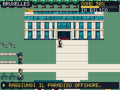
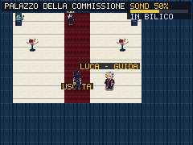
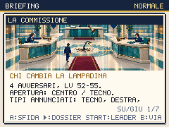

# Tre tavoli, un lampione

Round del 2 ottobre 2026. Bruxelles cambia facciata: palazzo di vetro teal e pietra avorio, Caffè Schuman con canopy, viale chiaro, pareti blu e tappeto bordeaux. Il tavolo con cartella e timbro compare nel palazzo e nel caffè. La Commissione ha quattro viste direzionali proprie: idle, senza dichiarare un ciclo di camminata. Le collisioni e le porte restano quelle attraversate nei percorsi verificati.

## Un problema fuori dalla foto

La nuova scrittura segue un lampione rotto che tre tavoli si passano. Il Relatore convoca una riunione per decidere chi risponde alla mail; l'allegato chiede un'altra riunione. L'Eurodeputato manda un cartonato alla foto mentre la sedia aspetta l'originale. Il Commissario pesa le imprese su una bilancia il cui tavolo appartiene al concorrente più grande. Il Lobbista offre una maniglia, trattenendo la chiave per il cliente. La Commissione termina scrivendo un nome accanto al lavoro da fare: il verbale assegna il lavoro, senza dichiararlo già fatto.

La [procedura ufficiale di nomina della Commissione](https://commission.europa.eu/about/organisation/how-commission-appointed_en) comprende elezione e approvazione parlamentare; il vecchio «non rispondo a nessuno» è stato sostituito. La satira prende spunto dai motivi di [As Per My Last Email](https://knowyourmeme.com/memes/as-per-my-last-email) e della [riunione che poteva essere un'email](https://knowyourmeme.com/photos/1467557-dogs), con scene e battute originali. Non riproduce le immagini dei meme. I panorami generati includono bandiere europee in alcuni ambienti, benché il prompt chiedesse di evitarle; i personaggi sono di fantasia.

## Leggere prima di affrontare

Le quattro prove sul viale e la Commissione aprono il dossier con A. Attraversare il campo visivo non avvia una lotta; B annulla senza modificare salvataggio, PP, denaro o morale. Il dossier permette di leggere mosse, abilità, oggetti e livelli, e di scegliere un leader valido. I briefing illustrati passano da 24 a **28**; un'immagine nuova non dà cure aggiuntive all'IA.

Le quattro prove restano facoltative, non requisiti per entrare nel palazzo. Le squadre crescono da LV 44–45 a 48–50; la Commissione mantiene Macronfox 52, Putingrad 53, Xipanda 53 e Ursulax 55 con Gilet. Il Caffè Schuman ripristina gratuitamente PV e PP, status e KO; un ambulante vicino vende cure ed equipaggiamento con preventivo. La hostess resta ferma accanto al molo: durante la prima prova pubblica il suo vagare aveva ostacolato il percorso. Dal molo si può tornare a Offshore anche prima della vittoria. Il passaggio al Campo Largo richiede la vittoria e la feature Atto 3; EXTRA > CONTENUTI mostra il catalogo, non un interruttore da attivare.

Il finale legge il registro del morale. Fiducia, coesione, promesse, decisioni e storia restano quelle guadagnate nella campagna: la vittoria non ripara promesse scadute. Il contatore di progresso avanza normalmente con le lotte. Il premio resta una Tessera Dorata e +10 sondaggi, con invito al Campo Largo.

## Campagne riprese da salvataggi giocati

Tre segmenti in normale ripartono dal risultato del Tesoriere, senza inserire specie, livelli, denaro o flag. Usano i tasti del gioco, acquisti reali, archivio delle mosse e bar. Il seed 20261002 viene riavviato all'inizio del segmento: non sono campagne ininterrotte dall'avvio, né certificazioni del bilanciamento per tutti i seed o in difficile.

| Starter iniziale | Prove sul viale | Commissione | Morale al finale |
|---|---|---|---|
| Ellyna | Quattro vittorie | Vittoria al primo tentativo | 68 fiducia / 74 coesione, una promessa mantenuta |
| Renzino | Quattro vittorie; anche un incontro selvatico vinto | Vittoria al primo tentativo | 80 / 80, due mantenute |
| Giorgetta | Quattro vittorie e un incontro selvatico, Gilet già ottenuti nel percorso precedente | Vittoria al primo tentativo | 36 / 56, due promesse ancora scadute |

Ellyna arriva al finale con quattro candidati KO, Movimenton e Generorso vivi: il successo non prova che sia sufficiente qualsiasi squadra. Prima del redesign, lo stesso salvataggio aveva perso una volta contro il lobbista; percorsi e dialoghi diversi consumano il generatore casuale diversamente, quindi il confronto non isola un miglioramento causale del bilanciamento. Livelli, roster e profili IA non sono stati abbassati per far passare le prove.

Il [registro delle prove](bruxelles-verbale-proof.json) conserva hash dei report, salvataggi padre, squadre, acquisti, mosse recuperate, esiti e finali personali. Gli originali completi restano in `artifacts/campaign-native/`.

## Risorse e verifiche

Dodici job Higgsfield `gpt_image_2_5`, qualità high, hanno prodotto **15 PNG runtime**, di cui 14 percorsi nuovi e uno che sostituisce il panorama della Commissione. Spesa **18 crediti**, saldo **604,72 → 586,72**, cumulativo **299,25**. Quattro richieste respinte con 429 prima di ricevere un job sono state ritentate; gli otto job già accettati sono stati conservati. Provenienza, prompt, tentativi e checksum sono in `scripts/higgsfield-bruxelles.json`. La precedente Commissione in `higgsfield-premium-next.json` è marcata come superata, preservando i suoi dati storici.

`prepare-bruxelles-assets.py` applica crop e ridimensionamento nearest, split delle direzioni e soglia alpha 128 per i trasparenti. Non disegna o ricostruisce contenuti. Le facciate diventano 160×64 e 64×32, il cast 24×32, i materiali 16×16, il tavolo 32×32 e i panorami 224×78. Le schermate native sono state ispezionate dopo la conversione.

Passano 286 test, typecheck/build, allineamento delle porte e layout degli edifici. La matrice dei dossier verifica **11.222 layout per motore**, con annullamento, rifiuto del leader KO, persistenza del leader e avvio della vera BattleScene. La matrice del mondo copre 66 mappe, 252 viste e 220 pose direzionali condivise; il cast della Commissione è verificato separatamente nelle quattro viste.

Chromium e WebKit verificano entrambe le porte del caffè e del palazzo, cure gratuite, cinque dossier con annullamento senza mutazioni, preventivo del mercante, ritorno marittimo prima del boss e blocco del Campo Largo prima della vittoria. Queste prove di navigazione usano una fixture post Garante, con incontri casuali disabilitati solo lì. Le campagne li mantengono attivi. Nella build di produzione, salvataggi realmente guadagnati entrano al caffè e raggiungono il Campo Largo dopo la Commissione tramite input nativo, conservando squadra, denaro e morale.

Il worker codifica directory ed estensioni comuni una sola volta e ricostruisce l'inventario completo; nessuna risorsa è stata esclusa per ridurre il bundle. Con audio attivo e CPU ×4, il codice pesa **357.884 byte gzip** (margine 516 sul limite 350 KiB), iniziale 188.237; rAF p95 mondo/lotta/Dex 17,6 / 17,6 / 17,6 ms. I limiti non sono stati alzati. Restano da verificare prestazioni su dispositivi fisici.

La preview locale verifica **458 checksum PNG**, 20 audio/catalogo, primo utilizzo offline di **566 risorse** e decodifica delle 19 tracce AAC nei due motori. Chromium verifica anche il riavvio offline; Playwright WebKit permette le richieste offline alla cache ma non il reload offline completo. Il sito pubblico verifica gli stessi 458 checksum, 566 risorse offline, AAC e percorsi nativi nei due motori. La prima installazione Chromium concorrente è scaduta durante l’attesa del worker; il tentativo isolato e quello sul follow-up sono riusciti. Il deploy principale `6d58cb0` ha CI 36984334435 e tre Vercel riusciti; il follow-up della hostess `9a5a78a` ha CI 36985613752 e tre Vercel riusciti. Le prove pubbliche usano salvataggi guadagnati e registrano anche il checksum del codice importato.

[CAMPO-LARGO-AUDIT.md](CAMPO-LARGO-AUDIT.md) registra il prossimo tratto, requisiti reali della foto e discrepanza dei livelli selvatici da indagare.

Questo round completa Bruxelles. Il redesign dell'intero gioco resta attivo: identità dei capitoli successivi, altri seed e difficoltà alta, pose dedicate alle specie mancanti e audit dei percorsi rimangono nel [piano generale](REDESIGN-PLAN.md).
