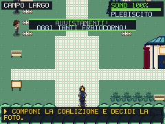
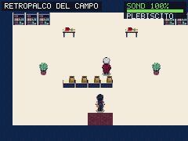
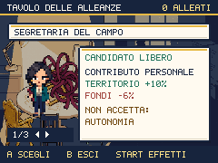
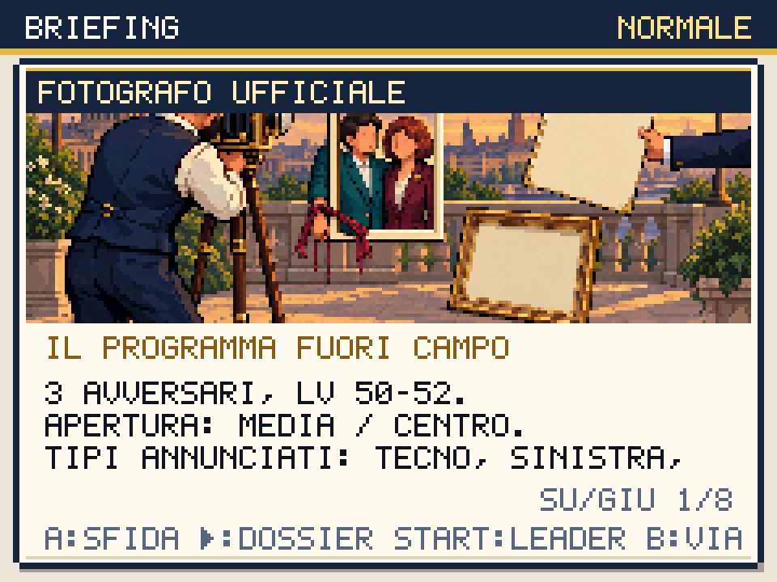

# Due posti, il programma fuori campo

Round del 2 ottobre 2026. Il Campo Largo diventa un set fotografico: palco bordeaux con due segni, gazebo teal, camera avorio, manifesto con due nastri sullo stesso perno, passaggi chiari e padiglione del retropalco. L'interno usa pavimento avorio e pareti blu, con due tavoli al posto degli otto ripetuti. Segretaria, Centrista, Sindaca e Fotografo hanno quattro direzioni proprie, tutte idle. I PNG condivisi ancora usati per alberi, recinti, piante, medico e archivista provengono dal redesign del mondo; questo round non genera nuovi cicli di camminata.

## Una scelta che resta nel salvataggio

La Segretaria porta una mappa che il fotografo vuole arrotolare perché occupa più spazio del logo. Il Centrista ha due programmi: ciascuno è il retro dell'altro. La Sindaca porta attrezzi e le chiedono se il guasto abbia un portavoce. Queste presentazioni vengono lette al primo incontro, prima di aprire la carta: cambiare solo le frasi di mappa non avrebbe raggiunto il controller delle alleanze. Il cast compare anche nelle carte.

Il Moderatore ha due tasti che gli restituiscono entrambi la parola. La Claque segue due cartelli senza ascoltare il programma. Il Fotografo misura due spalle, mentre il programma rimane fuori dalla cornice. Il motivo dei pulsanti contraddittori di [Daily Struggle / Two Buttons](https://knowyourmeme.com/memes/daily-struggle-two-buttons) ha ispirato questa contraddizione; scene, personaggi e battute sono originali, senza riprodurre il fumetto.

STRINGETEVI costa zero, applica delta base +4 al Centro e non mette in tensione nuovi patti. PANORAMICA costa 800, applica delta base +12 e incontra la linea rossa 13: con il Centrista alleato provoca un patto teso e -8 coesione; con Segretaria e Sindaca quell'evento non tende i loro patti. Fiducia e promesse civiche non vengono riparate dalla foto. La carta mostra preventivo e conseguenze prima della conferma; B annulla. Il Fotografo, dopo la vittoria, legge il tipo di foto, il numero di patti tesi e la coesione effettiva.

I candidati e il Fotografo restano alle postazioni. Nel tentativo iniziale, il loro vagare aveva reso inattendibile l'interazione con le coordinate viste prima del cammino; il baseline con tentativi di avvicinamento reali ha poi completato il capitolo. Il redesign non assume che quel primo errore della prova rendesse impossibile giocare.

## Preparazione e ritmo

Moderatore e Claque aprono il dossier con A, senza lotte dal campo visivo. Il Moderatore è una prova di capitolo: vittoria o sconfitta registrano il dibattito, con delta locale +8 o -4, e consentono di tornare dal Fotografo. La Claque è facoltativa e premia tre Caffè. Il Fotografo mantiene squadra e livelli 50–52, mosse esplicite e IA capace di curarsi; la sua vittoria apre Futuro Anteriore. I tre dossier portano il catalogo da 28 a 31; l'arte non conferisce cure ai due allenatori ordinari.

L'ambulatorio resta gratuito e recupera PV, PP e KO. Il retropalco ospita ora il Circolo, accessibile da entrambe le porte. La guida e la missione indicano che la coalizione si compone nelle carte dei candidati: entrare nel retropalco serve a gestire la squadra, non a confermare il patto.

Salistrobo e Fratocorno passano da LV 28–31 a **43–46**, per offrire un'alternativa utilizzabile dopo Bruxelles. Una quarta prova deposita realmente Telecrate, cattura Salistrobo LV 43 con una Scheda, recupera la squadra dal medico e guadagna EXP nelle lotte successive. La cattura conserva 82.095 EXP sul nuovo candidato: non riceve esperienza per catturare sé stesso. Dopo il Moderatore diventa Salisound LV 43, apre la vera lotta del Fotografo e termina a LV 44; il roster vince. Questo prova un reclutamento utile in quel percorso, non il bilanciamento di ogni seed o specie.

## Campagne e conseguenze osservate

Quattro segmenti in normale ripartono dai codici guadagnati dopo la Commissione, usando input, acquisti, cure, archivio e Circolo. Non inseriscono specie, soldi, livelli o flag di vittoria. Il seed 20261002 riparte a inizio segmento: non sono campagne ininterrotte dall'avvio.

| Percorso | Foto / alleati | Esito | Fiducia / coesione finali |
|---|---|---|---|
| Ellyna preparata | Stretta, Segretaria + Centrista | Moderatore, Claque e Fotografo vinti | 68 / 74 |
| Renzino diretto | Panoramica, Segretaria + Centrista | Moderatore e Fotografo vinti; Centrista teso | 80 / 72 |
| Giorgetta civica | Panoramica, Segretaria + Sindaca | Moderatore e Fotografo vinti; patti attivi | 36 / 56 |
| Ellyna con reclutamento | Stretta, Segretaria + Centrista | Cattura, evoluzione e due vittorie | 68 / 74 |

Le due promesse scadute di Giorgetta restano scadute. Il percorso preparato di Ellyna termina con un KO; quello con reclutamento termina con Schleinix KO. Queste vittorie non dimostrano che qualsiasi squadra o preparazione sia sufficiente. La sconfitta effettiva del Moderatore e la riparazione di un patto dentro una campagna completa restano da percorrere; le regole, l'annullamento e la riparazione storica sono esercitati dai test e dalla matrice UI.

Il [registro](campo-cornice-proof.json) conserva hash dei report e dei codici, salvataggi padre, roster, candidati realmente schierati, acquisti, decisioni e morale. Gli originali sono in `artifacts/campaign-native/`.

## Produzione e verifiche

Diciassette job Higgsfield `gpt_image_2_5` high, tutti completati: **29 PNG runtime**, 28 percorsi nuovi e una sostituzione della foto. Spesa **25,5 crediti**, saldo **586,72 → 561,22**, cumulativo **324,75**. Il manifest `scripts/higgsfield-campo.json` conserva prompt, job, sorgenti, geometria, crop e checksum. La vecchia foto è marcata come superata nel manifest storico; il suo installer non sovrascrive la nuova. Conversione tecnica: crop, split, alpha 128, nearest e quantizzazione dei trasparenti, senza disegno o ricostruzione di contenuti. Tutte le sorgenti e le viste native sono state ispezionate.

Passano **286 test**, typecheck/build, validazione dei contenuti, allineamento delle porte e layout degli edifici. Chromium e WebKit verificano presentazioni, due alleati scelti, cancellazione della rimozione, porte del retropalco, cure, anteprima/cancellazione della foto, fondi insufficienti, effetti reali della panoramica, due dossier volontari e 16 direzioni dedicate. La fixture di navigazione disabilita solo lì gli incontri casuali; le quattro campagne li conservano. La matrice dei dossier verifica **12.551 layout per motore**, quella della campagna 142 viste, decisioni e riparazioni senza overflow. La matrice del mondo verifica 66 mappe, 252 viste e 220 pose condivise.

Il worker legge una sola volta, durante l'installazione, un inventario JSON versionato. Poi usa la cache senza recuperarlo dalla rete. `check-precache-build.mjs` verifica **626 risorse esatte** della build e rifiuto dell'installazione se l'inventario manca o è malformato. Nessun asset è escluso per ridurre il codice. Preview: **486 checksum PNG** e 20 audio/catalogo; **594 asset** e 19 AAC decodificati al primo uso offline nei due motori. Chromium verifica il reload offline; Playwright WebKit verifica richieste offline alla cache, non il reload completo.

Le prove native della build importano senza modifiche tre salvataggi guadagnati: ingresso nel retropalco, blocco del varco prima della vittoria e passaggio a Futuro dopo il Fotografo. Un primo tentativo della prova premendo A ripetutamente riapriva il dialogo davanti al giocatore; la prova corretta chiude con B. Il varco bloccato non salva automaticamente la posizione: la prova usa l'azione SALVA del gioco prima di leggere lo storage. Sono correzioni della verifica, senza aggiungere flag.

Con audio attivo e CPU ×4: **356.502 byte gzip** totali, iniziali 188.412; rAF p95 mondo/lotta/Dex 17,6 / 17,6 / 17,5 ms. I limiti 250/350 KiB non sono cambiati. FPS e ascolto su dispositivi fisici restano da verificare. Il commit **044516d** è pubblicato su [politicmon.vercel.app](https://politicmon.vercel.app/): [CI 36992112395](https://github.com/Kind3rin/politicmon/actions/runs/36992112395) e tre deploy Vercel riusciti. Sul dominio pubblico passano 486 checksum PNG, 20 audio/catalogo, 594 risorse offline e 19 AAC nei due motori, oltre ai sei percorsi nativi da salvataggi guadagnati. Il registro conserva il checksum di ciascun codice importato e distingue le prove pubbliche dalle sei prove locali. Il controllo dell'inventario di build è aggiunto alla CI dopo la compilazione. Il redesign integrale resta attivo; il prossimo audit è [FUTURO-ANTERIORE-AUDIT.md](FUTURO-ANTERIORE-AUDIT.md).
