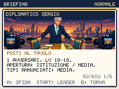
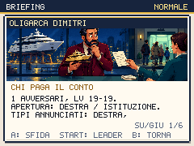

# Capitale: il tavolo, il conto e chi arriva preparato

Round del 2 ottobre 2026. Il Percorso 3, l'Archivio di Stato e la Global
Tower ora distinguono attraversamento, consultazione e sfida. Sei allenatori
aspettano **A** invece di imporre una battaglia per vicinanza. Le due prove
della Tower hanno briefing illustrati, annullabili con **B**, e consentono
di scegliere il leader con **START** prima di usare mosse o consumabili.

## Una preparazione volontaria

Usciere, protocollista, eminenza e archivista hanno indicazioni visibili per
la sfida. La segnaletica indica la Direttiva Decreto nell'archivio; il suo
recupero non richiede di battere l'archivista. Alla Tower, diplomatico e
oligarca offrono due prove distinte. Si può uscire e tornare al bar fra
le prove e prima di Tycoon. La missione Dazio e la guida di Luca spiegano
preparazione, PP, resistenze e rifornimenti dall'ambulante.

Squadre, livelli, ricompense e comportamento IA restano invariati. Il
diplomatico usa Zelenskir 18, l'oligarca Putingrad 19; in difficile sono
21 e 22. Tycoon conserva Bojoon 20, Muskrat 21 e Trumpon 23, incluso il
Sondaggio Truccato del terzo avversario. Aggiungere l'artwork non assegna
alle prove il profilo IA dei boss. I test controllano la probabilità di
errore e l'accesso alle cure nelle due difficoltà.

La nuova guida del porto corregge un'informazione vecchia: il marinaio dà
il traghetto con tre medaglie, senza richiedere l'auto. Auto, ruspa e
traghetto hanno istruzioni più brevi con il percorso **START > VEICOLO**;
la consegna e i requisiti effettivi rimangono quelli del gioco.

## Satira con una contraddizione riconoscibile

Il diplomatico avvicina le delegazioni ma la regia rivuole il tavolo lungo.
L'oligarca tratta lo yacht come strategico e il proprio conto come
negoziabile. L'agenda dell'usciere è piena per chi non può svuotarla;
l'eminenza pubblica gli incontri e considera le cene una categoria diversa.
L'archivista confonde segretezza e un file chiamato definitivo3_vero2.
Le risposte dopo la vittoria riprendono questi problemi.

Salotto e retroscenisti parlano di sedie spostate per la foto e fonti
anonime che pretendono di essere riconoscibili. Fontana, statua, turista,
influencer e veicoli mostrano la distanza fra immagine pubblica e costi
ordinari. Sono testi originali, senza immagini o battute copiate.

La ricerca ha consultato il meme
[Penguin Tariffs](https://knowyourmeme.com/memes/donald-trumps-penguin-tariffs)
e il contesto storico dell'
[ordine statunitense del 2 aprile 2025](https://www.whitehouse.gov/presidential-actions/2025/04/regulating-imports-with-a-reciprocal-tariff-to-rectify-trade-practices-that-contribute-to-large-and-persistent-annual-united-states-goods-trade-deficits/).
Da qui nasce il cartello inventato del pinguino a cui chiedono una firma
per rifiutare il dazio. Il testo non descrive le aliquote in vigore oggi.

## Due immagini Higgsfield

Due job `gpt_image_2_5`, **0,50 crediti** complessivi; saldo verificato
**617,47 → 616,97**, cumulativo **269,00** dal saldo iniziale 885,97.

| Scena | Job | PNG nativo |
|---|---|---|
| Diplomatico, tavolo e telecamere | `7c7be64f-aff7-44d4-9b14-ac7d5101c594` | 224×78, 34.653 byte |
| Oligarca, yacht e conto | `f86fce4a-b1fe-4fba-82c5-d5b1f2281fff` | 224×78, 34.876 byte |

Entrambi i personaggi sono immaginari. Sorgenti 1344×752, ritaglio da
y=72 per 468 pixel e riduzione nearest. Prompt, modello, job, sorgente,
ritaglio e SHA-256 sono in `scripts/higgsfield-capitale.json`. Il convertitore
esistente ora accetta anche `--asset`; i comandi di Mara e Hans rimangono
compatibili.

```sh
python3 scripts/prepare-first-campaign-assets.py /percorso/diplomatico.png \
  --manifest scripts/higgsfield-capitale.json --asset diplomatico
python3 scripts/prepare-first-campaign-assets.py /percorso/oligarca.png \
  --manifest scripts/higgsfield-capitale.json --asset oligarca
```





## Campagne fino alla terza medaglia

Il controller parte da una partita nuova, sceglie lo starter e percorre il
gioco tramite gli input reali. Il primo atto usa la preparazione già
documentata; Eurotown usa reclutamento e scelta tattica del leader.
La nuova politica `CAP_PLAN=prepared` affronta il protocollista sul Percorso
3 e le due prove della Tower, curandosi prima del boss. Non assegna medaglie,
livelli, denaro o esiti; apprendimento ed evoluzioni avvengono nelle scene.

| Starter / politica a Capitale | Passi totali | Lotte totali | Sconfitte totali | Leader contro Tycoon | Dazio |
|---|---:|---:|---:|---|---|
| Ellyna / preparata | 823 | 20 | 0 | Schleinix | Primo tentativo |
| Giorgetta / preparata | 693 | 16 | 0 | Giorgiagon | Primo tentativo |
| Renzino / preparata | 749 | 18 | 1 | Renzilla | Primo tentativo |
| Giorgetta / diretta | 620 | 14 | 1 | Giorgiagon | Secondo tentativo |

Seed 20261002, difficoltà normale. La sconfitta della partita preparata
di Renzino avviene contro Sua Emittenza; le prove di Capitale e Tycoon
riescono al primo tentativo. La partita diretta di Giorgetta salta tutte
le nuove prove e perde contro Tycoon, poi recupera al bar e vince.
Questa strategia è possibile: non è richiesto un allenamento nascosto.

Nella baseline `92e9beb`, Ellyna conquista Dazio alla prima prova dopo 718
passi e 21 lotte. Il percorso più breve impone quattro scontri per vicinanza:
protocollista, usciere, diplomatico e oligarca. La nuova versione permette
di scegliere gli incontri e fare pause di cura; il percorso preparato è
più lungo ma scelto. Non viene presentato come risparmio di tempo umano.

Il controller sceglie mosse e leader leggendo danno atteso, precisione e
PV attuali. Non compie cambi volontari mentre il leader è ancora in campo.
Audio e rete sono disattivati, tempo virtuale accelerato. Sono prove su un
seed e una politica, non una certificazione di tutte le squadre o della
durata di una partita umana.

```sh
for starter in ellyna giorgetta renzino; do
  END_AT=dazio RUN_PLAN=prepared EU_PLAN=tactical CAP_PLAN=prepared \
    EXPECT_BADGE=1 RUN_LABEL=capital-prepared STARTER="$starter" \
    npm run playtest:campaign:native
done
END_AT=dazio RUN_PLAN=prepared EU_PLAN=tactical CAP_PLAN=direct \
  RUN_LABEL=capital-direct STARTER=giorgetta npm run playtest:campaign:native
```

Dev server predefinito sulla porta 5188, modificabile con `BASE_URL`.
Risultati, save esportabili e immagini native sono in
`artifacts/campaign-native/` e `artifacts/screens/campaign-native/`.

## Avvio più leggero e worker compilato

SlotScene importava tutte le mappe solo per leggerne i nomi; il preload
dei fondali importava anche la selezione del fondale basata sulle mappe.
Ora il selettore usa etichette leggere generate dal registry e il preload
usa il solo catalogo delle immagini. Le mappe complete rimangono nel
modulo della campagna. Il test dei contenuti controlla copertura e nomi di
tutte le 66 mappe; il verificatore della build controlla che il contenuto
del mondo sia nel modulo differito.

```sh
node --import tsx scripts/sync-map-labels.mjs
```

Il comando rigenera `src/data/maps/names.ts` dal registry autorevole, senza
modificare le mappe. Il dizionario non eredita proprietà, così un ID
sconosciuto in un save rimane un'etichetta di ripiego.

Il service worker ora viene minificato con Terser dopo aver stampato il
build ID e la lista degli asset. Un errore di compilazione fallisce la
build invece di venire ignorato. Precache, versionamento, aggiornamento e
salvataggi mantengono il comportamento verificato dalla prova PWA.

| Codice gzip | Round Eurotown | Questo round |
|---|---:|---:|
| Iniziale | 212.218 byte | 189.284 byte |
| Totale, incluso worker | 358.369 byte | 358.042 byte |

L'avvio risparmia 22.934 byte. Il totale risparmia 327 byte dopo le
aggiunte; rimangono **358 byte** sotto il limite di 358.400. Le etichette
leggere da sole non riducevano il totale: il risultato finale include
la compilazione del worker. Il margine rimane ridotto e non giustifica
ulteriori funzioni senza nuove riduzioni o modularità. Nessun limite è alzato.

## Verifiche del round e lavoro aperto

- **281 test** e validatore dei contenuti superati: 52 specie, 78 mosse,
  49 allenatori, 66 mappe, 49 missioni, otto eventi classici.
- **3.030 layout dei briefing**, tredici illustrazioni, controllo di
  annullamento, leader KO rifiutato, persistenza e ingresso reale in lotta.
- **103 viste HQ**, incluse le istruzioni della missione Dazio.
- **Chromium/WebKit:** 86 approcci alle porte nella fixture, prove dei
  quattro briefing facoltativi nelle due difficoltà, annullamento con stato
  invariato, cura, EXP delle catture, mosse della panchina e persistenza.
- **Build locale:** 424 checksum, 533 asset Higgsfield PWA, aggiornamento,
  save conservato e ripresa; reload offline verificato solo in Chromium.
  Sei configurazioni della cornice esterna passano nei due motori.
- **Performance:** p95 17,6 ms per mondo, lotta e Dex con CPU Chromium ×4;
  budget di peso e tempi rispettati senza aumento dei limiti.

I briefing difficili sono verificati, non una campagna difficile completa.
Palazzo, Colle, atti successivi, finali tramite percorso reale, audio e
scrittura delle altre zone restano nel [piano attivo](REDESIGN-PLAN.md).
