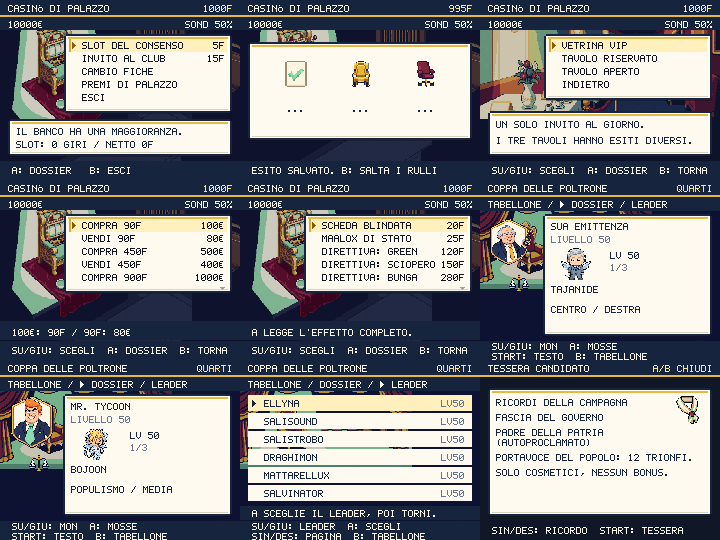

# Casinò e Coppa delle Poltrone

Round del 2 ottobre 2026. Tre nuovi ambienti, cinque simboli della slot,
cinque emblemi delle regole e sette ritratti completi. Venti PNG Higgsfield;
rimosso il vecchio `slot_cabinet.png`, ormai privo di utenti runtime.

## Il casinò presenta il contratto prima di incassare

Ogni giro, cambio, premio e invito apre un dossier paginato. B annulla senza
spesa, RNG o consumo dell'invito. La conferma finale rivalida fondi, capienza,
oggetti già posseduti e limite giornaliero prima della transazione.

La slot costa 5 fiche e usa tre estrazioni indipendenti fra cinque simboli.
Il tris vale 50F per VOTO, 150F per STELLA e 40F per gli altri; una coppia
restituisce 5F. I 125 casi hanno 4% tris, 48% coppia e 48% nessuna vincita:
incasso medio 4,96F, rendimento 99,2%. Il tris di MAZZETTE riduce i sondaggi
fino a 3 punti, mostrando la variazione effettiva al limite inferiore.
Il portafiche è limitato a 999.999 e l'incasso al limite viene dichiarato
con il valore reale. I save importati normalizzano fiche negative e frazionarie.

Costo ed esito economico sono salvati insieme **prima** dei rulli. B salta
l'animazione senza rimborso né nuova estrazione; RIDUCI EFFETTI mostra subito
il risultato. Il netto della sessione include soltanto i giri della slot.
100€ comprano 90F, che tornano in 80€: nessun arbitraggio nel cambio.
Le direttive già possedute non si comprano una seconda volta.

## Tre inviti, tre compromessi sulla morale

Un solo invito al giorno, condiviso fra tutti i tavoli e persistente nel save.
Ciascun invito costa 15F e ha tre esiti equiprobabili. Il dossier mostra tutte
le variazioni di fondi, sondaggi, fiducia e coesione con i limiti attuali.

| Tavolo | Contraddizione | Conseguenza |
|---|---|---|
| Vetrina VIP | La visibilità sostituisce il programma | Sondaggi +6/-4/+2; fiducia -2/-4/-1; possibile conto di 100€ |
| Tavolo riservato | Lo sponsor ha già scritto le richieste | Fondi +600/+200/-200€, sondaggi -4/-2/-6, fiducia -8/-6/-10, coesione -4/-3/-5 |
| Tavolo aperto | Ammettere un errore costa consenso ma rende l'azione credibile | Costo 100€, sondaggi +2/0/-1, fiducia +6/+4/+5, coesione +3/+2/+2 |

Non si entra se mancano i fondi per il peggiore costo possibile. Il risultato
registra la morale nella cronologia e riporta le variazioni effettive: una
fiducia già a zero non viene annunciata come ulteriormente ridotta.

## La Coppa prepara il match e protegge la campagna

Tre pagine navigabili: tabellone, dossier dell'avversario e scelta del leader.
Il dossier espone tutti e tre i Politicmon, tipi, livelli, mosse e dialogo
completo, senza tagliare nomi o righe. Il leader scelto viene salvato e usato
nella copia preparata per il match. B dal tabellone chiede conferma della
rinuncia; la quota di 1.500€ resta spesa. Consultare e annullare non mutano
squadra né fondi. Avvio e rinuncia chiamano il seguito una sola volta.

Il livello 50 vale per giocatore, avversario reale e incontri simulati del
resto del tabellone, anche in modalità difficile. MONOTIPO filtra la tua
squadra; SQUADRA 3 usa i primi tre; NIENTE OGGETTI e UNA SOLA CURA limitano
la tua borsa. Le restrizioni sono dichiarate prima del match.

Il torneo usa copie curate. Il serializzatore conserva la squadra originale
anche durante autosave, backup ed export nel match: UID, livelli, EXP, HP,
stato e PP non vengono rimpiazzati dalle copie. Fondi, oggetti realmente
consumati, sondaggi e altri progressi continuano a salvarsi. Manifesti EXP e
Spot non si consumano: l'EXP temporanea viene scartata e il match non paga
fondi. I Comizi si consumano perché il bonus ai sondaggi è reale.

La sconfitta elimina dal torneo senza la multa e il teletrasporto della
campagna. La quota è già il costo della sconfitta. Il primo trionfo dà
3.000€ e una Tessera Dorata; i successivi 700€ e due Schede Blindate.
Restano i normali sondaggi, eventuali ricompense giornaliere e loot dei match.
Il titolo PORTAVOCE DEL POPOLO compare nei ricordi della tessera insieme a
souvenir dell'epilogo e monumento. Il tabellone resta una sessione singola:
chiudere il gioco perde il torneo, conservando squadra e transazioni pagate.

## Satira e provenienza

I sette fantasmi hanno nuove introduzioni e sconfitte: share contro diritti,
valutazioni auto-certificate, circolarità burocratica, inaugurazioni senza
uso, bilanci e cambi di lista. Le battute sono originali, attribuite a
personaggi del gioco. La ricerca sulle nomine e sulle sedie vacanti usa
[ANSA, 19 aprile 2026](https://www.ansa.it/amp/sito/notizie/politica/2026/04/19/si-stringe-per-completare-la-squadra-di-governo-resta-il-nodo-consob_bb35a540-8724-4d8c-9c67-ffba1cab2642.html)
come spunto sul rinvio degli incarichi. Gli episodi della Coppa e del club
sono finzione satirica, senza citazioni di persone reali.

Sette job Nano Banana Pro/backend `nano_banana_2`, inclusa una correzione
pagata: il primo foglio dei fantasmi tagliava le sagome ed è stato scartato.
Il foglio corretto usa medaglioni completi. Prompt esatti, job, tentativo
scartato, URL sorgenti, SHA-256 e venti output sono registrati in
`scripts/higgsfield-arena.json`. La conversione esegue soltanto taglio,
ridimensionamento, rimozione del fondo e quantizzazione tecnica.
Spesa **14 crediti**, saldo verificato **639,97 → 625,97**; cumulativo **260**.

## Prove e limiti

272 test passano. Sette nuovi test coprono 125 esiti, transazioni negate,
cambio, duplicati, limiti delle fiche, invito giornaliero dopo import,
effetti reali, serializzazione temporanea e livelli effettivi della Coppa.
`shot:arena` controlla 843 viste native su Chromium e WebKit, con zero testo
fuori canvas: sette
fantasmi × cinque regole, tutte le pagine, rinunce, leader, costo salvato
prima dei rulli, inviti e percorso reale Mondo→Torneo→Lotta per tre round.
Le vittorie e la sconfitta nel controllo dei callback sono **forzate**:
questo prova orchestrazione e persistenza, non il bilanciamento di una
partita giocata. Iscrizione e salvataggio della quota sono provati nel
vero dialogo del banditore.

Typecheck, contenuti, meme pack, input, audit visivo, leggibilità ed evoluzioni
passano. I tre avvisi editoriali preesistenti dei meme pack restano tracciati.
Performance CPU ×4: p95 mondo/lotta/dex 18,5ms; bundle iniziale 206,7KiB,
totale 346,0KiB gzip, entro le soglie invariate 250/350KiB e 33,4ms.
La tessera gestisce gli input soltanto in update: START e direzioni
restano attivi anche nello stesso frame del draw, senza doppi cambi.
524 PNG installati. Il verificatore della build controlla 416 checksum e il
codice dei nuovi contratti; la prova PWA copre 525 risorse Higgsfield.

Il mandato complessivo resta attivo. Restano onboarding, pausa, viaggi,
interfaccia esterna, audio, revisione narrativa delle singole zone e prova
integrale della campagna con bilanciamento sul percorso reale.

Il controllo pubblico della PWA riesce anche con WebKit/iPhone 13:
525 asset recuperati offline e ripresa dopo background. Playwright WebKit
non supporta il reload completamente offline: questo controllo prova
precache e richieste offline, senza dichiarare quel riavvio come verificato.

## Pubblicazione verificata

Il round è pubblicato in `63f88cc`; la correzione dei comandi della tessera
è in `5efbb84`. La [CI del codice finale](https://github.com/Kind3rin/politicmon/actions/runs/36944972495)
è riuscita e i tre progetti Vercel riportano successo. Sul dominio pubblico
[politicmon.vercel.app](https://politicmon.vercel.app/) sono verificati 416
checksum, contratti nel codice, 525 richieste di asset offline su Chromium
Pixel 7 e WebKit iPhone 13, migrazione, aggiornamento e ripresa. Il reload
completamente offline è provato su Chromium; per WebKit vale il limite
indicato sopra. Le 843 viste native riescono su entrambi i motori.
