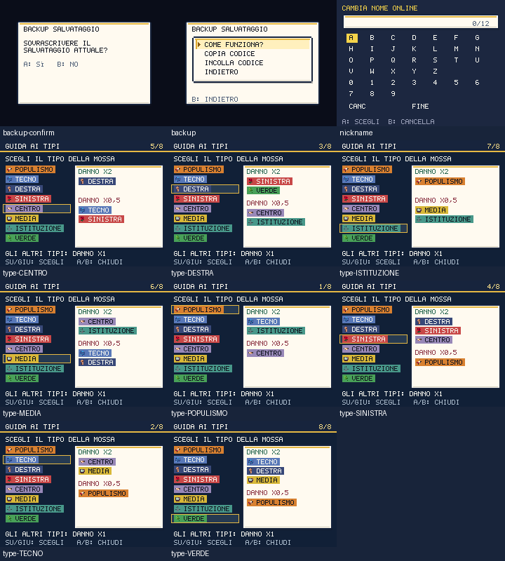

# Coerenza grafica e guida ai tipi — 1 ottobre 2026

Il caricamento lento o il fallimento di un foglio animato potevano far apparire
le vecchie creature PixelLab. I 52 PNG base e i 10 PNG d'azione sono ora copie
native delle pose dei 52 fogli Higgsfield: stessa identità in lotta, schede e
Politicdex, anche quando l'animazione non è disponibile. Il placeholder neutro
rimane quando manca anche il PNG statico.

Non sono state richieste nuove generazioni: **zero crediti aggiuntivi**.
Il saldo dell'ultimo controllo resta 679,97, con 206 crediti spesi nei round
precedenti. `higgsfield-monster-fallbacks.json` registra job originali, checksum
sorgente/finale e pose; `prepare-monster-fallbacks.py` prepara tutti i 62 PNG
prima di installarli. Nessuna reinterpretazione o deformazione delle creature.

La cornice caricata dal vecchio `ui/dialog.png` è rimossa dal bootstrap: i
pannelli senza stile esplicito usano la stessa scheda crema/navy/oro della UI
moderna. L'API di override rimane disponibile per strumenti storici. Due PNG
senza renderer, cartina campagna e tessera candidato, sono eliminati con il
relativo preload; la provenienza è conservata in `retiredAssets` nel manifest
storico. L'inventario attivo PixelLab verifica ora 192/192 file, senza richiedere
risorse che il gioco non usa.

La GUIDA AI TIPI mostra il tipo della mossa e le relazioni **danno ×2, ×0,5 e
×1**; tutti i bersagli sono su righe complete. Il cursore evidenzia chiaramente
la scelta; i testi sul pannello chiaro hanno colori scuri. La tabella delle
efficacie non cambia. Anche i suggerimenti del backup e il contatore del nome
hanno contrasto maggiore sul fondo crema.

## Prove eseguite

- 254 test, typecheck e audit statico delle 45 scene superati; zero clip e
  contratti di conferma/uscita visibili nelle 36 scene direzionali.
- `check:native-fallbacks`: HTTP 404 forzato per tutti i fogli animati, 52
  ritratti e 62 pose in lotta; il renderer usa il PNG statico atteso. Verifica
  della provenienza e dei checksum dei sorgenti; revisione visiva delle due matrici.
- `shot:native-ui`: 11 viste, tutte le relazioni degli otto tipi effettivamente
  disegnate, navigazione circolare, annullamento dell'import senza modificare
  la partita e zero testo oltre il canvas. Le prove usano un browser isolato.
- `shot:hq`: confermati trasferimenti, capacità, conservazione degli UID,
  dossier completi delle 47 missioni, archivio e titolo, 99 viste.
- PWA Chromium/Pixel 7: installazione, migrazione v13/v18, cache, update,
  riavvio offline, resume e primo uso offline di **475 risorse Higgsfield**,
  comprese tutte le 62 immagini di riserva.
- Prestazioni: **216,9/349,5 KiB gzip**, p95 mondo/lotta **18,5 ms**,
  dex **18,4 ms** sotto
  CPU Chromium ×4. I budget restano 250/350 KiB e 33,4 ms.

Il verificatore pubblico controlla ora 366 checksum di mondo, quartier generale
e immagini di riserva. Restano da ridisegnare altri emblemi, superfici sociali e
scene della campagna; queste verifiche non certificano il redesign completo né
una partita percorsa interamente nell'interfaccia.

Pubblicato nel commit `df8fb6d`: CI riuscita; verificati tutti i 366 PNG su
[politicmon.vercel.app](https://politicmon.vercel.app/) e riavvio offline pubblico
con primo utilizzo delle 475 risorse. Il redesign prosegue.

Nel successivo [round rete](RETE-EMBLEMI.md) sono rimossi anche l'API di override
e il file della cornice: il renderer moderno è ora unico, anche nei vecchi
strumenti di screenshot.
