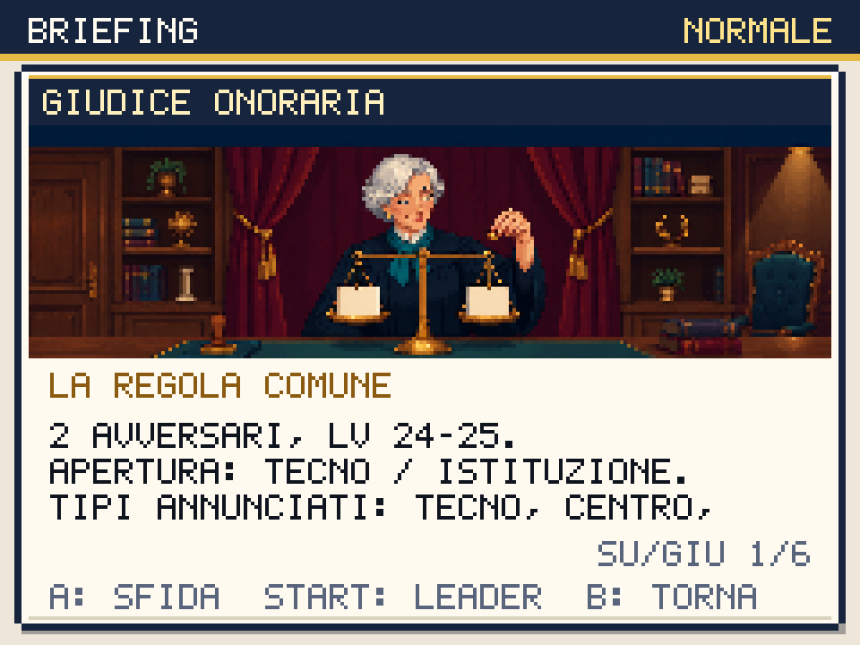
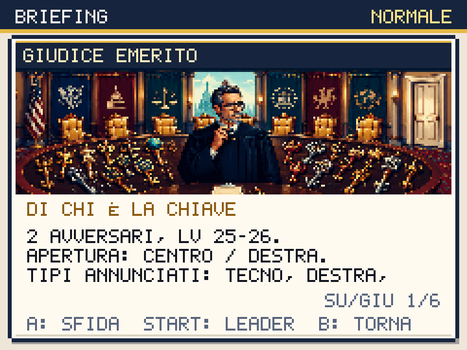
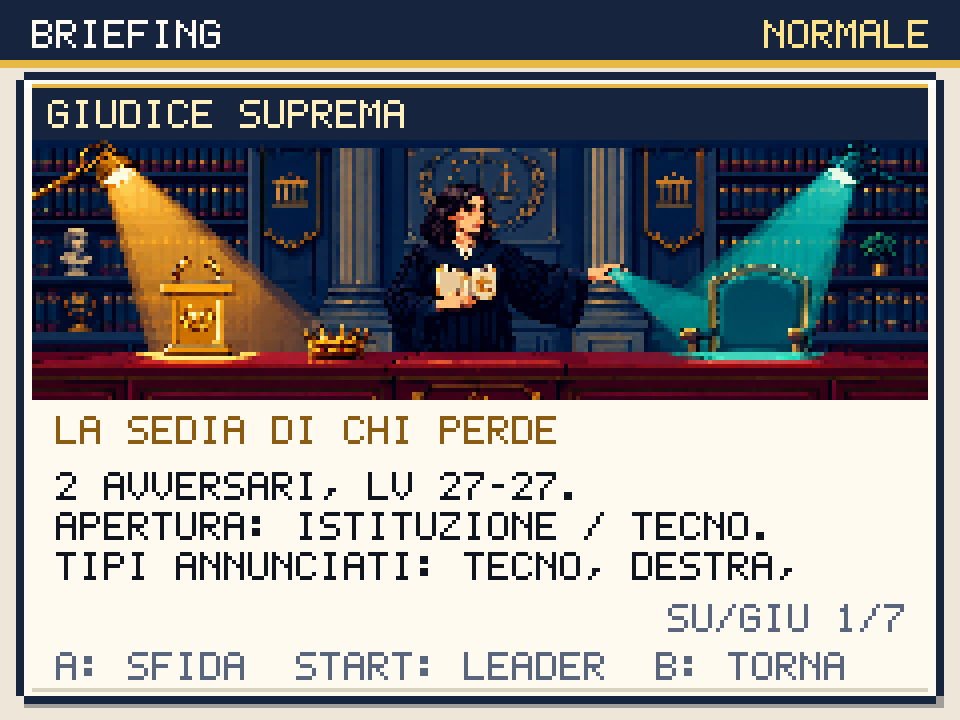

# Palazzo e Colle: il mandato non cancella il verbale

Round del 2 ottobre 2026. Le tre prove della Consulta e il Garante aspettano
**A**. I giudici hanno illustrazioni, briefing annullabili con **B** e scelta
del leader con **START**. Il percorso di ritorno attraverso il Palazzo
resta aperto: il bar di Capitale recupera PV, PP, status e KO fra le prove.
L'ambulante vende le cure da utilizzare durante le lotte.

## Tre prove riconoscibili

La prima giudice toglie l'eccezione riservata a chi firma la regola. Il
secondo incontra tre uffici che rivendicano una porta senza riparare la
serratura. La terza rimette nella foto la sedia di chi ha perso. Le risposte
dopo la vittoria riprendono la stessa contraddizione.

| Prova | Squadra normale | Livelli in difficile |
|---|---|---|
| La regola comune | Ursulax 24, Calendauro 25 | 27, 28 |
| Di chi è la chiave | Tajanide 25, Draghimon 26 | 28, 29 |
| La sedia di chi perde | Xipanda 27, Putingrad 27 | 30, 30 |

Squadre, livelli, ricompense e IA restano quelli del gioco. Aggiungere
l'artwork non concede ai giudici il profilo dei boss o un Gilet in difficile.
La missione delle tre prove diventa secondaria e conserva il completamento
individuale. Il Garante era già raggiungibile senza battere tutti i giudici;
il diario ora descrive correttamente questa scelta.

Il Garante conserva Zelenskir 28, Ursulax 29, Draghimon 30 e Mattarellux 32
con Gilet. Il Presidente Ombra conserva i quattro avversari 18/20/22/24.
L'archivio vuoto dei programmi eseguiti e l'idraulico senza ufficio stampa
sostituiscono i vecchi cartelli del Palazzo. Sono stati riscritti anche i
dialoghi dopo la vittoria e quelli dei due leggendari. Mattarellux annuncia
il proprio livello 49 prima della lotta. Fuga e KO continuano a lasciare
disponibile il leggendario; soltanto la cattura chiude l'incontro.

La ricerca ha consultato il motivo del doppio standard in
[Rules for thee but not for me](https://knowyourmeme.com/photos/2794076-history-memes)
e le [funzioni della Corte costituzionale](https://www.cortecostituzionale.it/contenuti/istituzioni/le-funzioni).
Battute e immagini sono originali. Le tre sfide inventate non sono
presentate come tre gradi di giudizio della Corte.

## Il morale arriva alla conclusione

La vittoria al Palazzo apre la porta e mostra il verbale reale della
partita. Il Garante separa il mandato dai sondaggi e legge lo stesso stato:
fiducia, coesione e numero di promesse mantenute, riparate o aperte.
Le vittorie non assegnano automaticamente fiducia ai cittadini.

Restano gli effetti concreti: fiducia alta/bassa modifica i prezzi;
coesione alta/bassa modifica la crescita PVE. Una promessa scade alla
terza nuova vittoria contro un allenatore della storia. Selvatici,
rivincite, Coppa e sfide ripetibili non consumano la scadenza. La
conclusione indica **START > MORALE** per finanziare o riparare il servizio;
il ritardo rimane registrato. Il finale esteso dell'Atto 3 continua a
leggere queste stesse scelte.

## Sei job, tre panorami installati

Sei generazioni `gpt_image_2_5`, **1,50 crediti**. Saldo verificato
**616,97 → 615,47**, cumulativo **270,50** dal saldo iniziale 885,97.

Le prime tre composizioni 16:9 sovrapponevano parte della testa alla barra
del titolo nel briefing nativo. Tre revisioni con riferimento conservano
i personaggi e ricompongono la scena in 21:9. Sorgenti finali 1344×576,
ritaglio da y=0 per 468 pixel, riduzione nearest a 224×78.

| Asset | Job finale | Byte PNG |
|---|---|---:|
| Giudice 1 | `b1bb2865-89cb-49b8-8617-3e65fd5dce37` | 26.091 |
| Giudice 2 | `6400debf-3dd5-414b-8819-ec0f05a7bec3` | 36.900 |
| Giudice 3 | `4ce8613b-dd2e-40da-b934-164dc0780389` | 30.749 |

Prompt, riferimenti, iterazioni scartate, sorgenti, trasformazioni e SHA-256
sono in `scripts/higgsfield-colle.json`. Il convertitore richiede Pillow:

```sh
python3 scripts/prepare-first-campaign-assets.py /percorso/giudice1.png \
  --manifest scripts/higgsfield-colle.json --asset giudice1
```







## Campagne nuove, risultati e limiti

Il controller `play-campaign-native.mjs` prosegue da NUOVA PARTITA fino al
Presidente Ombra o al Garante. Attraversa le mappe, sceglie i leader,
acquista dal negozio, apprende le mosse e accetta le evoluzioni tramite gli
input delle scene. Non assegna livelli, fondi, vittorie o flag di finale.

Una partita con promessa del bus ha trovato una sfida opzionale nel
corridoio accanto all'uscita del bar di Capitale: impediva di allontanarsi
verso la Tower. La protezione del punto di comparsa ora copre anche le
celle laterali all'approccio delle porte. Due regressioni riproducono
entrambe le direzioni davanti al bar nei due motori.

Il primo contatto con l'ambulante può essere solo una spiegazione delle
direttive: il controller controlla l'acquisto effettivo e torna a
interagire. Un passante può richiedere una breve attesa del percorso.
La politica finale preparata acquista fino a 8 Spritz e 4 Mojito,
affronta le tre prove e torna al bar. Prima del finale rifornisce quanto
consumato. Valuta danno, resistenze, status, potenziamenti e cambi gratuiti;
le stime usano copie del campo senza consumare PP o RNG.

| Partita / politica | Passi | Lotte | Sconfitte totali | Colle |
|---|---:|---:|---:|---|
| Baseline `fa07921`, Ellyna, percorso breve | 933 | 24 | 2 | Un giudice intercetta il percorso; Garante perso due volte |
| Nuovo percorso diretto, Ellyna | 940 | 23 | 2 | Nessun giudice affrontato; Garante perso due volte |
| Preparata tattica, Ellyna, nessuna scelta bus | 1.110 | 25 | 0 | Tre prove e Garante vinti al primo tentativo |
| Preparata tattica, Giorgetta, bus promesso | 1.077 | 23 | 4 | Tre prove vinte; Garante perso due volte |
| Preparata tattica, Renzino, bus finanziato | 1.087 | 23 | 3 | Tre prove vinte; Garante perso due volte |

Seed 20261002, difficoltà normale. Le partite attraversano anche primo
atto, Eurotown e Capitale; le sconfitte totali includono queste tappe.
La partita riuscita di Ellyna conclude con Schleinix 33, Movimenton 28,
Generorso 27 e Telecrate 27. Gli altri percorsi hanno panchine e mosse
differenti. La progressione di queste squadre resta da perfezionare:
il finale non è dichiarato verificato per tutti gli starter.

Le scelte native del bus producono stati distinti, verificati dopo il
Palazzo: pagamento **fiducia 62, coesione 66, mantenuta**; promessa
lasciata scadere **40, 54, aperta/scaduta**. La scena del Palazzo legge
rispettivamente 1 mantenuta o 1 aperta. Nella partita vittoriosa senza
scelta del bus, il Garante legge 50/60 e zero promesse. Le scelte non
sono state inserite direttamente nel salvataggio.

Esempio riproducibile:

```sh
BASE_URL=http://127.0.0.1:5188 STARTER=ellyna RUN_PLAN=prepared \
  EU_PLAN=tactical CAP_PLAN=prepared COURT_PLAN=prepared CIVIC_PLAN=skip \
  END_AT=garante EXPECT_COMPLETE=1 RUN_LABEL=colle-tactics \
  node scripts/play-campaign-native.mjs
```

JSON, codici salvataggio, narrativa osservata e screenshot sono prodotti
in `artifacts/campaign-native` e `artifacts/screens/campaign-native`.
La sintesi versionata con hash delle sorgenti, esiti e narrativa osservata
è in [colle-playtests.json](colle-playtests.json). Il percorso che prima
si bloccava ora supera Capitale e Palazzo e raggiunge il Garante: 1.032
passi, 22 lotte, due sconfitte contro il Garante; nessun errore di percorso.
Le durate del controller accelerato non rappresentano minuti di gioco umano.

## Verifiche del round

- **281 test**, typecheck e build riusciti. IA dei giudici verificata nelle
  due difficoltà.
- **3.690 viste** di briefing/dossier/leader per 16 illustrazioni.
  Annullamento reale WorldScene dei tre giudici e del Garante: niente PP,
  fondi, promesse, ricompense o avvio di una lotta. Rifiuto dei leader KO,
  leader persistito e avvio di BattleScene.
- **105 viste HQ**, 49 dossier missione su 92 pagine, zero overflow.
- Regressioni Chromium/WebKit: 86 approcci ai warp, cura gratuita e catture
  con apprendimento del candidato corretto. Porte allineate e accessibili.
- Audit statico: 47/47 scene con screenshot, zero clip residui. Le immagini
  action dedicate restano 10/52; le pose runtime non sono tutte nuove action
  disegnate separatamente. Validator: 52 specie, 78 mosse, 49 trainer,
  66 mappe, 49 quest, 8 eventi meme.
- Bundle iniziale **189.456 byte gzip**, totale **358.361**, limite 358.400:
  restano **39 byte**. World/Battle/Dex p95 **18,5/18,5/18,5 ms**, CPU ×4.
  Ulteriori funzioni richiedono una riduzione strutturale del bundle.
- Release locale: **427 checksum PNG** e **536 asset Higgsfield PWA** in
  Chromium/WebKit. Reload offline verificato in Chromium; in WebKit sono
  verificati precache e primo utilizzo offline, perché Playwright non
  supporta il reload offline del service worker WebKit.

Pubblicazione **258b8bc** su master: [CI 36964930805](https://github.com/Kind3rin/politicmon/actions/runs/36964930805)
e tutti e tre i deploy Vercel riusciti. Su
[politicmon.vercel.app](https://politicmon.vercel.app/) sono verificati
427 checksum PNG, 536 asset PWA, aggiornamento della cache, ripresa dopo
background e sei configurazioni della cornice esterna in Chromium/WebKit
(390×844, 844×390, 1280×800). Reload offline Chromium riuscito; la limitazione
Playwright WebKit descritta sopra resta applicabile.

Restano progressione fino al Colle per le diverse squadre, atti successivi,
audio, dialoghi delle altre zone e verifica integrale del redesign.
