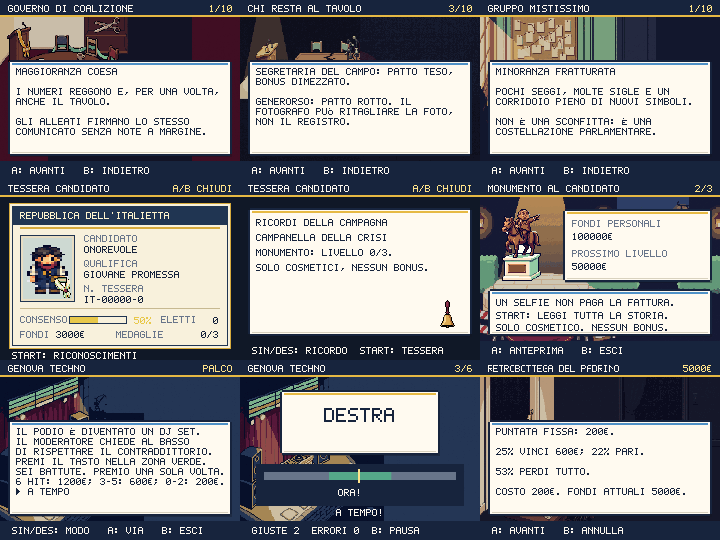

# Epiloghi, ricordi e postgame

Round del 2 ottobre 2026. Quattro finali personali, ricordi visibili nella
tessera, monumenti illustrati e attività con avvio/anteprima annullabile.
Questo round non chiude il redesign dell'intera campagna.

## Finali che ricordano la partita

L'epilogo legge il risultato elettorale, gli alleati ancora presenti, i patti
tesi/riparati e il registro delle rotture, comprese quelle di chi ha lasciato
il tavolo. Riporta fiducia e coesione, ogni promessa con nome e stato e le
scelte registrate su foto, Generorso e diplomazia. Le pagine conservano tutto
il testo. B torna indietro; A nell'ultima pagina consegna il premio e torna
al mondo. Guardie contro doppio premio e doppio callback.

I quattro souvenir esistevano come flag ma erano invisibili: fascia,
campanella, megafono e tessera del gruppo misto hanno ora icone e nomi nel
menu TESSERA. START apre i riconoscimenti; SIN/DES sceglie tra quelli ottenuti.
Il titolo del monumento massimo è leggibile per intero. Nessun bonus PvP
viene attribuito ai cosmetici. La chiusura della foto non mostra più il
termine di sviluppo «vertical slice» e riconosce anche le rotture storiche.

## Gameplay nel postgame

Genova Techno attende A per iniziare. SIN/DES sceglie tra prova a tempo e
senza timer; RIDUCI EFFETTI propone quest'ultima. Nella prova ritmica ogni
segnale dura 1,35 secondi, con finestra di 0,44 secondi centrata a metà barra.
Premere troppo presto non assegna un hit; un input tardivo/sbagliato o un
segnale scaduto conta un errore. B mette in pausa senza consumare tempo:
A riprende, B esce senza premio. Sei hit sono PERFETTO; 3–5 sono IN ONDA.
Il risultato mostra quanto è stato davvero accreditato, con sondaggi limitati
a 100; le ripetizioni sono allenamento e pagano zero. Anche senza timer il
premio rimane una tantum.

Il monumento ha quattro sprite coerenti. A apre il preventivo completo per
il prossimo livello; B annulla; A alla fine paga 10.000/25.000/50.000 euro.
La transazione verifica nuovamente livello e fondi, impedendo conferme
obsolete, doppio pagamento e costruzione oltre il massimo. START legge
l'intera descrizione, comprese le ultime righe del colosso. La spesa è
esplicitamente cosmetica.

Nel retrobottega ogni direttiva e favore a pagamento apre un dossier prima
della conferma: effetto, prezzo, fondi e perdita effettiva di sondaggi,
fiducia e coesione dopo i limiti. B non spende né estrae un risultato casuale.
I risultati riportano i delta effettivi. La scommessa espone sia le
probabilità sia gli incassi lordi e la perdita media di 6 euro per puntata.
Le guardie per fondi, direttive già possedute e protezione permanente restano
attive. L'annullamento precede anche l'estrazione della scommessa.

## Satira e riferimenti

Testi originali sul podio convertito in DJ set, sul contraddittorio chiesto
al basso, sulle sedie che non applaudono, sul registro che il fotografo non
può ritagliare e sulla porta laterale che non distribuisce numeri di attesa.
Per Genova è stato consultato l'annuncio del concerto al Porto Antico
([ANSA, 15 settembre 2026](https://www.ansa.it/amp/ansa2030/notizie/green_blue/2026/09/15/salis-lanciamo-il-fuori-salone-il-2-ottobre-dj-novah_b0f55b43-43d8-42bb-9a16-585a43daf132.html)).
Il gioco inventa personaggi, dialoghi e contabilità: non attribuisce queste
frasi o questi favori alle persone della notizia. Non riproduce meme altrui.

## Produzione e prove

Nove job Nano Banana Pro, backend `nano_banana_2`, tutti completati: sette
fondali 240×163, quattro icone 32×32 e quattro statue 64×76. **18 crediti**,
saldo verificato **657,97 → 639,97**, cumulativo **246** dall'inizio dei round.
Fonti, prompt, job e checksum sono in `scripts/higgsfield-epilogue.json`.
Preparazione in staging e revisione visiva prima dell'installazione.
Le linee separatrici dei due fogli sono state escluse ritagliando 16 pixel
dai margini delle celle, senza tagliare oggetti. Nessuna nuova generazione
necessaria. Tutti i 15 PNG sono integrati e hanno SHA-256 registrato.

- **265 test** riusciti senza SKIP: ricordi conservati nell'importazione del
  save, anteprime pure, memoria delle promesse e rotture, transazioni del
  monumento, finestre ritmiche, modalità accessibile, limiti e premi una tantum.
- `shot:epilogue`: **214 viste native**, quattro finali a tre livelli di morale,
  tessere, monumenti/storie/annullamenti, ritmo/pausa/timeout/allenamento,
  sei transazioni del retrobottega e rifiuto per fondi mancanti. Zero errori
  browser e zero testo fuori dal canvas. Le immagini sono state riviste.
- Typecheck, contenuti, meme pack, input, leggibilità, evoluzioni e audit
  visuale statico riusciti. **505 PNG** non vuoti. Gli audit statici e questa
  matrice non equivalgono a una campagna completa giocata su tutte le mappe.
- Budget 250/350 KiB gzip e 33,4 ms invariati. Misure finali: **206,6/343,3 KiB**, p95 mondo/lotta/dex **18,5/18,5/18,5 ms**, Chromium con CPU ×4.
- Verifica della build locale: **397 checksum** e codice dei nuovi epiloghi
  e del ritmo. PWA Chromium/Pixel 7: **506 risorse Higgsfield** al primo uso
  offline, migrazione del salvataggio, aggiornamento, reload e resume.

La revisione prosegue su altre scene, audio, ritmo delle lotte, casinò/coppa,
interfaccia esterna e percorsi reali della campagna.

Pubblicato nel commit `4340c40`: [CI riuscita](https://github.com/Kind3rin/politicmon/actions/runs/36941084208)
e deploy Vercel completato. Sul dominio [politicmon.vercel.app](https://politicmon.vercel.app/)
sono stati verificati **397 checksum** e il nuovo codice degli epiloghi e del
ritmo; la prova PWA Chromium/Pixel 7 ha confermato **506 risorse** al primo
uso offline, migrazione, aggiornamento, reload e resume. Le evidenze native
sono in `artifacts/screens/epilogue`; la selezione pubblicata è quella sopra.
