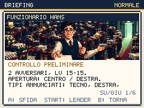

# Eurotown: prepararsi prima di firmare

Round del 2 ottobre 2026. Il tratto dopo Auditel ora permette di scegliere
quando combattere, reclutare e recuperare i PP. Hans offre una prova
facoltativa con un nuovo briefing illustrato. Il bar dichiara esattamente
che cosa cura e lascia tornare più rapidamente all'esplorazione.

## Percorso e preparazione

I tre ospiti del Percorso 2, il lobbista nella piazza e Hans iniziano la
sfida con **A**, con un'indicazione sopra la testa. Passare vicino a loro
non avvia più una catena di battaglie. Hans può essere annullato con **B**;
uscire dal tappeto a sud consente di curarsi prima di Lady Direttiva.
Cartelli, guida di Luca e missione Spread spiegano questi passaggi.

Il briefing consente già di scegliere il leader con **START**: un abitante
ora lo segnala. Le Direttive della borsa restano riutilizzabili e il bistrot
lo spiega. Le squadre avversarie, i livelli e le ricompense non cambiano:
Hans è al livello 15/15 normale e 18/18 difficile, Lady Direttiva al 15/17
normale. L'aggiunta dell'illustrazione non promuove Hans al profilo IA dei
boss: conserva il comportamento precedente in entrambe le difficoltà.

Il bar ripristina **PV, PP, status e KO** gratuitamente. Il vecchio messaggio
«massimo del consenso» era impreciso: la cura non aumenta sondaggi o morale.
La ricevuta ora elenca gli effetti reali. La spiegazione delle rivincite e
del punto esclamativo dorato compare alla prima cura, insieme alla guida del
bar; nelle visite successive bastano saluto e ricevuta. La fixture verifica
due visite, fondi e sondaggi invariati, tutti i PP recuperati e la lezione
delle rivincite mostrata una sola volta.

## Satira della scelta precompilata

Il consenso precompilato del lobbista, il rifiuto nascosto in fattura,
l'applauso fuori preventivo e il consulente che rimpiange il modulo tolto
sostituiscono le battute generiche su burocrazia, banane e traduzioni.
Le risposte dopo la vittoria riprendono la contraddizione introdotta prima
della lotta. Sono dialoghi originali, senza immagini o testi copiati dai meme.

La ricerca ha consultato il meme dei cookie
[The Italian cookie gatekeeper](https://knowyourmeme.com/photos/3175453)
e il tema della scelta effettiva nel
[parere EDPB su consent or pay](https://www.edpb.europa.eu/news/edpb-consent-or-pay-models-should-offer-real-choice_en).
Il bersaglio è chi presenta come libera una scelta costruita per ostacolare
il rifiuto. Non viene attribuita una nuova regola giuridica ai personaggi.

La pagina del
[Consiglio UE sulla semplificazione](https://www.consilium.europa.eu/it/policies/simplification/),
aggiornata il 30 settembre 2026, descrive proposte e misure con stati diversi.
Da questo contesto nasce la scena inventata della firma eliminata che
richiede tre incontri di consulenza: non è un'affermazione sul risultato
complessivo delle politiche europee.

## Immagine Higgsfield

Un job `gpt_image_2_5`: **0,25 crediti**, saldo verificato
**617,72 → 617,47**, cumulativo **268,50** dal saldo iniziale 885,97.
Job `26f92cbc-072d-42ff-be98-01ad15a177ae`. Hans è un funzionario immaginario,
tra fascicoli a spirale e una porta accessibile illuminata. L'immagine non
contiene parole; nomi, livelli e suggerimenti vengono disegnati dal gioco.

Sorgente 1344×752; ritaglio a y=72, altezza 468, riduzione nearest a
224×78. Il PNG finale pesa 40.927 byte. Prompt, modello, job, URL, saldo
e SHA-256 sono in `scripts/higgsfield-eurotown.json`. Il convertitore
esistente accetta ora `--manifest`; il comando precedente per Mara conserva
il proprio manifest predefinito.

```sh
python3 scripts/prepare-first-campaign-assets.py /percorso/hans-source.png \
  --manifest scripts/higgsfield-eurotown.json
```



## Partite dall'inizio fino a Spread

`play-campaign-native.mjs` parte da una partita nuova e usa gli input reali
per camminare, scegliere lo starter, combattere, reclutare, curarsi,
apprendere, evolvere e scegliere il leader. Non assegna medaglie, soldi,
livelli o esiti. L'osservazione della battaglia richiama il callback reale.
Il controller legge lo stato per pianificare il percorso e le mosse.

Tre partite normali, seed 20261002, con preparazione del primo atto e
politica tattica dopo Auditel:

| Starter | Passi totali | Lotte | Sconfitte totali | Reclutamenti | Leader contro Lady Direttiva | Spread |
|---|---:|---:|---:|---:|---|---|
| Ellyna | 594 | 16 | 0 | 3 | Schleinix | Primo tentativo |
| Giorgetta | 464 | 12 | 0 | 3 | Grillix | Primo tentativo |
| Renzino | 520 | 14 | 1 | 3 | Grillix | Primo tentativo |

Renzino perde una volta contro Sua Emittenza e vince la riprova. Tutte e
tre le partite vincono la prova di Hans e Lady Direttiva al primo tentativo.
Gli starter evolvono nelle scene reali; le nuove reclute provengono dai
selvatici incontrati camminando.

La politica tattica cerca un quarto candidato sul Percorso 2, cura la squadra,
affronta un ospite e Hans, torna al bar e sceglie il leader nel briefing.
Confronta danno atteso, precisione e PV attuali; usa lo stesso criterio per
i rimpasti dopo i KO. Non effettua cambi volontari mentre il leader è ancora
in campo: rimangono altre strategie da verificare.

Una prova distinta con **Giorgetta**, stesso primo atto preparato ma percorso
diretto dopo Auditel, salta ospite e Hans e cura comunque la squadra: perde
entrambi i tentativi contro Lady Direttiva. La medaglia non viene assegnata.
Anche la preparazione standard a tre membri, prima dell'ultimo ritocco dei
dialoghi, perde due volte; reclutamento, crescita della panchina e scelta
del leader insieme rendono praticabile una risposta diversa. La prova non
isola il contributo di ciascuna decisione e non dimostra che una sola
combinazione sia necessaria.

Il confronto preliminare Ellyna sulla build precedente `89aa3f7` percorre
435 passi e conquista Spread alla seconda prova, con sfide automatiche e
senza pausa di cura tra Hans e Lady. La nuova preparazione standard percorre
454 passi e vince al primo tentativo. È un confronto di percorso e scelte
su un seed, non una stima statistica del bilanciamento.

Riproduzione della matrice tattica:

```sh
for starter in ellyna giorgetta renzino; do
  END_AT=spread RUN_PLAN=prepared EU_PLAN=tactical EXPECT_BADGE=1 \
    RUN_LABEL=spread-tactical STARTER="$starter" npm run playtest:campaign:native
done
END_AT=spread RUN_PLAN=prepared EU_PLAN=direct RUN_LABEL=spread-direct \
  STARTER=giorgetta npm run playtest:campaign:native
```

Dev server predefinito: porta 5188, modificabile con `BASE_URL`. JSON,
checkpoint esportabili e immagini native vengono scritti in
`artifacts/campaign-native/` e `artifacts/screens/campaign-native/`.
Il tempo di simulazione è accelerato, audio e rete sono disattivati: i
contatori in secondi non misurano minuti di gioco umano o prestazioni.

## Verifiche e limiti

- **280 test** superati; validatore dei contenuti superato.
- **Chromium e WebKit:** 86 approcci alle porte nella fixture, annullamento
  di Mara/Hans nelle due difficoltà, cura reale dei KO e dei PP, catture
  naturali con squadra da tre/sei, apprendimento della panchina e persistenza.
  I livelli difficili sono controllati nel briefing; non sono partite
  complete in modalità difficile.
- **2.622 layout di briefing**, undici illustrazioni; annullamento,
  selezione persistente del leader e ingresso in lotta controllati.
- **103 viste HQ**, incluse le istruzioni aggiornate di Spread.
- **Build locale:** 422 checksum PNG; 531 risorse Higgsfield nella prova
  PWA Chromium/WebKit. Reload offline verificato solo in Chromium;
  Playwright WebKit verifica precache e primo utilizzo degli asset.
- **Performance:** codice gzip iniziale 212.218 byte, totale 358.369 byte;
  p95 massimo 18,5 ms con CPU Chromium ×4. Il limite totale resta 358.400
  byte: **31 byte di margine**. Prima di nuove funzioni serve recuperare
  spazio nel codice o nella modularità, senza alzare il budget.

Il round arriva a Spread normale. Capitale, Palazzo, Colle, atti successivi,
campagna completa, difficoltà alta, audio e scrittura delle altre zone
restano nel [piano attivo](REDESIGN-PLAN.md).

## Pubblicazione verificata

Codice e documentazione pubblicati in `2bdc24e`, con
[CI riuscita](https://github.com/Kind3rin/politicmon/actions/runs/36958740661)
e tre deploy Vercel riusciti. Sul
[dominio pubblico](https://politicmon.vercel.app/) corrispondono tutti i
422 checksum e i nuovi riferimenti nel bundle. La PWA verifica 531 asset,
migrazione v13→v18, salvataggio conservato, aggiornamento della cache e
ripresa dal background in Chromium/WebKit; il reload offline passa in
Chromium. Le sei configurazioni della cornice esterna passano in entrambi
i motori, con titolo fermo sotto la guida e focus ripristinato alla chiusura.
