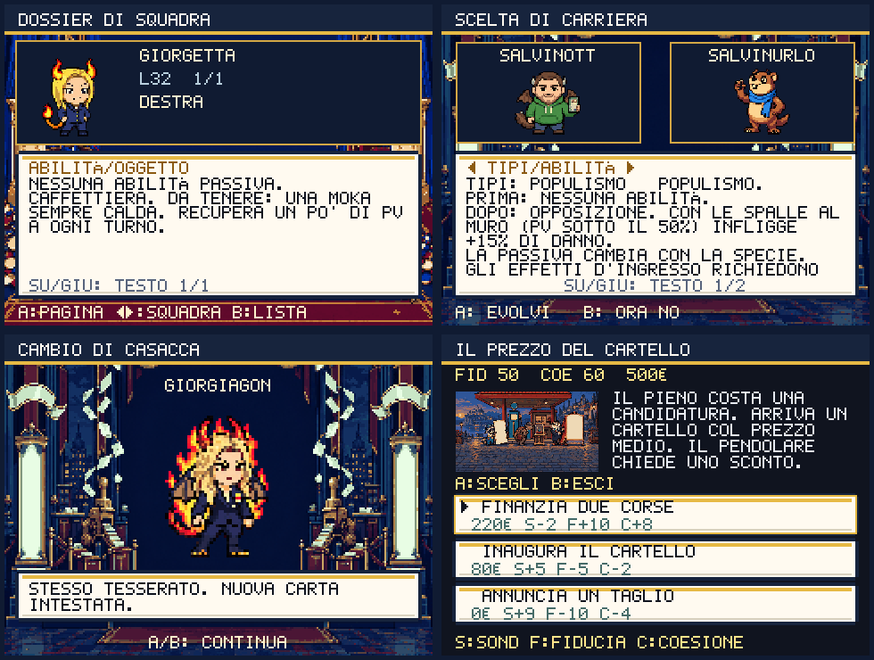

# Evoluzioni, schede squadra e caro carburante

Round del 1 ottobre 2026. Questa revisione sostituisce la vecchia scheda unica e
la trasformazione automatica con una scelta consultabile. Il redesign complessivo
resta aperto: [piano corrente](REDESIGN-PLAN.md).



## Dossier della squadra

A su un membro della squadra apre cinque pagine: PROFILO, MOSSE,
ABILITÀ/OGGETTO, CARRIERA e DIFESE. A cambia pagina, SU/GIU scorre tutto il testo,
SINISTRA/DESTRA sfoglia i membri mantenendo la pagina e B torna alla lista.
Le descrizioni non sono tagliate alle prime due righe.

MOSSE: START seleziona la mossa successiva; mostra effetto, PP, tipo e priorità.
ABILITÀ/OGGETTO conserva i nomi e le descrizioni complete. DIFESE mostra i
moltiplicatori dei tipi; il profilo usa i valori effettivi del singolo esemplare.
In PROFILO, START riprende l'oggetto tenuto nella borsa e salva la modifica.
Nei mirror la consultazione non sposta oggetti nella borsa originale.

CARRIERA mostra tutte le regole della specie, comprese soglie dei sondaggi,
rami alternativi, tessere e scambi. Una forma per livello già disponibile si
può aprire con START, anche al livello massimo: non serve un altro level-up.
I sondaggi vengono letti nuovamente all'apertura, quindi un rinvio può cambiare
il ramo disponibile. Le tessere continuano a usarsi dalla borsa, gli scambi
richiedono la procedura di rete.

## Scelta prima della trasformazione

Ogni evoluzione da livello, tessera o scambio apre il confronto fra le forme:
SINISTRA/DESTRA cambia VALORI, TIPI/ABILITÀ e MOSSE; SU/GIU scorre il testo.
A accetta, B rinvia senza modificare la creatura. La tessera viene consumata
soltanto dopo la trasformazione confermata; annullare lo scambio di forma non
annulla lo scambio di creature già concluso. Quest'ultimo resta salvato.

VALORI confronta statistiche e PV allo stesso livello, applicando le regole vere
su una copia. I PV conservano la proporzione; una creatura KO resta KO. Status,
oggetto e mosse rimangono, i PP non vengono ricaricati e la forma meme stagionale
si azzera. Non vengono insegnate automaticamente mosse dei livelli passati.
MOSSE distingue quelle conservate dalle future mosse del nuovo learnset.

La passiva cambia insieme alla specie; gli effetti all'ingresso richiedono un
nuovo ingresso in campo. La trasformazione non equivale a un cambio gratuito
né azzera i modificatori della battaglia in corso.

La rivelazione usa una nuova camera Higgsfield e il roster animato. Le carte
intestate e i simboli sono il tema della scena, senza il precedente lampo bianco
su tutto lo schermo. A salta l'animazione; la conferma finale applica una sola
volta la trasformazione. RITMO RAPIDO accelera la presentazione e RIDUCI EFFETTI
ferma pose e particelle mantenendo leggibile la scelta.

## Il prezzo del cartello

Il benzinaio del Percorso 3 apre la settima scelta civica. Sono tre risposte con
costi e conseguenze visibili:

| Scelta | Costo | Sondaggi | Fiducia | Coesione |
|---|---:|---:|---:|---:|
| Finanzia due corse | 220€ | −2 | +10 | +8 |
| Inaugura il cartello | 80€ | +5 | −5 | −2 |
| Annuncia un taglio | 0€ | +9 | −10 | −4 |

La decisione persiste nel verbale e il dialogo del benzinaio cambia al ritorno.
Non si possono accumulare bonus ripetendola; fondi insufficienti non registrano
alcuna scelta. Fiducia e coesione continuano a influenzare prezzi e crescita
secondo le loro soglie. I sondaggi misurano la visibilità della campagna.

La vignetta e i dialoghi sono originali. Gli spunti storici sono l'ironia sul
rifornimento diventato bene prezioso nella
[raccolta Sky TG24 del 2022](https://tg24.sky.it/cronaca/2022/03/16/caro-benzina-meme)
e il contrasto fra cartelli e prezzi descritto da
[ANSA il 5 agosto 2023](https://www.ansa.it/canale_motori/notizie/mondo_motori/2023/08/05/consumatori-flop-cartelli-sale-ancora-prezzo-carburanti_c8fd46e7-752c-4333-8823-d9c5a7b7a6b2.html).
Il gioco non riproduce prezzi odierni né attribuisce i suoi dialoghi a persone reali.

## Asset e verifiche

Tre job GPT Image 2.5: 4,5 crediti, saldo verificato 774,47 → 769,97.
Fondali evoluzione e dossier 240×180; vignetta pompa 240×136. Palette 48 colori,
nessun testo generato; 132.807 byte complessivi. Prompt, job e originali:
[scripts/higgsfield-evolution-dossier.json](../scripts/higgsfield-evolution-dossier.json).

Con Python e Pillow: `python3 scripts/prepare-evolution-dossier.py --download`
ricostruisce i PNG dagli originali esistenti senza nuove generazioni.
Il preload è differito e la precache include tutti i 76 asset Higgsfield.

Sono state rimosse le vecchie caricature testuali dei mostri e le chiamate a
quel renderer. I fogli animati sono prioritari; un foglio assente usa il PNG
base registrato, un PNG assente mostra il placeholder. Il validator richiede
un PNG registrato e presente per tutte le 52 specie, comprese le evoluzioni.

```sh
npm test
npm run typecheck
npm run check:evolutions
npm run validate:content
npm run audit:input-contracts
npm run audit:text-legibility
npm run audit:satire
# Vite dev sulla porta 5179:
npm run shot:evolution-dossier
npm run shot:monster-frames
npm run shot:gameplay-guide
npm run shot:switch-guide
npm run shot:morale-satire
# Build e preview sulla porta 4180:
npm run perf:check
npm run smoke:pwa:release
```

246 test; matrice schede/evoluzioni di 2.137 layout senza sovrapposizioni o testo
fuori schermo. Il controllo attraversa squadra, borsa e scambio locale già
concluso: verifica rinvio, nuova soglia, salvataggio, consumo della tessera,
rilascio dello stato multiplayer occupato e callback singola. La procedura di
rete dello scambio non è simulata come prova di connettività.

Regressioni: 260 campioni delle pose, renderer PVE/PVP e fallback; 1.846 layout
del dossier di battaglia; 247 layout dei cambi; 23 scene del morale. Il test PWA
controlla migrazione v13→v18, conservazione del salvataggio e primo utilizzo
offline di tutti gli asset, comprese le tre immagini nuove.
