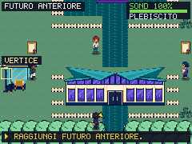
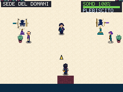
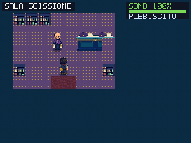
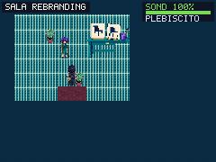
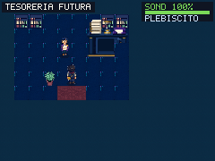
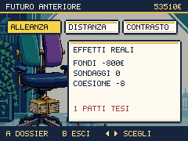
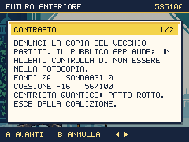
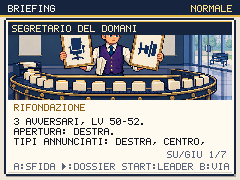

# Futuro Anteriore: il conto del nuovo logo

Round del 2 ottobre 2026, successivo al Campo Largo pubblicato. Il redesign generale resta attivo: questo verbale riguarda le cinque mappe di Futuro, le scelte, il Segretario e il ramo Futurorso.

La sede è un edificio largo 128×48 con due porte reali, tetto a manifesti piegati e vetri viola. Piazza, sala principale e tre uffici hanno materiali e arredi propri. La Scissione divide le scrivanie ma conserva la base del debito; il Rebranding presenta due sedie uguali; la Tesoreria ha una cassaforte vuota e una clessidra esaurita. Sette personaggi, 28 viste direzionali, sostituiscono i ruoli generici del capitolo. Sono fermi durante le interazioni.

## Prima del voto

Le leve richiedono i verbali delle due sale: parlare con i responsabili registra la lettura; poi gli addetti autorizzano il trasloco e la grafica. Un tentativo anticipato indica la porta corretta senza applicare costi o riparazioni. Le leve già approvate nei vecchi salvataggi restano valide. La Tesoreria è facoltativa: legge fiducia, coesione, patti tesi e il prezzo reale delle promesse scadute nel menu Morale.

Al tavolo centrale ci sono **tre** scelte. Il dossier mostra prezzi, consenso e conseguenze prima della conferma; B annulla. L’alleanza costa 800, aggiunge Generorso alla coalizione e applica la linea rossa 10. La distanza incassa 600 fondi base, modificati dai patti. Il contrasto dà due punti di consenso, entro 100, e applica la linea rossa 11. Un primo strappo costa otto punti di coesione e dimezza il bonus del patto; il secondo lo rompe, toglie l’alleato e costa sedici. Fiducia e servizi civici non si riparano firmando un nuovo nome.

La satira parte dal motivo di [They’re the Same Picture](https://knowyourmeme.com/memes/theyre-the-same-picture): presentare come diverse due cose uguali. Qui diventa un ufficio originale che fattura la novità di una cornice; dialoghi e immagini sono nuovi, senza usare il fotogramma del meme. Il personaggio sulla mappa e quello nel panorama del dossier condividono il nuovo Segretario dai capelli grigi.

## Preparazione, sfida e reclutamento

Il Segretario compare dopo la scelta. A apre il briefing; B rinvia la lotta. Non attacca dal campo visivo. La squadra resta Vannaccix 50, Futurorso 52, Mediocrate 50, con IA di preparazione e abilità dichiarate. Il dossier permette di scegliere il primo candidato. Le cure gratuite del Campo recuperano PV e PP; uscire e rientrare conserva verbali, leve e scelta. Le due uscite di ogni ufficio e le due porte della sede sono praticabili.

La vittoria assegna una sola volta i flag del capitolo, la Tessera Futuro e l’accesso al vertice. **Non regala fiducia o coesione.** Il verbale finale legge ancora i servizi scaduti e i patti tesi.

Il nuovo prato a est della piazza recluta Vannaccix 43–46 solo dopo la vittoria. Questo reclutamento guadagnato funziona in Governo e Opposizione; le altre esclusive restano tali. Il Circolo nel retropalco permette di liberare un posto. Usare subito la Tessera sul nuovo Vannaccix apre Futurorso; guadagnare prima un livello lo porta invece a Generorso. Un primo audit richiedeva 31 incontri allo Stretto per questa prova: il vivaio sostituisce quel ritorno e mantiene il reclutamento adeguato alla squadra di fine capitolo.

## Cinque segmenti guadagnati

Tutti ripartono da `campo-verbale` dei salvataggi ottenuti al Campo tramite comandi del gioco, senza assegnare squadra, fondi o strumenti. La prima fotografia del segmento differisce dal codice padre solo per 0,4 secondi di assestamento del tempo di gioco; lo stato serializzato restante coincide. Seed del segmento 20261002, difficoltà normale; non è una campagna ininterrotta dall’inizio. Tre roster avversari uguali e un solo tentativo vincente in ciascun segmento non certificano ogni combinazione o la difficoltà alta.

| Salvataggio e scelta | Fondi finali | Fiducia / coesione | Conseguenza osservata |
|---|---:|---:|---|
| Ellyna, alleanza | 57522 | 68 / 66 | Segretaria tesa, Generorso alleato; un candidato KO dopo la sfida |
| Renzino, contrasto | 55512 | 80 / 56 | Il Centrista già teso esce al secondo strappo |
| Giorgetta, distanza | 48422 | 36 / 56 | Due promesse restano scadute; il premio non le cancella |
| Ellyna con Salisound, alleanza | 56488 | 68 / 66 | Recluta del Campo conservata nel percorso successivo |
| Giorgetta, distanza e riparazioni | 47477 | 50 / 62 | Morale paga 945: bus 270, molo 675; Vannaccix reclutato ed evoluto |

Nell’ultimo percorso il menu Morale ripara i due servizi prima della scelta: fondi −945, fiducia +14, coesione +6, ritardi ancora nel verbale. Dopo la vittoria, Telecrate viene depositato realmente nel Circolo; il prato offre un Vannaccix 44, catturato con una Schedona. Il partecipante riceve 1400 punti consenso e la panchina viva la propria quota; il nuovo reclutato conserva gli 87507 punti iniziali. La Tessera guadagnata viene consumata dal normale menu Borsa e Vannaccix diventa Futurorso 44, senza EXP inventata. Il percorso torna alle cure e arriva al vertice.

`scripts/play-campaign-native.mjs` registra i punti annunciati dal motore: al limite 55 la crescita personale resta ferma, mentre la panchina sotto il limite riceve la quota. Questo evita un’asserzione falsa durante l’audit allo Stretto; il limite del gioco non è stato alzato.

La provenienza, le impronte dei codici, i cambi di morale, i roster realmente schierati e i risultati sono in [future-proof.json](future-proof.json). Gli originali e i report completi locali rimangono in `artifacts/`, escluso da Git.

## Risorse e verifiche

27 tentativi Higgsfield: 26 completati e uno fallito rimborsato. 23 sorgenti finali, **44 PNG runtime**, 42 percorsi nuovi e due sostituzioni. Tre rigenerazioni riuscite correggono identità del Segretario, pavimento e parete troppo fitti alla scala nativa. Spesa **39 crediti**, saldo **561,22 → 522,22**; cumulativo **363,75** dai primi 885,97. Nessun acquisto. Job, prompt, sorgenti precedenti, hash e correzione delle viste est/ovest dello scissionista sono in `scripts/higgsfield-future.json`. `prepare-future-assets.py` esegue solo ritaglio, soglia alpha, palette e resize nearest.

288 test passano; contenuti, pacchetti meme, controlli, evoluzioni e audit visivo statico passano. In Chromium e WebKit: porte, tre uffici, firme, annullamento, fondi insufficienti, secondo strappo, morale conservato, ritorno alle cure e 28 viste del cast. La navigazione usa cloni di salvataggi guadagnati; danni artificiali e fondi 799 sono fixture esplicite, non vittorie. 146 viste delle scelte verificano transazioni e testo; 12551 layout dei briefing per motore verificano anche leader, KO, cancellazione e avvio reale della battaglia. 66 mappe, 253 viste e 220 pose condivise sono decodificate; le schermate non certificano ogni percorso.

Build: bundle iniziale 184,0 KiB e totale 349,6 KiB gzip, entro il limite 350. Intervalli p95 mondo, lotta e Dex circa 17,5 ms nella prova mobile con CPU rallentata. 668 risorse esatte nell’inventario PWA, una sola richiesta di inventario e fallimento esplicito su inventario non disponibile o malformato. La produzione locale verifica 529 checksum PNG, 20 audio/catalogo, 636 prime risorse offline e 19 tracce AAC. Chromium prova il riavvio offline; WebKit verifica cache e primo utilizzo offline, mentre Playwright non supporta il suo reload offline. I dispositivi fisici restano una verifica aperta.

Sei percorsi nativi della build locale importano tre stati guadagnati nei due motori: ingresso alla sede, apertura e cancellazione del briefing, ritorno dal vertice. Fondi, squadra, morale, coalizione ed elezione rimangono identici. La pubblicazione viene registrata qui dopo la verifica della CI, dei deploy e degli stessi percorsi pubblici.

Il prossimo audit è [DIPLOMACY-AUDIT.md](DIPLOMACY-AUDIT.md). Restano tutti gli ambiti aperti nel [piano generale](REDESIGN-PLAN.md).
