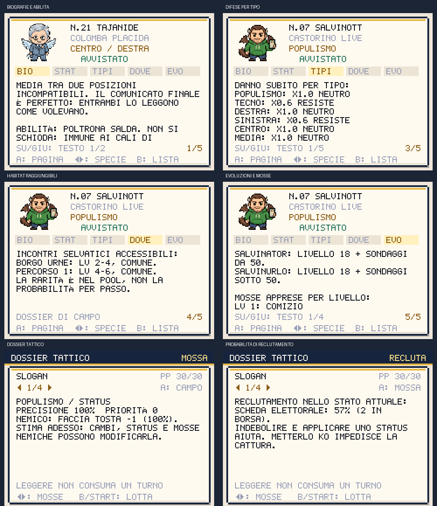
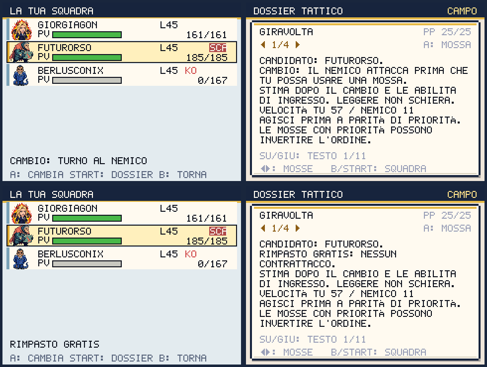

# Politicmon: gameplay, Politicdex e animazioni

Revisione del 1 ottobre 2026. La guida usa le regole della simulazione: leggere
una scheda non consuma turni, PP, abilità una tantum o numeri casuali.



## Politicdex

La lista offre TUTTI, VISTI, ELETTI, MANCANTI e QUI. Frecce destra/sinistra
cambiano filtro; START filtra per tipo tra le specie già avvistate. A apre la
scheda; nella scheda A cambia pagina, destra/sinistra cambia specie e su/giù
scorre il testo. B torna alla lista conservando visibile la specie selezionata.

Ogni specie ha cinque pagine, più le eventuali forme meme sbloccate:

| Pagina | Contenuto |
|---|---|
| BIO | Descrizione satirica completa, abilità e sue regole |
| STAT | Cinque valori base e difesa speciale, quando diversa |
| TIPI | Danno subito dagli otto tipi, inclusi i tipi doppi |
| DOVE | Habitat raggiungibili, livelli, rarità nel pool, incontri unici, scambi ed evoluzioni di provenienza |
| EVO | Evoluzioni per livello/oggetto/scambio, soglie dei sondaggi e mosse apprese |

Gli habitat rispettano versione, confini, medaglie, flag e opzioni di contenuto.
Una specie sconosciuta mostra indizi di acquisizione; biografia, ritratto,
statistiche e tipi richiedono l'avvistamento. La rarità descrive il peso della
specie nel pool selvatico, non la probabilità di incontrarla a ogni passo.

Sono state riscritte 39 biografie: la comicità nasce da programmi, deroghe,
slide, conferenze e contraddizioni del mondo di fantasia. Il richiamo di Renzino
a «first reaction shock» deriva dalla citazione ripresa ironicamente dallo
stesso Renzi, documentata da
[CorriereTV](https://video.corriere.it/politica/renzi-ironizza-suo-inglese-first-reaction-shock-tormentone-questo-periodo/6ab11a3c-5974-11eb-89c7-29891efac2a7).
Le altre fonti e la revisione della storia sono in [SATIRA-MORALE.md](SATIRA-MORALE.md).

## Dossier prima della mossa

START nel menu LOTTA delle battaglie PVE apre il dossier. B o START lo chiudono;
la selezione della mossa resta quella consultata. A passa tra MOSSA, CAMPO e,
negli incontri selvatici, RECLUTA.

- MOSSA: intervallo di danno senza critico, precisione, priorità, efficacia,
  possibile KO, cure, rinculo, assorbimento, status, immunità e limiti ai modificatori.
- CAMPO: velocità effettive, ordine a pari priorità, bonus dei sondaggi,
  abilità, modificatori attuali ed effetti a fine turno.
- RECLUTA: probabilità effettiva per ogni scheda disponibile, incluse abilità,
  oggetti tenuti, propaganda e status temporanei.

La stima fotografa il momento della lettura: una mossa, uno scambio o uno status
avversario possono cambiarla. Il danno richiama `calcDamage` su copie dei
combattenti; non anticipa la scelta dell'avversario. Il dossier resta PVE: il
duello online conserva il suo flusso di comandi e il timer di rete.

La GAFFE temporanea ora raddoppia il fattore di status per il reclutamento come
INDAGATO e SCANDALO, rispettando il limite della formula e senza sommare due
volte il bonus se un altro status è presente.

## Consultare un candidato prima del cambio

Nella squadra aperta durante una battaglia PVE, START sul candidato sano apre
il suo dossier senza schierarlo. Le frecce confrontano le sue mosse; A alterna
MOSSA e CAMPO. B o START tornano alla squadra mantenendo il candidato selezionato.
A nella squadra conferma il cambio. Il componente già in campo e i KO non
possono essere consultati come sostituti.

Il messaggio sotto la squadra distingue CAMBIO: TURNO AL NEMICO da RIMPASTO
GRATIS. Il cambio ordinario concede il contrattacco; quello dopo un KO, proprio
o avversario, non concede un attacco immediato. La selezione obbligatoria dopo
un proprio KO permette di leggere il dossier, ma B nella squadra non la annulla.

Il confronto ricostruisce il candidato con PV, status, oggetto e PP attuali,
azzera i suoi modificatori precedenti e applica le abilità d'ingresso su copie.
Include il bonus di velocità di VOLTAGABBANA e l'azzeramento dei modificatori di
entrambi con TABULA RASA. CAMPO ricorda il costo del cambio: la stima precede
l'eventuale contrattacco e non prevede la mossa nemica. Leggere conserva squadra,
avversario, PP, abilità una tantum, sequenza casuale e salvataggio.



## Ritmo e presentazione

In PAUSA > OPZIONI, RITMO LOTTE alterna NORMALE e RAPIDO. Il ritmo rapido accelera
messaggi e animazioni; conserva danni, ordine dei turni e tempo concesso alla
rete in PvP. La preferenza è salvata e i vecchi salvataggi partono da NORMALE.

Gli otto tipi hanno effetti visivi distinti, condivisi dalle lotte PVE e PVP.
RIDUCI EFFETTI ferma le pose, toglie scosse, lampeggi e movimenti dei colpi,
mantenendo numeri di danno e indicazioni di efficacia.

Tutte le 52 creature hanno quattro pose Higgsfield: riposo, attacco, preparazione e
palpebre chiuse. Le pose sono allineate, trasparenti, con una palette comune
per ogni creatura. Il caricamento avviene dopo il primo frame; una risorsa
assente torna allo sprite originale. Provenienza e costi: [HIGGSFIELD-ASSETS.md](HIGGSFIELD-ASSETS.md).


Riordinare la squadra ora salva subito il leader scelto.

## Preparare e affrontare i boss

Le nove sfide principali aprono un briefing prima di costruire la battaglia:
A inizia, B torna al mondo, START alterna piano e scelta del leader.
Il piano mostra tipi dell'apertura, tipi complessivi, livelli reali (anche in
DIFFICILE e nelle rivincite), stile e consigli. SU/GIU scorre tutti i consigli.
Selezionare un leader sano lo porta in testa alla squadra e salva la scelta.
Leggere o annullare conserva PV, PP, avvistamenti, progresso e ricompense.

L'IA valuta il danno con statistiche attuali, meteo, abilità e oggetti tenuti.
Evita cure a PV pieni, status bloccati, buff inutili e mosse senza PP;
considera rinculo, assorbimento, priorità e possibili KO. Legge il campo e le
mosse disponibili, senza ricevere il comando selezionato dal giocatore.
PRIMA PAGINA e LODO sono valutati su copie: la decisione non li consuma.

I boss hanno sei stili: pressione, assalto, controllo, fortezza, preparazione
e adattamento. Lo stile modifica il peso delle azioni utili; i profili NORMALE
e DIFFICILE mantengono frequenze d'errore distinte. Il dossier CAMPO ricorda
anche lo stile dell'allenatore durante la lotta.

Il rimpasto dopo un KO avversario è gratuito; un cambio ordinario concede il
contrattacco. `npm run balance:bosses` ora usa la simulazione condivisa reale,
compresi status, immunità, cure, PP, rinculo e abilità, e sfrutta il rimpasto.
Su 1.000 fixture per boss, le vittorie in NORMALE sono **56,5–70,4%**.
Lady Direttiva passa a LV 15/17 e Presidente Ombra a LV 18/20/22/24, mantenendo
le specie e i bonus DIFFICILE. Il modello esclude consumabili, EXP durante la
lotta, meteo e dottrina della finale; i risultati misurano fixture preparate,
non il tasso di vittoria dei giocatori. Report: [simulazioni boss](../design/balance/p7-boss-simulations.md).


## Verifica riproducibile

```sh
npm test
npm run typecheck
npm run validate:content
npm run audit:text-legibility
npm run audit:input-contracts
npm run audit:satire
npm run audit:progression
# Vite dev sulla porta 5179:
npm run shot:gameplay-guide
npm run shot:monster-frames
npm run shot:boss-briefing
npm run shot:switch-guide
npm run balance:bosses
npm run shot:move-effects
npm run shot:morale-satire
npm run check:roster-animations
npm run check:duel
# Build e preview sulla porta 4180:
npm run perf:check
npm run smoke:pwa:release
```

La matrice del dossier verifica tutte le 52 specie, le due versioni, le 78
mosse e le posizioni di scorrimento: 1.846 layout senza testo fuori schermo
o sovrapposto. Controlla anche apertura/chiusura reale, PP, riordino e salvataggio.
La matrice delle pose verifica 52 creature in cinque momenti, renderer PVE/PVP,
timer online a ritmo rapido e fallback con un PNG deliberatamente assente.
Gli effetti hanno 48 campioni (otto tipi, due direzioni, tre istanti).

Il briefing aggiunge 2.106 layout su nove boss, sei dimensioni della squadra,
NORMALE/DIFFICILE e tutte le posizioni di scorrimento. La suite completa ha
242 test; i 73 asset Higgsfield passano la verifica del primo utilizzo offline
Chromium/Pixel 7. Il bundle resta entro i budget: 219,0 KiB iniziali e
349,4 KiB totali gzip; p95 sotto 19 ms nei tre scenari con CPU Chromium ×4.

Il confronto prima del cambio aggiunge 247 layout sulle 52 specie e sui percorsi
ordinario, gratuito e obbligatorio. Il test attraversa le scene reali, verifica
che la lettura non modifichi lo stato e controlla che il contrattacco consumi
un PP nemico solo quando il cambio è ordinario. Confronta inoltre TABULA RASA
nell'anteprima con la sua applicazione nel cambio confermato.

Le metriche Vercel si avviano sul deploy; l'anteprima locale le disattiva per
evitare richieste JavaScript a endpoint non presenti e relativi errori HTML.

Il test di duello usa due contesti browser con rete P2P reale e controlla un
turno, HP speculari, resa, ritorno al mondo, record e integrità del salvataggio.
Il suo harness è isolato dal loop della schermata titolo e legge lo stato dopo
l'update, evitando comandi A dovuti a un campione di debug del frame precedente.

Nella verifica finale di questo blocco i controlli locali PvP passano, mentre
la prova di rete è stata saltata dopo due tentativi senza connessione ai relay.
La matrice delle animazioni verifica entrambi i renderer e il timer online;
il duello completo va ripetuto quando i relay sono raggiungibili.
