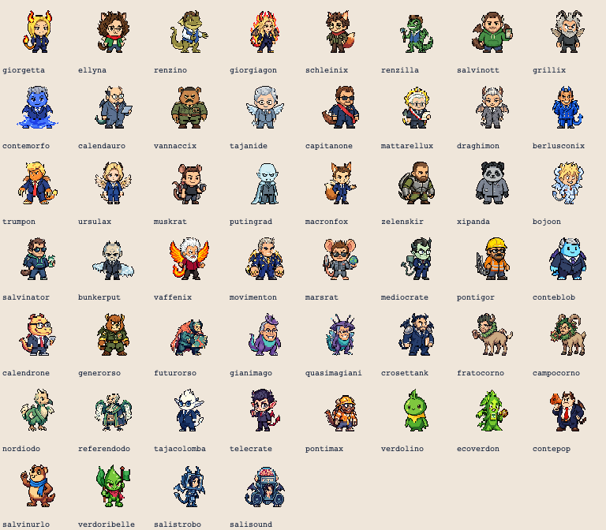
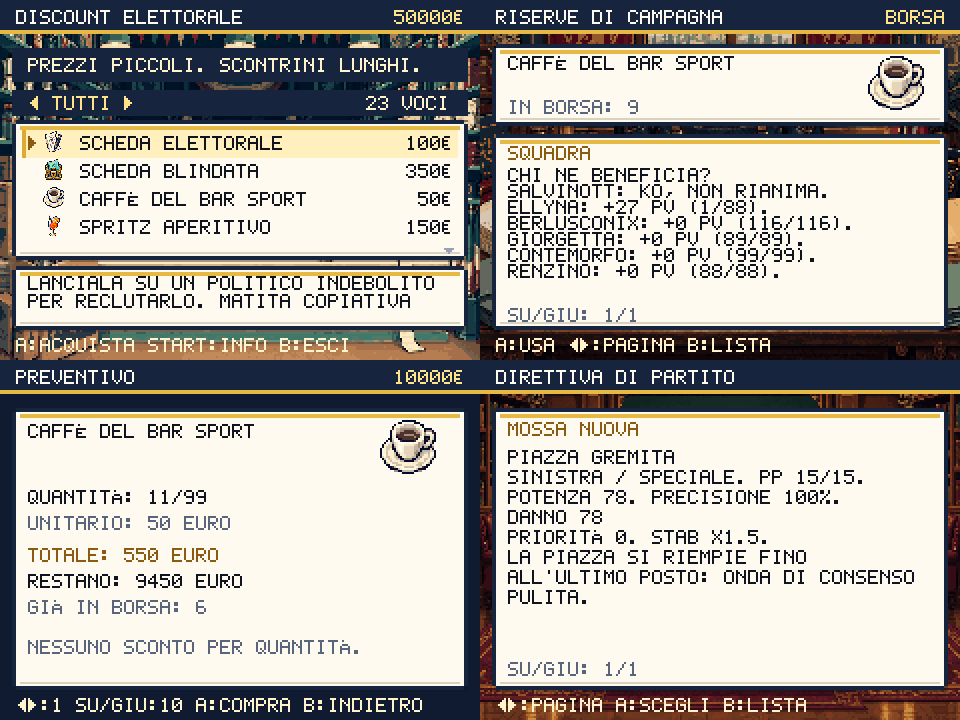
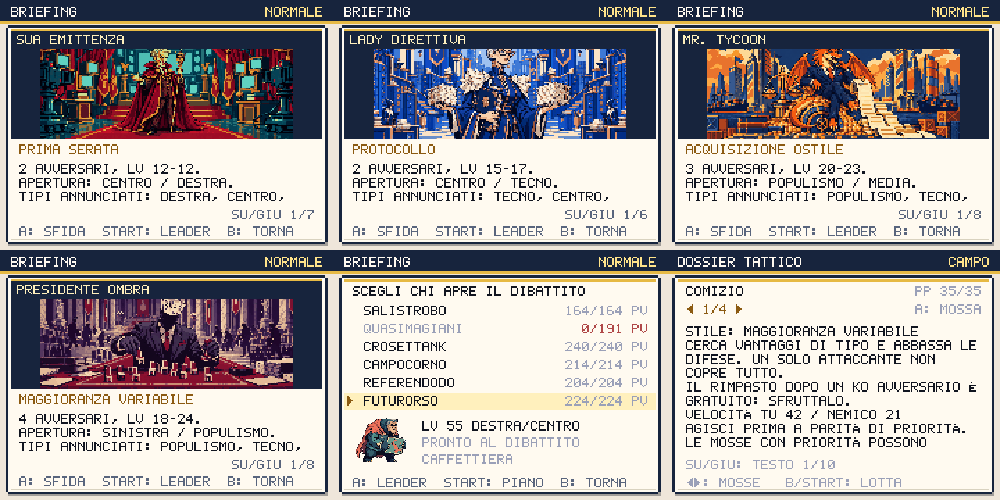
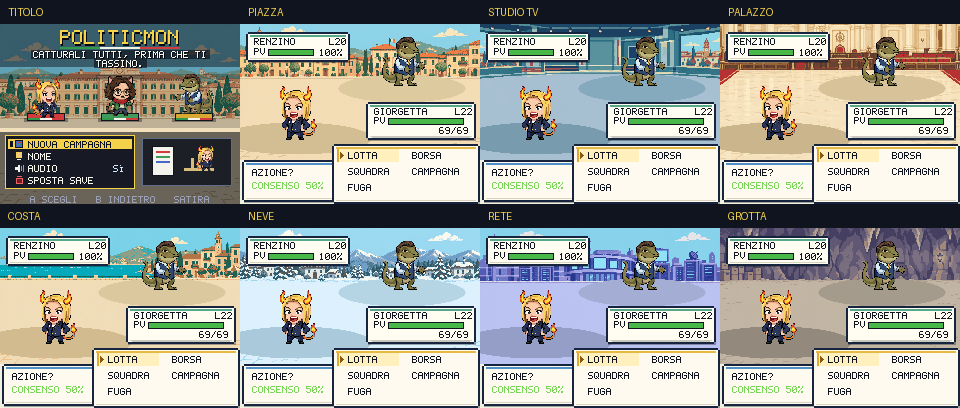
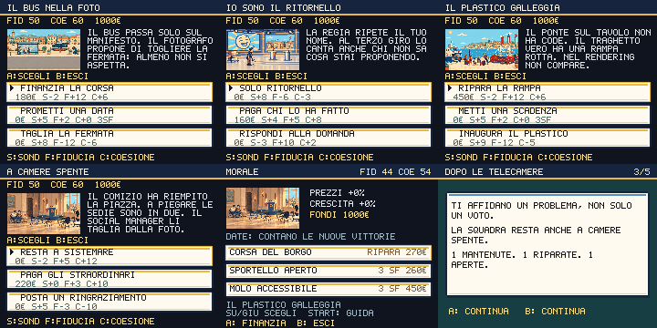

# Politicmon: risorse Higgsfield

M2, illustrazione del titolo, 6 ottobre 2026: palazzo al tramonto con sole, tappeto rosso, bandierine e coriandoli, verticale 9:16, `gpt_image_2_5` high 1k, riferimento `title-bg.png` precedente. Due varianti (A: alba, B: tramonto), scelta la B (job `9ab68544-c3cf-499a-b99e-1a9a5395c100`; la A è `6dfc0f46-49b4-4f6b-a777-6e55c2f8d1d6`). Originale 752×1344, in gioco 564×1008 a 192 colori (204 kB) in `public/title-bg.png`, al posto dell'immagine 240×180 che sul telefono si vedeva sfocata. **3 crediti**, saldo **300,47 → 297,47**.

M2, mezzibusti degli avversari e della gente, 5 ottobre 2026: diciassette fogli 3×2 `gpt_image_2_5` high 1k, uno sprite di ruolo (`npc_<ruolo>_south.png`, importato da produzione) come riferimento per cella. Fogli `trainers-a…h`: i 48 allenatori con un volto proprio (`trainer-<id>.png`); `npcs-1…9`: 53 tipi di abitanti (`npc-<chiave>.png`, uno per tipo, condiviso tra le città) più `trainer-eu-lobby`. 17 job, un invio respinto (429, nessun addebito) rimandato. **25,5 crediti**, saldo **325,97 → 300,47**. Job, URL, celle e prompt in `scripts/higgsfield-portraits.json`; `scripts/prepare-portraits.py` ripete il taglio senza crediti. +1,4 MB di PNG 96×96 in `public/sprites/portraits/`.

M2, ritratti per i dialoghi, 5 ottobre 2026: otto fogli 3×2 di mezzibusti, uno sprite del gioco come riferimento per ogni volto. `gpt_image_2_5`, qualità high, 1k, 3:2. Fogli A e B: Quirino, Gianni, Mara, barista, guardia, aiutante, capo, influencer, nonna, bambino, sindaco, funzionario della Commissione (job `0215515f-f334-4795-9e2b-e6538bef33b1`, `f4d2415d-e38c-44a6-9a04-39ccbcfb8a37`). Fogli C–H: i 35 set di sprite dei capitoli di storia (Campo Largo, Futuro Anteriore, diplomazia, Genova, tour, Palazzo, Offshore) più il protagonista (job `1eea59fc…`, `eeacaba4…`, `24415b44…`, `26d88e13…`, `15099fa8…`, `9ef3c177…`, ids completi nel manifest). Tutti visti e integrati nei dialoghi. **12 crediti**, saldo **337,97 → 325,97**. 48 PNG 96×96 trasparenti in `public/sprites/portraits/` (7–14 kB l'uno, 656 kB in tutto), tagliati con `scripts/prepare-portraits.py` (sfondo crema rimosso, 56 colori, nessun dithering); provenienza, URL e ordine delle celle in `scripts/higgsfield-portraits.json`. Un personaggio con un proprio set di sprite mostra il volto di quel set, mai quello del ruolo generico di ripiego; senza busto resta lo sprite che cammina.

M2, sei icone della pausa: job `998d9de2-e21e-4db3-bed1-fea11dd75118`, riferimento del lotto precedente, alpha verificato; 6 PNG 96×96 / 14.942 B totali. **1,5 crediti**, saldo **339,97 → 338,47**, sorgente/parametri/SHA nel manifest e conversione selettiva esistente.

M2, riferimento di stile visto: `4240b27d-6f5a-4ff7-9ad3-047d7aef2cb3`, originale in `artifacts/m2/style-reference.png`; allegato al lotto icone successivo. **1,5 crediti**, saldo verificato **341,47 → 339,97**.

Laboratorio starter verticale: `be16e697-34f3-4f73-b433-d311ab09c14c`, 240×360 / 35.212 B, originale visto e starter provati. **1,5 crediti**, saldo **342,97 → 341,47**; provenance e conversione nel manifest.

Palco verticale di carriera: atlante 480×720, 125.322 B; job `32b70d2e-5248-468e-89cf-46592e69f7ff`, originale visto e reclutamento/crescita giocati. Renderer riallinea di 35 px nativi le due fasi inferiori.
**1,5 crediti**, saldo **344,47 → 342,97**; prompt, sorgente, SHA e conversione selettiva nel manifest esistente.

Prato verticale del Percorso 1: 240×360, 44.196 B; job `50e472d0-f0ed-413c-9608-33c2db789dd6`, originale visto e campo giocato fino a Gianni.
**1,5 crediti**, saldo **345,97 → 344,47**; prompt, sorgente, SHA e conversione selettiva nel manifest esistente.

Crescita dopo KO: atlante 480×270, quattro fasi del podio e candidato runtime; job `9c42c16e-7338-41c6-b3a8-ec45119db0c4`, visto e giocato.
**1,5 crediti**, saldo **347,47 → 345,97**; prompt, sorgente, SHA e conversione selettiva nel manifest esistente.

Reclutamento riuscito: atlante 480×270, quattro fasi del timbro e candidato runtime; job `0181211c-00d6-4fbe-b364-830b7a56b25a`, visto e giocato.
**1,5 crediti**, saldo **348,97 → 347,47**; prompt, sorgente, SHA e conversione selettiva nel manifest esistente.

Copione di Gianni: atlante 480×270, quattro fasi viste e giocate; job `2cb68c8c-7ee2-497c-8761-79af03fb025e`.
**1,5 crediti**, saldo **350,47 → 348,97**; sorgente, prompt, SHA e conversione selettiva nel manifest esistente.

Cattura virale: atlante 480×270, quattro fasi; job `4b4b188c-061a-4e9d-867d-0e9daac6ee85`, `gpt_image_2_5` high.
**1,5 crediti**, saldo **351,97 → 350,47**; fonte/SHA e conversione ripetibile in `higgsfield-assets.json` e `prepare-higgsfield-assets.py --asset battle-viral`.

Venticinquesimo blocco: Hotel Diplomatico, lobby, tre suite, terrazza, padiglione a vetri e cinque cast direzionali. 25 job `gpt_image_2_5` high completati, incluse cinque correzioni; 11 invii respinti per rate limit senza job. **35 PNG runtime**, 33 percorsi nuovi, **37,5 crediti**, saldo **522,22 → 484,72**, cumulativo **401,25**. Due vecchi panorami sono sostituiti e i manifest precedenti marcati superseded. Profilo sinistro del delegato generato separatamente, nessuna specchiatura. Provenienza in `higgsfield-diplomacy.json`, conversione ripetibile in `prepare-diplomacy-assets.py`. [DIPLOMACY-VERBALE.md](DIPLOMACY-VERBALE.md) documenta cinque campagne guadagnate, morale, dossier e offline.

Ventiquattresimo blocco: Futuro Anteriore, sede a manifesti piegati, tre uffici, sette cast direzionali, scelte e Segretario. 27 tentativi `gpt_image_2_5` high: 26 completati, uno fallito rimborsato. 23 sorgenti finali, **44 PNG runtime**, 42 percorsi nuovi, **39 crediti**, saldo **561,22 → 522,22**, cumulativo **363,75**. Tre rigenerazioni correggono identità del cast e leggibilità dei materiali. Provenienza in `higgsfield-future.json`; [FUTURO-VERBALE.md](FUTURO-VERBALE.md) documenta firme, morale, cinque campagne, vivaio ed evoluzione realmente guadagnata.

Ventitreesimo blocco: Campo Largo, set e retropalco, quattro cast direzionali, tre dossier e nuova foto. Diciassette job `gpt_image_2_5` high, **25,5 crediti**, saldo **586,72 → 561,22**, cumulativo **324,75**. Ventinove PNG runtime, 28 percorsi nuovi. Provenienza in `higgsfield-campo.json`; [CAMPO-CORNICE.md](CAMPO-CORNICE.md) documenta conseguenze, Circolo, reclutamento, quattro campagne e verifiche offline.

Ventiduesimo blocco: Bruxelles, cinque panorami, palazzo e caffè, quattro viste della Commissione, materiali e tavolo. Dodici job `gpt_image_2_5` high, **18 crediti**, saldo **604,72 → 586,72**, cumulativo **299,25**. Quindici PNG runtime, uno sostituisce la precedente Commissione. Prompt, tentativi e checksum in `higgsfield-bruxelles.json`; [BRUXELLES-VERBALE.md](BRUXELLES-VERBALE.md) documenta conversioni, navigazione, tre campagne reali e morale conservato.

Ventunesimo blocco: Offshore, tre panorami di briefing, Lido Cayman a conchiglia, palma e quattro viste del Tesoriere. Sei job `gpt_image_2_5` qualità high, **9 crediti**, saldo **613,72 → 604,72**, cumulativo **281,25**. Nove PNG, prompt e checksum in `higgsfield-offshore.json`; conversioni ripetibili e prove in [OFFSHORE-REGISTRO.md](OFFSHORE-REGISTRO.md). Porte, annullamento, ritorno e rotta UE verificati nei due motori; tre salvataggi di campagne reali vincono il boss con preparazioni diverse.

Ventesimo blocco: regia audio, un fondale 240×180 per il mixer del gioco.
Un job `gpt_image_2_5`, **0,25 crediti**, saldo **613,97 → 613,72**,
cumulativo **272,25**. Prompt, cartella, job, fonte e checksum in
`higgsfield-audio.json`. [AUDIO-REGIA.md](AUDIO-REGIA.md) documenta anche
19 composizioni originali prodotte dal sintetizzatore del progetto,
volumi indipendenti, controlli nativi e decodifica offline. La musica
non è attribuita a Higgsfield e non ha consumato crediti del connettore.

Diciannovesimo blocco: cinque panorami 224×78 per Capitano, DJ, Citofonista,
attivista No-Ponte e Geometra. Cinque job `gpt_image_2_5`, **1,25 crediti**,
saldo **615,22 → 613,97**, cumulativo **272,00**. Prompt, job, URL, ritagli
e SHA degli originali e dei PNG in `higgsfield-stretto.json`.
[STRETTO-COLLAUDO.md](STRETTO-COLLAUDO.md): sfide volontarie, ritorno
verificato, premio evolutivo e campagne native con morale distinto dalle vittorie.

Diciottesimo blocco: archivio delle linee, un PNG 240×180 per recuperare
le mosse dimenticate. Un job `gpt_image_2_5`, **0,25 crediti**, saldo
**615,47 → 615,22**, cumulativo **270,75**. Prompt e checksum in
`higgsfield-archive.json`; [ARCHIVIO-PREPARAZIONE.md](ARCHIVIO-PREPARAZIONE.md)
riporta confronto, salvataggio, dossier dei rivali e nuove partite native.

Diciassettesimo blocco: tre giudici illustrati per la Consulta. Sei job
`gpt_image_2_5`, incluse tre revisioni dell'inquadratura nativa: **1,50
crediti**, saldo **616,97 → 615,47**, cumulativo **270,50**. Tre PNG 224×78,
provenienza completa e iterazioni in `higgsfield-colle.json`.
[COLLE-VERBALE.md](COLLE-VERBALE.md): sedici briefing, satira su regole,
competenze e diritti, morale letto dal Palazzo e dal Garante; campagne
nuove e limiti della progressione documentati.

Sedicesimo blocco: tavolo diplomatico e conto dell'oligarca per le due prove
facoltative della Global Tower. Due job `gpt_image_2_5`, **0,50 crediti**,
saldo **617,47 → 616,97**, cumulativo **269,00**. Prompt, job, ritagli e
checksum in `higgsfield-capitale.json`; conversione con
`prepare-first-campaign-assets.py --manifest --asset`.
[CAPITALE-PREPARAZIONE.md](CAPITALE-PREPARAZIONE.md): tredici briefing
illustrati, nuova satira, sfide volontarie e tre partite nuove fino a Dazio.

Quindicesimo blocco: sportello illustrato per la prova facoltativa di Hans.
Un job `gpt_image_2_5`, **0,25 crediti**, saldo **617,72 → 617,47**,
cumulativo **268,50**. Provenienza e ritaglio in `higgsfield-eurotown.json`;
conversione con `prepare-first-campaign-assets.py --manifest`, compatibile
con il comando precedente di Mara. [EUROTOWN-SCELTE.md](EUROTOWN-SCELTE.md)
documenta la nuova satira, le sfide volontarie, la cura dei PP e tre partite
nuove con preparazione tattica fino a Spread. Undici briefing illustrati.

Quattordicesimo blocco: backstage illustrato per la prova facoltativa di Mara.
Un job `gpt_image_2_5`, **0,25 crediti**, saldo **617,97 → 617,72**,
cumulativo **268,25**. Prompt, job e checksum in
`higgsfield-first-campaign.json`; ritaglio tecnico con
`prepare-first-campaign-assets.py`. [PRIMO-ATTO-GAMEPLAY.md](PRIMO-ATTO-GAMEPLAY.md)
documenta crescita, catture, apprendimento della panchina e tre partite nuove
fino ad Auditel. Il credito residuo resta disponibile per il redesign.

Tredicesimo blocco: quattro ambienti per onboarding, pausa e scorta.
Quattro richieste `nano_banana_2`, backend registrato `nano_banana_flash`,
**8 crediti**, saldo **625,97 → 617,97**, cumulativo **268**. Provenienza e
checksum in `higgsfield-desk.json`, conversione con `prepare-desk-assets.py`.
[INGRESSO-PAUSA-VIAGGI.md](INGRESSO-PAUSA-VIAGGI.md): 276 test, dossier
completi, 514/506 viste native e sei lotte reali automatizzate del tutorial.

Dodicesimo blocco: casinò, club, Coppa, dieci emblemi e sette ritratti.
Sette job compresa la correzione dei fantasmi: **14 crediti**, saldo
**639,97 → 625,97**, cumulativo **260**. Venti PNG; un vecchio cabinet
rimosso. Provenienza in `higgsfield-arena.json`, conversione ripetibile con
`prepare-arena-assets.py`. [CASINO-COPPA.md](CASINO-COPPA.md): 272 test,
843 viste, persistenza durante il torneo e transazioni con dossier.

Undicesimo blocco: sette ambienti del postgame, quattro souvenir e quattro
statue. Nove job Nano Banana Pro, **18 crediti**, saldo **657,97 → 639,97**,
cumulativo **246**. Prompt, job e SHA-256 in `higgsfield-epilogue.json`;
staging con `prepare-epilogue-assets.py`, revisione nativa e 15 PNG integrati.
[EPILOGHI-POSTGAME.md](EPILOGHI-POSTGAME.md) documenta gameplay e verifiche.

Decimo blocco: cinque ambienti per foto, convenzione, diplomazia, coalizione e
scrutinio. Cinque job Nano Banana Pro, **10 crediti**, saldo **667,97 → 657,97**,
cumulativo **228**. Prompt, job e checksum in `higgsfield-campaign-ui.json`;
staging con `prepare-campaign-ui-assets.py` e revisione nativa prima dell'installazione.
[PATTI-CONSEGUENZE.md](PATTI-CONSEGUENZE.md) descrive scelte, morale e verifiche.

Nono blocco: otto emblemi, fondale dei percorsi, macchina del casinò e ambiente
sociale. Sei job Nano Banana Pro compresa la correzione del prato, **12 crediti**;
saldo **679,97 → 667,97**, cumulativo **218**. Undici PNG finali con checksum
in `higgsfield-core-ui.json`. [RETE-EMBLEMI.md](RETE-EMBLEMI.md) documenta
anche le rimozioni, lo storico e le prove reali di duello/scambio.

Round di coerenza: 62 PNG statici ricavati dalle pose Higgsfield esistenti,
**zero nuove generazioni e zero crediti**. Provenienza in
`higgsfield-monster-fallbacks.json`; [COERENZA-GRAFICA.md](COERENZA-GRAFICA.md)
spiega integrazione e prova con tutti i fogli animati indisponibili.

Ottavo blocco: **sei icone e tre ambienti del quartier generale**. Cinque job
Nano Banana Pro, compreso un rifacimento per rimuovere scritte generate.
**10 crediti**, saldo **689,97 → 679,97**, cumulativo **206**. Provenienza e
checksum: `scripts/higgsfield-hq.json`; preparazione: `prepare-hq-assets.py`.
Integrazione e verifiche: [QUARTIER-GENERALE.md](QUARTIER-GENERALE.md).

Settimo blocco: **295 PNG del mondo e del cantiere**, inclusi 220 frame di player
e NPC, 12 viste di mezzi, traghetto e capitano, 60 terreni/edifici/oggetti e una
scena civica. **68 crediti**, saldo **757,97 → 689,97**, cumulativo **196**.
65 richieste: 38 completate e 27 fallite senza addebito; prove completate ma
scartate incluse nel costo. GPT Image 2.5, Nano Banana 2 e Nano Banana Pro;
quest'ultimo è registrato dal provider come `nano_banana_2`. Prompt, job,
selezione delle celle e rigenerazioni nei manifest `higgsfield-world-*`.
Integrazione, fonti satiriche e limiti delle prove: [MONDO-CANTIERI.md](MONDO-CANTIERI.md).

I blocchi precedenti sono conservati sotto come cronologia della produzione.

Blocco completato il 1 ottobre 2026: sette sfondi di battaglia e un nuovo
sfondo titolo. Modello GPT Image 2.5, qualità high, risoluzione sorgente 1k.
Saldo osservato prima/dopo: 885,97 → 873,97 crediti; costo del blocco: **12**.

Secondo blocco: quattro vignette per scelte e promesse, **6 crediti**.
Saldo osservato: **873,97 → 867,97**. Totale dei primi due blocchi: **18 crediti**,
dodici immagini integrate. Storia, morale e fonti: [SATIRA-MORALE.md](SATIRA-MORALE.md).

Terzo blocco: **24 creature × quattro pose = 96 pose**, con GPT Image 2.5.
Costo di produzione: 36 crediti; confronto Grok scartato: 2 crediti.
Saldo osservato: **867,97 → 829,97**. Costo del blocco: **38 crediti**.
Totale dei primi tre blocchi: **56 crediti**.

Quarto blocco: le **28 specie rimanenti** (42 crediti) e **nove illustrazioni
dei boss** (13,5 crediti). Saldo osservato: **829,97 → 774,47**;
costo: **55,5 crediti**. Totale dei primi quattro blocchi: **111,5 crediti**.
Il roster completo ha **52 fogli / 208 pose**. Nessun acquisto o abbonamento attivato.

Quinto blocco: fondali per evoluzione e scheda squadra, vignetta caro carburante.
**4,5 crediti**, saldo **774,47 → 769,97**; spesa cumulativa **116 crediti**.
Tre PNG a 48 colori, **132.807 byte** complessivi. Provenienza e riproduzione:
`scripts/higgsfield-evolution-dossier.json` e `scripts/prepare-evolution-dossier.py`.
Integrazione e controlli: [EVOLUZIONI-SCHEDE.md](EVOLUZIONI-SCHEDE.md).



Sesto blocco: **tre ambienti e trenta icone degli oggetti**, prodotte in cinque
fogli da sei elementi. Otto job GPT Image 2.5, qualità high, 1k. Costo **12**,
saldo **769,97 → 757,97**, cumulativo **128 crediti**. I 33 PNG nativi occupano
**200.066 byte**. `scripts/higgsfield-supplies.json` conserva provenienza e
parametri; `scripts/prepare-supplies.py --download` ricostruisce le risorse.
Controlli, gameplay e prove: [RISERVE-DIRETTIVE.md](RISERVE-DIRETTIVE.md).



## Pose dei personaggi

Il roster animato copre tutte le 52 specie, comprese evoluzioni ramificate,
personaggi internazionali e creature dell'Atto 3. Ogni sorgente usa lo sprite
originale del progetto come riferimento, con controllo visivo di anatomia,
accessori, corna, ali e coda prima dell'integrazione.

Ogni sorgente è una griglia 2×2: riposo, attacco, preparazione e palpebre
chiuse. La conversione tecnica rimuove il fondo magenta, applica una scala
comune alle quattro pose e le allinea alla stessa base. Ogni PNG finale è
256×64, trasparente, con una palette di 48 colori condivisa. I 52 fogli
occupano **746.099 byte** complessivi, caricati dopo il primo frame.

I fogli sono usati nel renderer condiviso PVE/PVP e nei ritratti del
Politicdex. RIDUCI EFFETTI mantiene la posa di riposo. Un foglio assente o
con dimensioni errate torna al PNG originale, senza lasciare il campo vuoto.
Gli sprite originali restano disponibili per tutte le specie.

La prova GPT di Giorgetta è stata integrata e verificata prima di estendere
il roster. Il confronto Grok ha perso le corna ed è stato scartato. AutoSprite
era presente nel catalogo ma la generazione ha restituito tipo non supportato:
nessun job creato; la produzione usa i fogli GPT verificati.

`scripts/higgsfield-monster-frames.json` conserva crediti, job, URL, riferimenti
agli sprite del progetto, prompt e parametri. Gli originali sono in
`artifacts/premium/`; i fogli pubblici in `public/sprites/monsters/animated/`.

```sh
python3 scripts/prepare-monster-frames.py scripts/higgsfield-monster-frames.json
```

Il comando recupera gli originali mancanti e ricrea i fogli senza nuove
generazioni. La matrice `npm run shot:monster-frames` verifica 260 campioni,
renderer PVE/PVP, timer online, isolamento del salvataggio e fallback.

## Illustrazioni delle sfide

Nove scene originali introducono i boss nel briefing, dallo studio di Sua
Emittenza alla cattedrale dei server dell'Algoritmo Sovrano. I banner sono
224×78, opachi, a 48 colori, **74.155 byte** complessivi. La conversione
conserva l'inquadratura intera; testi e controlli sono disegnati dal gioco.
Partono nel preload differito e sono disponibili anche offline.



`scripts/higgsfield-premium-next.json` conserva tutti i 37 nuovi job, parametri,
URL, destinazioni e saldo. Gli originali dei boss sono in
`artifacts/premium-next/`; i PNG pubblici in `public/sprites/ui/boss/`.

```sh
python3 scripts/prepare-boss-art.py
npm run shot:boss-briefing
```

Il controllo verifica 2.106 layout, annullamento dal mondo, rifiuto dei leader
KO, salvataggio del leader e avvio della battaglia reale senza consumo di PP
o anticipo delle ricompense. Uscire dal briefing libera anche lo stato occupato
del multiplayer.



## Risultato nel gioco

| Ambiente | Dove appare |
|---|---|
| Piazza | Borgo Urne, Mediopoli, Eurotown, capitale, Bruxelles, Campo Largo |
| Studio TV | Palestra TV, redazione, retropalco, terrazza diplomatica, talk show |
| Palazzo | Palazzo, Colle, Commissione e altri interni senza tema specifico |
| Costa | Stretto, Offshore, chiosco, bar sul mare, distretti Sud e Isole |
| Neve | Oblast del Meme |
| Rete | Futuro Anteriore, Genova Techno, capitale e Palazzo dei Feed |
| Grotta | Grotta del Consenso e Archivio di Stato |

I percorsi mantengono il prato PixelLab. Il selettore in
`src/game/battle/backdrop.ts` sceglie l'ambiente alla creazione della battaglia,
sia PVE sia PVP; i colori delle piattaforme seguono il tema. Gli sfondi partono
nel preload non bloccante. Se un PNG manca, si usa il prato originale; se
anche questo non è disponibile, il renderer disegna due fasce di colore.

La nuova schermata titolo lascia logo, starter animati e menu al renderer,
senza personaggi stampati nello sfondo. Il suo URL usa la versione della build.

I sette PNG di battaglia occupano **113.536 byte** complessivi, più **21.053**
per il titolo. Sono nativi 240×136 / 240×180, con 48 colori e nessun dithering.
La precache PWA include tutti gli asset; il service worker risolve gli URL
versionati anche al primo utilizzo offline, nella cache della stessa build.

Le vignette fermata, studio, molo e lavoro fuori camera occupano altri
**52.489 byte**, nativi 240×136 a 48 colori. Appaiono nelle sei scelte civiche;
il verbale illustra anche il menu MORALE.



## Provenienza e riproduzione

`scripts/higgsfield-assets.json` conserva progetto Higgsfield, job ID, URL
degli originali, prompt e parametri per ogni asset. Gli originali scaricati
restano in `artifacts/higgsfield/`, escluso da Git; i PNG pronti per il gioco
sono in `public/`.

Per ripetere la conversione, con Python e Pillow disponibili:

```sh
python3 scripts/prepare-higgsfield-assets.py --download
```

Il comando recupera solo gli originali mancanti e non richiede nuove generazioni
o crediti. Senza `--download` usa gli originali già presenti.

## Verifica

```sh
npm test
npm run build
# Con Vite dev in esecuzione sulla porta 5179:
npm run shot:battle-backdrops
npm run shot:morale-satire
# Con preview della build sulla porta 4180:
npm run smoke:pwa:release
```

Lo screenshot harness controlla otto campi PVE, un duello PVP, il titolo,
caricamento PNG e fallback per un asset mancante. Il test PWA rimuove le copie
versionate dalla cache e verifica che tutti i 109 asset siano recuperabili
dalla precache durante il reload offline Chromium/Pixel 7.

Politicdex, dossier, ritmo delle lotte e controlli sono documentati in
[GAMEPLAY-DEX.md](GAMEPLAY-DEX.md).

Lotto lotte — Fuorionda: saldo **352,97 → 352,72** (0,25 crediti), job `50580beb-1fcf-4ac5-9131-6e50a6069c3c`.
Quattro fotogrammi visti e integrati nella finale di Polemica; atlante 480×270, sorgente e checksum nel manifest esistente.

Lotto evoluzione — saldo **352,72 → 352,47** (0,25 crediti), job `4c462345-8203-4cd7-b325-f494b3a065b9`.
Quattro fasi viste e giocate nel cambio Ellyna → Schleinix; atlante 480×360 da 97,6 kB, provenienza/checksum nel manifest esistente.

Lotto eventi di campo — saldo **352,47 → 352,22** (0,25 crediti), job `97757873-4c43-4f81-8eb3-a34c0561b622`.
Atlante 480×360 con quattro vignette viste; vignette conservate nel manifest; gli eventi iniziali ora usano avvisi compatti nell’arena, senza la schermata separata.

Lotto titolo — saldo **352,22 → 351,97** (0,25 crediti), job `48e93be5-9b8e-4c21-9a3e-ad05942887c2`.
Piazza del dibattito vista e integrata dietro gli starter: 480×270, 48 colori; provenienza e checksum nel manifest.

M2 terreno, 4 ottobre 2026: foglio 4×5 visto, job `65bc2fa0-2741-480a-b262-d571f356b5f3`.
Saldo **338,47 → 338,22** (0,25 crediti). Venti varianti 16px in tiles/m2; erba, sterrato e sabbia nel fondale esterno. Pavimento/asfalto preparati, integrazione ancora aperta. Sorgente e checksum nel manifest; preparazione ripetibile con prepare-m2-terrain.py.

M2 acqua, 4 ottobre 2026: quattro fotogrammi visti, job `82f24191-0f0a-4bf1-9959-a0b4b7b1f05e`.
Saldo **338,22 → 337,97** (0,25 crediti). Frame 16px in tiles/m2, ciclo a 4 Hz; Riduci effetti congela il primo. Sorgente, parametri e checksum nel manifest.

Varietà, 6 ottobre 2026: un foglio busti (`npcs-10`: geologa e cavatore del Percorso 3, 1,5 crediti) e cinque fondali di lotta 240×136 (`lago`, `cava`, `viale`, `foro`, `tv`, stesso prompt di `piazza` più scena e `piazza.png` come riferimento; quantizzati a 48 colori con `prepare-higgsfield-assets.py`). Un invio fallito (lago) è stato rigenerato. Job e prompt in `scripts/higgsfield-assets.json` e `scripts/higgsfield-portraits.json`.

Leggende, 6 ottobre 2026: un foglio 2×2 di cimeli (`relics-1`: Telecomando d'Oro, Agenda d'Oro, Penna del Garante, Kit del Bunker; 1,5 crediti, riferimenti `divisa.png` e `telecamera.png`), ritagliati con `scripts/prepare-relics.py` (telecomando e penna ruotati in diagonale per riempire i 32×32). Saldo 289,72 → 288,22. Manifest in `scripts/higgsfield-relics.json`.

Colle dell'Antenna, 6 ottobre 2026: un foglio 3×2 di busti per i tre sfidanti (`trainers-i`: Ripetitorista, Radioamatore, Meteorologo dei sondaggi; 1,5 crediti, riferimenti npcs-9 e gli sprite guard, professor, journalist). Saldo 288,22 → 286,72.


Icone delle posture, 8 ottobre 2026: tre icone pixel 96×96 per i pulsanti della lotta (Attacca, pugno con fulmine; Smentisci, palmo fermo entro un cerchio; Temporeggia, clessidra). Tre job `gpt_image_2_5` in qualità high, 1024×1024 su fondo navy, riferimento di stile la lotta e le icone della pausa. **Costo reale: 1,5 crediti a immagine** (il preflight con qualità di default dava 0,25: non è il prezzo della high). Saldo **286,72 → 282,22**. Ritaglio del fondo e scala 96 px con `scripts/prepare-posture-icons.py`; i file sono in `public/sprites/ui/posture/` e collegati in `POSTURES` (`src/game/battle/posture.ts`).

Edifici di Borgo e Mediopoli, 8 ottobre 2026: due fogli 3×2 in `scripts/higgsfield-world-environment.json`. `building-3` (job `b60daebf-c4f7-4d3a-bc21-209eaee48a35`): studio TV di Mediopoli, casa tua, redazione, circolo, attico; `building-4` (job `0fd5ead9-0047-4276-8358-2a48d517d393`): solo la cella del laboratorio, rigenerata perché il primo laboratorio era una torre troppo stretta per l'impronta. Richiesti `nano_banana_2`, 1k, 3:2; il server li ha serviti come `nano_banana_flash`, registrato nel manifest. 1,5 crediti per foglio: saldo **282,22 → 279,22** (3,0 crediti).
Installati: `mediopoli_studio.png` (nuovo, override della famiglia di tetto `y` nella mappa di Mediopoli; la palestra resta quella di Eurotown), `build_lab_front.png`, `build_house_front_red.png`, `build_house_front_green.png`, `build_circolo_front.png`, `build_apartment_front.png`. Impronte, porte e warp invariati. Nel manifest le celle sostituite di `building-0` e `building-1` sono `superseded`.
Non installati: `build_gym_front`, `build_casino_front`, `cave_mouth`, `cave_rock`, `cliff_sand` risultano diversi dallo staging rispetto ai file in `public/`; lasciati com'erano, da riesaminare a parte.
