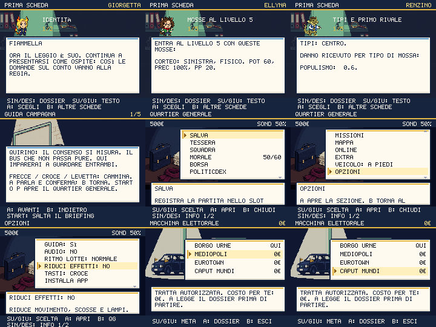

# Ingresso, quartier generale e viaggi

Round del 2 ottobre 2026. Quattro nuovi ambienti Higgsfield: laboratorio degli
starter, briefing, scrivania del quartier generale e scorta con distributore.
Le vecchie anteprime limitate a due righe e il menu trasporto sovrapposto al
mondo sono sostituiti. La pausa diventa una scena autonoma e scorrevole.

## La prima scelta mostra ciò che si sceglie

L’anteprima di ciascuno dei tre starter offre quattro dossier: identità,
mosse al livello 5, tipi e primo rivale, crescita. La descrizione Dex è
intera; si leggono statistiche base e abilità, tutte le mosse iniziali con
potenza, precisione, PP e descrizione, moltiplicatori reali e condizioni
dell’evoluzione. SIN/DES cambia dossier, SU/GIU pagina il testo. Non si
estraggono nuovi valori casuali per consultare la scheda.

A apre la conferma, spiegando quale starter sceglierà Gianni e che le altre
due schede del laboratorio diventeranno indisponibili. B annulla oppure
torna al laboratorio. La conferma definitiva concede un solo Politicmon:
la scena e il mondo rifiutano richieste duplicate. RIDUCI EFFETTI congela
la posa dell’anteprima.

Il briefing di Quirino appare all’ingresso nel mondo e viene segnato come
letto soltanto alla fine o con START, che lo salta esplicitamente. B torna
alla pagina precedente. Il menu EXTRA > GUIDA CAMPAGNA permette di rileggerlo,
aggiornato con la missione attuale. Spiega controlli, laboratorio, medaglie,
sondaggi, fiducia, coesione e scadenze delle promesse.

## Il primo dibattito insegna senza fingere una vittoria

Prima del match un dossier mostra avversario, livello effettivo, mosse del
leader attuale, efficacia e controllo tattico. Il rivale entra al livello 4
in normale, 7 in difficile; il testo segue anche una squadra cambiata dopo
un tentativo. In questo primo confronto Gianni non usa cure. I successivi
rivali mantengono il profilo più competitivo.

La sconfitta iniziale cura e riporta nel laboratorio senza multa, conserva
lo starter e non concede vittoria, avanzamento del rivale o Politicdex.
Parlare con Quirino permette di riprovare. La vittoria registra il progresso
e apre la consegna del Dex e di cinque schede, protetta da duplicazioni.
Il primo debuttante aveva prima il callback di vittoria anche in caso di
sconfitta: il nuovo percorso corregge quella discrepanza. I progressi già
presenti nei salvataggi storici non vengono reinterpretati.

Le nuove battute parlano di attenzione misurabile e servizi che mancano,
discorsi su telefoni scarichi e consulenti che suggeriscono di cambiare tono.
I personaggi parlano nel contesto del gioco; nessuna frase è attribuita a
politici reali.

## Il quartier generale resta tutto nello schermo

La pausa mostra sei righe per volta, scorre fino all’ultima voce e mantiene
SALVA in cima. Il riquadro informativo espone il nome completo della voce e
il suo effetto: SIN/DES pagina ogni spiegazione. Anche le opzioni lunghe,
i veicoli e le informazioni sulla missione rimangono consultabili.

Fondi e sondaggi sono visibili; fiducia, coesione, coalizione e stato online
si aggiornano al ritorno dalle altre sezioni. Il duello si abilita soltanto
con un altro giocatore collegato, anche se la connessione cambia con il
sottomenu già aperto. Restano guida, audio, ritmo, riduzione effetti,
vibrazione quando supportata, controlli touch, installazione e backup.
Le azioni esistenti continuano a usare le rispettive scene.

## La scorta dichiara meta e contratto

Quattro destinazioni consultabili, comprese quelle chiuse e la città attuale.
Il dossier dichiara requisiti, costo per il giocatore **0€** e che il viaggio
non cura. Il Dex abilita il servizio; Auditel apre Eurotown, Spread apre
Caput Mundi. Le stesse condizioni vengono rivalidate alla conferma e nel
mondo prima del trasferimento. B lascia invariati posizione e risorse.
Arrivare salva la posizione senza alterare HP, PP, fondi o oggetti.

La satira dello scontrino più lungo dello sconto usa come spunto
[ANSA, 16 settembre 2026](https://www.ansa.it/amp/canale_motori/notizie/mondo_motori/2026/09/16/carburanti-taglio-delle-accise-scende-a-122-centesimi-fino-al-25-settembre-poi_4e4024e1-c541-4edf-8413-2b1d64e27b87.html),
che descrive la riduzione dello sconto sul gasolio da 12,2 a 6,1 centesimi.
La battuta e il viaggio spesato sono finzione del gioco, senza nuovi prezzi
reali inseriti nelle regole.

## Produzione e verifiche

Quattro richieste `nano_banana_2`, risoluzione 2k; il servizio registra il
backend `nano_banana_flash`. Prompt, modello richiesto, modello risolto,
job e SHA-256 sono in `scripts/higgsfield-desk.json`. I quattro sfondi sono
revisionati prima dell’installazione; la conversione fa ridimensionamento e
quantizzazione tecnica, senza nuove generazioni. **8 crediti**, saldo
verificato **625,97 → 617,97**, cumulativo **268**. Nessun acquisto o trial attivato.

276 test passano, inclusi dossier completi, matchup dal sistema di danno,
guida senza mutazioni, requisiti delle tratte e distinzione dell’IA del tutorial.
`shot:desk` passa con **514 viste su Chromium e 506 su WebKit**, zero testo
fuori canvas. Il numero varia con le opzioni supportate dai due motori.
Sono provati i tre starter, due modalità di movimento, ogni voce della pausa
con layout desktop/touch, paginazione, salvataggio manuale, primo e secondo
tocco sulle voci, annullamento, gate delle tratte e arrivo effettivo.
Il round casinò/Coppa mantiene 843 viste valide dopo il cambio della pausa.

Per sei percorsi Mondo→Starter→Guida→Lotta sono forzati sconfitta e vittoria,
per provare cura, assenza di falsa vittoria, riprova dal professore e premio
esatto una volta. In aggiunta, sei lotte sono completate attraverso gli input
della vera scena, con seed 20261002 e scelta della mossa con il danno atteso
maggiore, senza consumabili o potenziamenti volontari:

| Starter | Normale | Difficile |
|---|---|---|
| Giorgetta | Vittoria | Sconfitta |
| Ellyna | Vittoria | Vittoria |
| Renzino | Vittoria | Vittoria |

Questi casi provano un ingresso giocabile e il percorso di recupero. Non
costituiscono un campione del bilanciamento complessivo né una partita umana
completa. WebKit e layout touch sono emulati, senza certificare dispositivi
fisici. La campagna completa resta da percorrere.

Typecheck, validazione contenuti, meme pack, input, audit visivo sulle 47 scene,
leggibilità ed evoluzioni passano. Restano i tre avvisi editoriali preesistenti
dei meme pack. Performance CPU ×4: p95 mondo/lotta 18,6ms, Dex 18,5ms;
206,7KiB iniziali e 348,7KiB totali gzip, entro le soglie invariate.
528 PNG installati; verifica build su 420 checksum e codice dei nuovi dossier.
La PWA controlla 529 risorse Higgsfield.

Il redesign generale resta aperto: interfaccia esterna, dialoghi delle zone,
audio, ritmo dei percorsi e bilanciamento della campagna con prove integrali.
