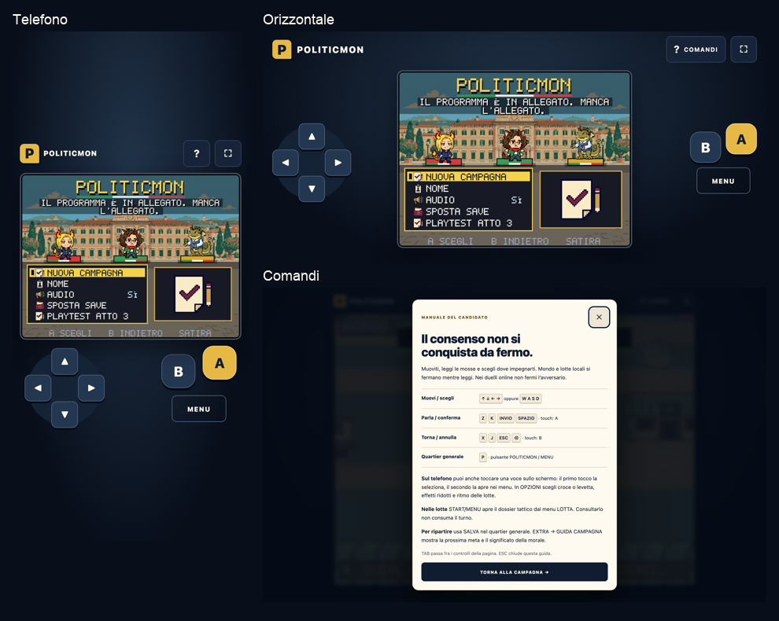

# La pagina diventa parte del gioco

Round del 2 ottobre 2026. La cornice desktop e mobile usa blu, carta e oro
coerenti con i nuovi dossier. Sono rimossi scocca bombata, badge COLOR,
spia POWER decorativa, griglie degli altoparlanti e riflessi sopra il canvas.
Il marchio apre ancora il menu; COMANDI e schermo intero sono azioni reali.

## Il gioco occupa il centro

Su computer si vedono logo, guida, schermo intero quando supportato e una
legenda dei tasti. Sul telefono la croce e A/B/MENU hanno bersagli di almeno
44 pixel CSS; in orizzontale si dispongono ai lati del canvas senza coprirlo
o sovrapporsi fra loro. La levetta conserva la preferenza salvata.

La dimensione iniziale e quella del renderer seguono la stessa formula,
con spazio dichiarato per intestazione e controlli, rapporto 4:3 e backing
store denso. La pagina non impone più il divieto di zoom tramite il viewport.
La guida può scorrere e ingrandirsi; canvas e controlli conservano il proprio
comportamento di puntatore. Il pulsante schermo intero appare solo dove
l’API esiste e dichiara lo stato di ingresso/uscita.

## Consultare non impartisce ordini

COMANDI apre una guida HTML modale: frecce/WASD, conferma, annullamento,
menu, doppio tocco dei menu, dossier tattico e salvataggio. Mentre è aperta,
il game loop continua a disegnare ma non aggiorna la scena o il tempo di
partita. Le prove congelano esattamente lo stato sia nel mondo sia in una
vera BattleScene. Non è una pausa dei messaggi ricevuti dalla rete: il round
non modifica il protocollo multiplayer. La guida distingue esplicitamente
le lotte locali dai duelli online: consultarla non ferma l’avversario remoto.

ESC o i due pulsanti chiudono la guida e restituiscono il focus al canvas.
TAB e SHIFT+TAB restano nei due pulsanti della guida anche con le preferenze
di navigazione di WebKit. Fuori dalla guida TAB torna alla navigazione HTML;
il menu di gioco si apre con P, logo o MENU. INVIO e SPAZIO sui pulsanti
nativi attivano il pulsante; non producono contemporaneamente una conferma A.

Quando il focus passa a un controllo HTML, il keyup continua a rilasciare il
tasto del gioco. Apertura/chiusura della guida, perdita di focus e background
svuotano pressioni, tocchi pendenti e levetta. La tastiera nativa per nomi e
chat mantiene la sua conferma e non la inoltra alla scena sottostante.

## Prove e limiti

`shot:shell` esegue dieci configurazioni in ciascuno dei due motori:
320×568, 390×844, 412×892, 768×1024, 568×320, 844×390, 667×280,
1280×800, 1440×900 e 800×600. Verifica geometria dei gruppi e dei singoli
pulsanti, assenza di sovrapposizioni, 44px minimi, rapporto del canvas,
logo via INVIO, menu con P, keyup dopo cambio focus, focus modale e ripresa.
Su touch A scrive davvero il salvataggio e ne verifica l’UID del leader.
La levetta registra la direzione, poi blur la rilascia e ricentra il cappuccio.
Sono provati rotazione e ritorno, tastiera nativa e quattro casi di pausa
in BattleScene. Schermo intero entra ed esce nei due motori desktop provati.
Le schermate e i report sono in `artifacts/screens/shell` e `artifacts/reports`.

Typecheck e 276 test passano. L’audit accessibilità aggiornato controlla i
colori della cornice e bersagli da 44px: testo/carta 16,4:1, testo/controlli
11,6:1. Non è una certificazione di lettura del mondo canvas da screen reader.
Le configurazioni touch e WebKit sono emulate, senza prova di hardware fisico.

Performance CPU ×4: p95 mondo, lotta e Dex **18,5ms**; codice iniziale
**207,3KiB** e totale **349,3KiB** gzip. Le soglie 250/350KiB e 33,4ms restano
invariate; il margine totale è ridotto e i prossimi round devono rimuovere
codice superfluo prima di aggiungere funzioni sostanziali.

La verifica della build locale passa su 420 checksum e presenza della nuova
cornice. La PWA passa su Chromium/Pixel 7 e WebKit/iPhone 13 con 529 risorse;
il reload completamente offline è provato soltanto su Chromium. Nessun PNG
di gioco cambia: 528 file restano installati.

Il round `b36ec49` è pubblicato: CI e tre deploy Vercel riusciti, 420 checksum
e 529 risorse verificati sul dominio pubblico. `check:shell:release` prova
anche la pagina di produzione in sei casi: telefono, orizzontale e computer
su ciascun motore. Il titolo resta identico pixel per pixel durante la guida,
TAB non esce dalla finestra modale e ESC restituisce il focus al canvas.

Questo round non richiede raster o video aggiuntivi: **0 crediti**.
Saldo Higgsfield letto **617,97**, spesa cumulativa del progetto **268**.
Il round precedente, [Ingresso e viaggi](INGRESSO-PAUSA-VIAGGI.md), è già
pubblicato e verificato sul dominio pubblico.

Il mandato completo rimane aperto: percorsi e incontri, dialoghi delle zone,
audio e bilanciamento di una campagna realmente percorsa con scelte alternative.
