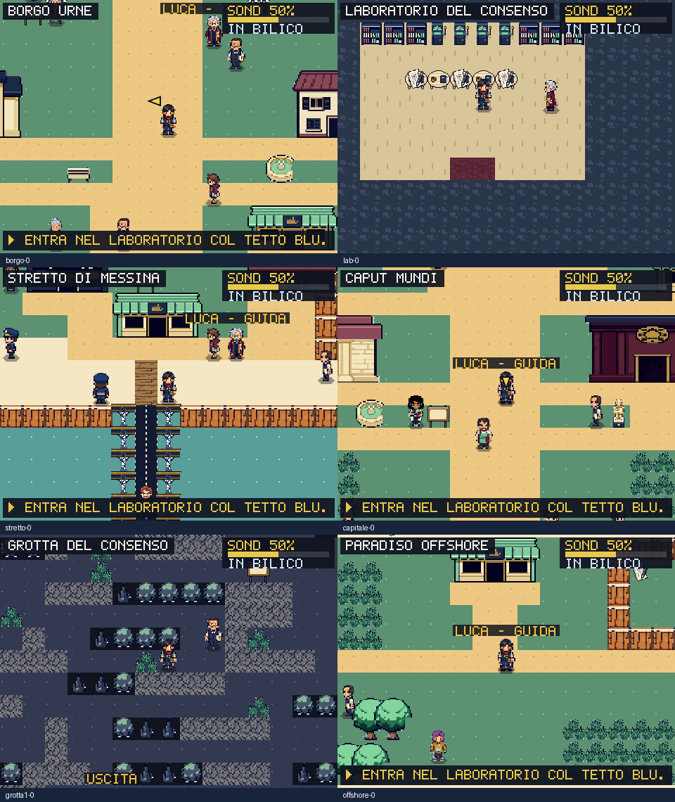
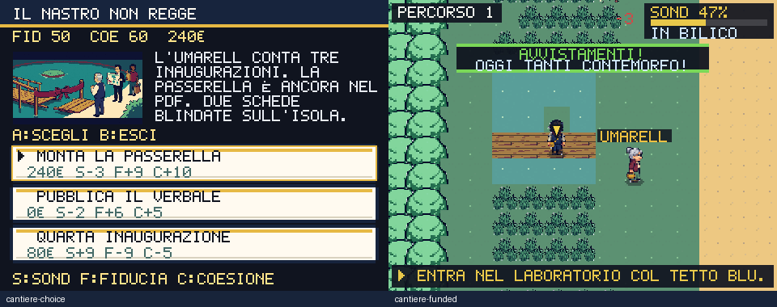

# Mondo e cantieri — 1 ottobre 2026

Questo round sostituisce 295 PNG del mondo e introduce una scelta che modifica
un percorso reale. Il redesign completo resta attivo: l'identità e la scrittura
di tutte le zone, il ritmo della campagna e le interfacce richiedono altri round.

## Un'opera pubblica che serve davvero

Sul Percorso 1 l'UMARELL osserva una passerella ancora nel PDF. Il giocatore
sceglie tra costruire, protocollare una segnalazione o pagare un'inaugurazione.
Le conseguenze sono dichiarate prima della conferma:

| Scelta | Costo | Sondaggi | Fiducia | Coesione | Esito nel mondo |
|---|---:|---:|---:|---:|---|
| Costruire | 240 € | −3 | +9 | +10 | Quattro caselle d'acqua diventano passerella |
| Segnalare | 0 € | −2 | +6 | +5 | Passaggio chiuso; resta il traghetto |
| Tagliare il nastro | 80 € | +9 | −9 | −5 | Passaggio chiuso; il cittadino ricorda la cerimonia |

La passerella dà accesso anticipato all'isola con due SCHEDE BLINDATE già
presenti sulla mappa. La scelta consuma i fondi una volta sola; uscire con B o
non avere denaro sufficiente conserva lo stato. Il cittadino risponde alla
decisione anche dopo l'importazione di un salvataggio. Il traghetto conserva
un accesso alternativo: la scelta non blocca la storia principale.

Rendering e collisioni leggono la stessa trasformazione delle quattro caselle,
senza modificare le mappe condivise. Una nuova partita non eredita il ponte.
Fiducia e coesione mantengono le conseguenze sui sistemi documentati in
[SATIRA-MORALE.md](SATIRA-MORALE.md); qui producono anche un esito visibile.

La scena usa satira originale sul divario tra inaugurazione e servizio.
La ricerca sugli umarell parte dal
[servizio RAI sul controllo volontario dei cantieri a Torino](https://www.rainews.it/tgr/piemonte/articoli/2026/04/il-comune-assume-gli-umarell-per-controllare-i-cantieri-8c7bf754-9de0-4991-9b89-4c0ec2c59e05.html)
e dal [resoconto ANSA sui meme del Quirinale](https://www.ansa.it/amp/sito/notizie/politica/2022/01/26/quirinale-non-solo-meme-su-mattarella-spuntano-i-santini_1d5d7279-02f3-4244-9684-f143f48ef655.html).
Non sono riprodotti immagini, slogan o dialoghi di quei meme.

## Risorse e direzioni

| Risorse finali | Quantità |
|---|---:|
| Player e dieci ruoli NPC: quattro direzioni × idle e quattro pose di cammino | 220 |
| Auto, ruspa e monopattino: quattro viste ciascuno | 12 |
| Traghetto e capitano | 2 |
| Terreni, edifici e oggetti | 60 |
| Illustrazione del cantiere | 1 |

Palette condivisa: navy, crema, menta, bordeaux e oro. Le facciate mantengono
le dimensioni degli ingombri esistenti; le porte sono state controllate anche
visivamente. Gli sprite mantengono ancoraggi ai piedi e trasparenza. Il catalogo
ASCII dei personaggi non utilizzato e cinque PNG storici senza utenti runtime
sono rimossi. Due texture degli interni sono state rigenerate dopo la revisione
nelle mappe: muro a basso contrasto e pavimento con doghe più grandi.

RIDUCI EFFETTI congela pulsazioni, stelle e marker, elimina sobbalzi dei mezzi,
scintille, scosse e flash di incontro/banner. I tempi di avvio delle lotte e
gli spostamenti restano funzionanti; le pose di cammino accompagnano il movimento.

Produzione: **65 richieste, 38 job completati e 27 falliti**. I fallimenti non
hanno consumato credito; le prove completate e poi scartate sono incluse nella
spesa. **68 crediti**, saldo **757,97 → 689,97**. Spesa cumulativa dal saldo
iniziale di 885,97: **196 crediti**. Nessun acquisto o abbonamento attivato.

Prompt, job, sorgenti e selezione delle celle sono in
`scripts/higgsfield-world-characters.json`, `scripts/higgsfield-world-environment.json`
e `scripts/higgsfield-world-attempts.json`. `prepare-world-assets.py --download`
ricostruisce i PNG in staging con estrazione, rimozione del bianco esterno,
ridimensionamento nearest-neighbor e quantizzazione a 48 colori. `--install`
installa solo dopo la preparazione riuscita di tutte le risorse. Le celle
scartate e le sostituzioni sono esplicite nei manifest; non si tratta di nuovi
asset PixelLab, anche se un controllo storico conserva quel nome.
I manifest conservano il checksum delle sorgenti; la preparazione lo verifica.
`verify-world-release.mjs` confronta i 295 PNG pubblicati con i file locali e
controlla che i bundle contengano la scelta civica e la trasformazione del ponte.

## Verifiche e limiti

- 254 test, typecheck, contenuti, contratti input e leggibilità superati.
- Matrice di 252 viste su tutte le 66 mappe, 220 pose e 12 viste dei veicoli
  decodificate senza errori. Revisione delle immagini alle dimensioni native.
  Le fixture mostrano posizioni campione; non attraversano tutti i percorsi.
- `check:civic-bridge`: NPC e menu reali, annullamento, pagamento, ritorno alla
  stessa WorldScene, cammino sul ponte, raccolta unica, import save e partita
  separata. Tre test verificano anche raggiungibilità e decisioni alternative.
- Porte, coerenza mappe, ingombri del mondo e regole delle evoluzioni superati.
- Audit visuale: 45 scene, zero clip. Audit del percorso critico: connettività
  del grafo dei viaggi. Simulazioni di campagna: 7 checkpoint e 10 profili;
  queste prove non equivalgono a una campagna completa giocata nell'interfaccia.
- PWA locale: installazione, aggiornamento, primo utilizzo offline di **404
  asset Higgsfield**, riavvio offline e ritorno dal background superati.
- Performance finale: **216,9 KiB iniziali / 348,9 KiB totali** gzip;
  p95 **17,6 ms** per mondo, lotta e dex sotto CPU Chromium ×4. I limiti
  restano 250/350 KiB e 33,4 ms.
- L'audit meme conserva tre avvisi già presenti; non sono dichiarati zero avvisi.

Schermate e report del round sono in `artifacts/screens/world-redesign/` e
`artifacts/world-redesign/`. Le fixture azzerano la dissolvenza e il flash
temporaneo del banner d'ingresso prima della cattura: non alterano il renderer.

Pubblicazione verificata: commit `9aba179`, CI riuscita e deploy su
[politicmon.vercel.app](https://politicmon.vercel.app/). I checksum dei 295 PNG
pubblicati corrispondono ai file locali; la prova PWA su quel deploy verifica
anche i 404 asset offline. Il redesign completo continua nel round successivo.

