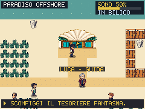
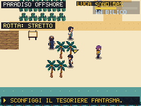
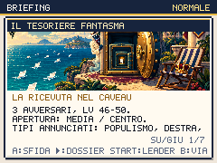

# Il sole è pubblico, l'ombra ha cambiato residenza

Round del 2 ottobre 2026. Offshore acquista un'identità propria: spiaggia,
banchine di legno, palme con un nastro d'oro, Lido Cayman con tetto a
conchiglia e Tesoriere Fantasma in completo avorio. Il suo volto rimane
un'ombra; quattro PNG distinti rappresentano fronte, retro e profili.
Il personaggio presidia l'altopiano: queste sono viste direzionali idle,
non un nuovo ciclo di camminata.





## Prepararsi prima di firmare

Commercialista, Prestanome e Tesoriere aspettano A. Camminare nel loro
campo visivo non avvia la lotta. Il dossier mostra squadra, mosse,
abilità, livelli della difficoltà scelta e leader; B annulla senza
consumare PP, denaro o ricompense. Tre nuove illustrazioni portano a
**24** i briefing illustrati. Un'illustrazione non assegna cure o precisione
da boss alle due prove ordinarie: l'IA ora distingue esplicitamente il
ruolo tattico dalla presenza dell'immagine.

Il Lido recupera PV e PP gratuitamente, con entrambe le porte utilizzabili.
Un ambulante vende cure, schede e oggetti tramite il negozio del gioco:
il preventivo precede l'acquisto. Si può reclutare nell'erba, recuperare
mosse dall'archivio, equipaggiare un Gilet e tornare allo Stretto prima
della sfida. La guida corregge il vecchio «lv 38+»: gli incontri
selvatici dell'isola sono **30–45**. La rotta orientale per Bruxelles
resta accessibile senza battere il Tesoriere o parlare con lo Sherpa.

Le squadre conservano livelli e mosse precedenti: Commercialista 40/41,
Prestanome 41/42/43, Tesoriere Telecrate 46, Conteblob 48 e Berlusconix 50.
Statistiche, EXP, prezzi e distribuzione degli incontri non sono abbassati
per ottenere una vittoria del controller.

## Tre contraddizioni, una ricevuta

La ricerca sulle [società offshore spiegate da ICIJ](https://www.icij.org/investigations/panama-papers/what-is-a-tax-haven-offshore-finance-explained/)
ha fornito il contrasto narrativo tra sede, intestazione e controllo.
[It's Free Real Estate](https://knowyourmeme.com/memes/its-free-real-estate)
ha suggerito una promessa pubblicitaria che cambia significato quando
arriva il contratto. Dialoghi, scene e immagini sono originali: nessun
fotogramma del meme o accusa fattuale a una persona reale è incorporato.

Il Commercialista ha una conchiglia come sede e un timbro come personale.
Il Prestanome possiede le chiavi degli alberghi, ma paga il panino a rate.
Il Tesoriere apre tre caveau per trovare la ricevuta della loro custodia.
Gli NPC riprendono questi paradossi: «Sul contratto sono il padrone.
Sul citofono sono il fattorino.» La vittoria legge il verbale del morale;
le promesse mantenute, riparate e ancora aperte rimangono nella memoria.

## Asset e provenienza

Sei job `gpt_image_2_5`, qualità `high`, risoluzione 1k, **9 crediti**.
Saldo riletto **613,72 → 604,72**, spesa cumulativa **281,25**. Nove PNG
finali: tre panorami 224×78, edificio 64×32, palma 32×48 e quattro viste
24×32 del Tesoriere. Prompt, job, fonti e checksum in
[scripts/higgsfield-offshore.json](../scripts/higgsfield-offshore.json).
La normalizzazione tecnica usa ritagli, nearest neighbour, palette e
soglia alpha 128; non ridisegna creativamente i pixel. Gli edifici e gli
oggetti possono ora avere risorse specifiche per mappa; il ruolo logico di
un NPC rimane distinto dal suo aspetto. Porte e collisioni conservano
la geometria della mappa. Gli altri NPC usano il cast Higgsfield già
rinnovato: il round non attribuisce a ciascuno un ritratto individuale.

```sh
python3 scripts/prepare-first-campaign-assets.py artifacts/offshore/tesoriere.png --manifest scripts/higgsfield-offshore.json --asset tesoriere
python3 scripts/prepare-offshore-world.py
npm test
npm run validate:content
BASE_URL=http://127.0.0.1:5190 npm run check:offshore
BROWSER=webkit BASE_URL=http://127.0.0.1:5190 npm run check:offshore
BASE_URL=http://127.0.0.1:5190 npm run check:building-doors
BASE_URL=http://127.0.0.1:5190 npm run shot:boss-briefing
BROWSER=webkit BASE_URL=http://127.0.0.1:5190 npm run shot:boss-briefing
WORLD_PHASE=offshore BASE_URL=http://127.0.0.1:5190 npm run shot:world-redesign
PERF_AUDIO=1 npm run perf:check
```

## Campagne e verifiche

[offshore-registro-proof.json](offshore-registro-proof.json) conserva i
riepiloghi, le provenienze e gli SHA dei report. Tre salvataggi ottenuti
nelle precedenti campagne da nuova partita sono importati tramite il
codice di salvataggio, senza aggiungere livelli, denaro, oggetti o flag.
Il segmento Offshore riparte con seed **20261002**: non è un flusso casuale
ininterrotto dalla prima scena. Le prove usano input del gioco, incontri,
catture, acquisti, cura, archivio e briefing reali.

| Starter originario | Reclutamenti sull'isola | Prove e Tesoriere | Fiducia / coesione alla fine |
|---|---|---|---|
| Ellyna | Muskrat 34, Putingrad 36 | Tre vittorie al primo tentativo | 68 / 74; una promessa mantenuta |
| Renzino | Pontimax 43, Xipanda 39 | Tre vittorie al primo tentativo | 80 / 80; due promesse mantenute |
| Giorgetta | Pontimax 42, Xipanda 35 | Tre vittorie al primo tentativo; due Gilet aggiuntivi acquistati | 36 / 56; due promesse infrante |

Tra importazione e arrivo sull'isola le tre partite risolvono la verifica
pubblica giornaliera già presente, che assegna +6 fiducia e +8 coesione.
Dall'arrivo alla vittoria del Tesoriere quei valori non cambiano; le
promesse importate conservano lo stesso stato. Il nuovo epilogo di
Giorgetta mostra ancora «0 MANTENUTE. 0 RIPARATE. 2 APERTE.»

La prima Ellyna senza reclutamenti perde due volte col Tesoriere. Una
precedente Giorgetta preparata con Xipanda e Trumpon perde due volte;
il percorso finale ha anche reclutamenti diversi. Questi confronti non
isolano l'effetto del negozio o dei Gilet e non dimostrano equilibrio
universale. Il controller di prova ora aspetta la dissolvenza d'ingresso
prima di premere pausa: l'errore precedente nell'archivio era un input
scartato durante la transizione, non una modifica necessaria al gioco.

**286 test**, contenuti, meme pack, contratti input e audit visivo/testi
passano. **9.724 layout di briefing per motore** coprono difficoltà,
squadre di varie dimensioni, annullamento, leader e avvio effettivo.
Il test di navigazione percorre porte, cure, negozio, ritorno marittimo
e viaggio verso Bruxelles prima del boss, oltre alle quattro viste del
Tesoriere, in Chromium e WebKit. Usa stato sintetico e disabilita gli
incontri casuali solo nella sua pagina isolata; le campagne li conservano.
Il controller attende e ricalcola il percorso se un NPC mobile occupa
la destinazione, con un limite finito di passi.

La matrice del mondo decodifica **66 mappe, 252 viste e 220 pose del cast**;
è una verifica campione del renderer, non una campagna completa.
CPU Chromium ×4 con musica attiva: p95 mondo/lotta/Dex **17,6 / 17,5 /
17,6 ms**, nessun frame oltre 100 ms. Bundle iniziale **187.968 byte gzip**,
totale **357.916**, margine **484 byte** sotto il limite invariato di
350 KiB. Il margine richiede ulteriori separazioni del codice nei round
successivi, senza aumentare il budget.

Build locale: **443 checksum PNG e 20 audio/catalogo**; primo uso offline
**552 asset Higgsfield e 19 AAC stereo** nei due motori. Reload offline
verificato solo in Chromium, precache e ripresa in WebKit. Restano
campagne in difficoltà alta, seed diversi, Bruxelles e altri atti,
identità degli interni e delle zone, animazioni dedicate mancanti e
prove su dispositivi fisici. Il redesign completo rimane attivo.
