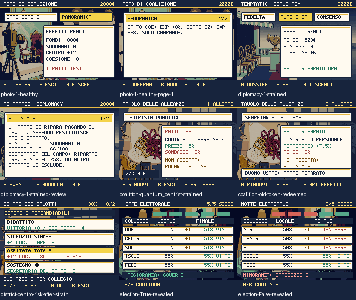

# Patti, conseguenze e campagna

Round del 2 ottobre 2026. Foto, Futuro Anteriore e Temptation Diplomacy hanno
un'interfaccia comune con tre stati: scelta, dossier annullabile, risultato.
Cinque nuovi fondali Higgsfield danno identità anche al tavolo delle alleanze
e allo scrutinio. I collegi territoriali usano il nuovo ambiente del tavolo,
con nomi e valori su righe separate e controlli sempre visibili.

## Conseguenze effettive

Le anteprime usano gli stessi resolver della conferma. Mostrano variazioni
effettive dopo i limiti 0–100 e i modificatori della coalizione. Il primo A apre
il dossier, senza pagare; B torna alla scelta; A sull'ultima pagina conferma.
I paragrafi restano interi sulle pagine. Il risultato e la riapertura non
ripetono pagamenti, ricompense o penalità.

| Evento | Coesione | Effetto sull'alleato |
|---|---:|---|
| Prima violazione di un patto | −8, limitato dal valore disponibile | Bonus personale dimezzato |
| Nuova violazione / patto già riparato | −16, limitato dal valore disponibile | Esclusione e memoria della rottura |
| Autonomia con alleato teso riparabile | +6, massimo 100; costo 500€ | Riparazione immediata, bonus personale al 75% |

La regola vale per foto, scelte politiche e promesse territoriali. La coesione
influisce sull'EXP della campagna: +8% da 70, −8% sotto 30. La fiducia resta
distinta; queste decisioni non la modificano. Il PvP conserva le proprie regole.

La riparazione diplomatica prima creava un buono senza alcun percorso per
spenderlo. Ora il patto viene riparato nella stessa transazione del pagamento.
Il precedente non viene cancellato e ogni membro ha una sola riparazione.
I buoni dei salvataggi precedenti sono riscattabili dalla scheda dell'alleato:
versione della violazione esatta, nessun altro pagamento, recupero unico.

I prezzi del negozio, i rimborsi e i sondaggi dopo una lotta ora usano i canali
di coalizione che le schede già dichiaravano. I modificatori sono percentuali;
prezzi e ricompense mantengono il proprio arrotondamento. START nella scheda
mostra tutti i modificatori netti, incluso l'assetto della coalizione. Il
contributo personale distingue patto attivo, teso e riparato. B annulla una
rimozione in attesa senza chiudere la scheda.

Le anteprime territoriali calcolano il consenso dopo l'eventuale violazione,
quindi con il bonus già ridotto. Le promesse mostrano costo e coesione; il
dibattito mostra vittoria e sconfitta con modificatori e limiti effettivi.
I collegi conservano la scelta diretta con A e il limite di due azioni: non
sono ancora parte del flusso di dossier/conferma delle tre scene principali.

Lo scrutinio mostra cinque indicatori, collegi e riconteggio effettivo;
nasconde il numero finale dei seggi finché i collegi non sono stati aperti.
A/B prima rivela i risultati, poi prosegue: il callback non scatta alla sola
rivelazione. Nessuna nuova animazione lampeggiante o scuotimento.

## Scrittura e ricerca

Nuovi testi originali sul programma fuori dall'inquadratura, la fedeltà
finanziata a preventivo, il silenzio fatturato come consulenza e il carattere
tipografico approvato prima del programma. Le conseguenze parlano di alleati
con nome leggibile, invece dei numeri interni delle linee rosse.

I riferimenti editoriali consultati sono il dibattito sul nome della
coalizione ([ANSA, 1 luglio 2026](https://www.ansa.it/amp/sito/notizie/politica/2026/07/01/il-rebus-del-nuovo-nome-del-campo-largo-da-alleanza-per-la-carta_0e13280a-8524-4aa2-b753-a2886e29dcb3.html))
e la comunicazione attraverso una foto di gruppo ([ANSA, 16 gennaio 2026](https://www.ansa.it/amp/sito/notizie/politica/2026/01/16/foto-di-gruppo-del-campo-largo-per-liran-la-piazza-ce_07fde573-56ba-46dd-89f9-cc99a52db43f.html)).
Le battute del gioco sono invenzioni: non attribuiscono preventivi, pagamenti
o frasi fittizie alle persone citate nelle notizie. Non sono copiati meme o
dichiarazioni. La revisione narrativa dell'intera campagna resta aperta.

## Produzione e verifiche

Cinque job Nano Banana Pro (backend riportato `nano_banana_2`), cinque PNG
240×163, **10 crediti**, saldo **667,97 → 657,97**, cumulativo **228**.
Prompt, job, fonti e SHA-256 sono in `scripts/higgsfield-campaign-ui.json`.
`prepare-campaign-ui-assets.py` prepara in staging; le immagini native sono
state viste prima dell'installazione. Tutti i checksum del manifesto coincidono
con i PNG installati.

- **261 test** riusciti, typecheck e validazione contenuti. I nuovi casi coprono
  purezza delle anteprime, delta esatti, blocchi, limiti, coesione/EXP, riparazione
  e buoni storici, prezzi e ricompense effettivi. Nessun test saltato.
- `shot:campaign-ui`: **142 viste**, 16 scelte su alleanze sane/tese,
  annullamento del dossier, conferma esatta, 20 stati di schede con effetti
  netti, rimozione annullabile, buono storico, cinque collegi e due finali dello
  scrutinio. Zero errori browser e zero testi fuori dal canvas; schermate riviste.
- Audit di input: 35 implementazioni direzionali, incluso il controller comune
  delle tre scelte. Audit statico: 45 scene associate a script di schermata,
  zero chiamate di clipping; non certifica da solo l'aspetto di ogni scena.
- **490 PNG** non vuoti e terreno core completo. Duello e scambio reali fra due
  contesti browser riusciti dopo l'aggiornamento delle dipendenze; controllati
  salvataggi, conclusione, scambio simmetrico e payload illegali. Nessuno SKIP.
- Minificazione Terser, supportata da [Vite 6](https://v6.vite.dev/config/build-options#build-minify),
  con due passaggi e senza opzioni `unsafe`. Bundle **206,6/340,5 KiB gzip**;
  p95 mondo/lotta/dex **18,5/18,5/18,4 ms**, CPU Chromium ×4. Budget
  250/350 KiB e 33,4 ms invariati. Aggiornate tre dipendenze transitive compatibili;
  `npm audit` restituisce zero vulnerabilità.
- Verifica locale della build: **382 checksum**, nuovo codice delle anteprime
  e riparazione; PWA Chromium/Pixel 7 con **491 asset Higgsfield** al primo uso
  offline, migrazione, aggiornamento e resume. La pubblicazione richiede la
  stessa verifica sul dominio pubblico dopo il deploy.

Questo round non conclude il redesign. Restano partita completa nell'interfaccia,
revisione degli altri archi e dialoghi, scene residue, audio, involucro esterno,
chat fra peer reali e dispositivi/reti diversi. Le prove locali dei due browser
non certificano tutte le condizioni di rete o l'intera campagna.
