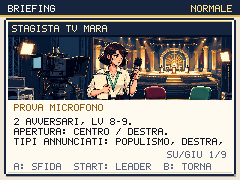
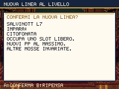

# Primo atto: costruire una squadra prima della diretta

Round del 2 ottobre 2026. Il percorso Borgo Urne → Mediopoli ora accompagna
reclutamento, crescita e preparazione senza imporre nuove serrature alla storia.
La prima medaglia richiede ancora una squadra capace di reggere Sua Emittenza.

## Problemi osservati e cambiamenti

Il percorso più corto poteva portare uno starter di livello 5 contro due
avversari di livello 12. La guida saltava la preparazione, gli incontri lungo
la strada erano automatici e reclutare un candidato non dava esperienza.
La Divisa Equa faceva crescere la panchina, ma il codice ignorava le mosse
apprese salendo di livello. Due personaggi usavano inoltre lo stesso ID
allenatore: vincere a Borgo rendeva già sconfitto lo sfidante del Percorso 1.

- **Crescita iniziale:** EXP ×2 fino al livello 10 del partecipante, con
  riduzione graduale del bonus fino a ×1 al livello 20. Il livello del
  partecipante determina il bonus; un nemico più forte continua a rendere
  più EXP. Le soglie salvate `0,8·L³ + 10·L²` restano identiche.
- **Reclutamento:** la cattura riuscita assegna EXP con la stessa procedura
  del KO. La Divisa lascia tutta l'EXP al partecipante e ne assegna metà
  alla panchina viva già presente; il candidato appena catturato e i KO
  sono esclusi. I Manifesti danno il bonus dichiarato e consumano una carica
  anche sulla cattura, dopo apprendimento ed eventuali evoluzioni.
- **Apprendimento della panchina:** ogni nuovo livello può aprire il
  confronto delle mosse per il candidato corretto. La conferma mostra nome
  e livello. Rinuncia e PP delle mosse conservate seguono le regole esistenti.
- **Missioni:** «Una squadra, due voci» porta all'erba del Percorso 1;
  «Il fondale vuole crescere» indica il sindacalista che regala la Divisa.
  Sono obiettivi di orientamento. La medaglia Auditel li considera già
  superati nei vecchi salvataggi avanzati.
- **Avversari iniziali:** Piero usa due tipi a livello 4; Rita resta a
  livello 7. Gli sfidanti di Borgo, Percorso 1 e piazza di Mediopoli
  attendono l'interazione. Nino ha un ID distinto, livelli 6/7 e premi propri.
- **Mara:** prova facoltativa al livello 8/9 in modalità normale, 11/12 in
  difficile, con briefing annullabile e illustrazione propria. La sua IA
  non usa cure; il cambio dopo un KO avversario e il recupero gratuito al
  bar diventano indicazioni concrete. Sua Emittenza conserva livelli 12/12,
  cure dell'IA, medaglia e ricompense.
- **Accessi:** uno sfidante errante poteva comparire sulla porta della
  palestra. La scelta della sua casella ora esclude ostacoli, acqua,
  uscite e spazio davanti alle porte.

## Satira del lavoro che tiene in piedi lo spettacolo

Mara controlla il microfono mentre il conduttore si prende i titoli di coda.
Piero registra una sconfitta come «ascolto del territorio» lasciando uguale
il rimborso. Chiara nasconde la dichiarazione dello sponsor con testo bianco
su sfondo bianco. Nino vive lo sportello unico con password diverse per
ufficio. Le battute descrivono contraddizioni dei personaggi e accompagnano
azioni del giocatore.

La ricerca del round ha consultato la notizia sul dimezzamento temporaneo
dello sconto sulle accise del gasolio, pubblicata il 25 settembre 2026 da
[ANSA](https://www.ansa.it/amp/canale_motori/notizie/mondo_motori/2026/09/25/prezzi-benzina-e-gasolio-stabili-sulle-strade-da-domani-si-dimezza-sconto-accise_4b00992f-da17-4bbb-b751-2fa642e403b4.html).
Il riferimento ispira Rita e il suo titolo prestabilito: il gioco non
presenta quella battuta come un prezzo attuale o una citazione del giornale.
Il progetto di digitalizzazione e interoperabilità SUAP/SUE della
[Funzione Pubblica](https://funzionepubblica.gov.it/it/il-dipartimento/area-di-interesse/attuazione-delle-misure-pnrr/il-pnrr-per-la-pa-riforme-e-investimenti/investimento-22-creazione-della-task-force-digitalizzazione-monitoraggio-e-performance/sub-investimento-223-digitalizzazione-sportello-unico-attivita-produttive-e-sportello-unico-edilizia/)
fornisce il contesto dello sportello unico. La disfunzione di Nino è
invenzione satirica, non un'affermazione sull'esito di quel progetto.

## Illustrazione e credito

Un job Higgsfield completato, modello `gpt_image_2_5`, produce il backstage
di Mara: `fa22c028-2678-4fd6-a607-1f69dbef0ef3`. Sorgente e ritaglio sono
stati controllati visivamente prima dell'integrazione a 224×78 pixel.
Il lavoro costa **0,25 crediti**, saldo verificato **617,97 → 617,72**,
spesa cumulativa **268,25** rispetto al saldo iniziale osservato di 885,97.

Prompt, dimensioni, job, fonte e SHA-256 sono in
[`higgsfield-first-campaign.json`](../scripts/higgsfield-first-campaign.json).
La conversione tecnica è ripetibile con
[`prepare-first-campaign-assets.py`](../scripts/prepare-first-campaign-assets.py)
passandogli il PNG sorgente locale. Non sono stati attivati acquisti o abbonamenti.





## Partite nuove tramite input

`playtest:campaign:native` parte da `newGameState()`: nessun livello, medaglia,
vittoria, cura o valuta assegnato dal controller. Movimento e azioni usano
eventi tastiera, le battaglie risolvono naturalmente, gli oggetti si
consumano e le sconfitte riportano al recupero previsto dal gioco. Il
controller sceglie il danno atteso migliore, cura sotto il 35% dei PV e
recluta fino a tre candidati. Non usa strategie avanzate di status o setup.

Le prove sono locali, multiplayer disattivato, audio disattivato, RIDUCI
EFFETTI attivo, seed 20261002. Il controller aggiorna le scene a passi di
0,1 secondi di tempo virtuale: i tempi registrati **non misurano la durata
di una partita umana né il frame rate**. L'esportazione e il salvataggio
dei checkpoint usano le API del gioco; il pulsante SALVA è provato dal
controllo della cornice esterna.

Il percorso preparato affronta Piero e Rita, ritira la Divisa, recluta e
si allena fino a livello 10 con tre candidati, usa i bar e prova Mara.
Consente al massimo due tentativi contro Sua Emittenza. La stessa politica
è stata eseguita sulla precedente pubblicazione `6c9f173` in una copia
isolata, disattivando solo l'asserzione sulle nuove ricompense di cattura.

| Versione / starter | Selvatici nella fase di preparazione | Passi totali | Sconfitte totali | Tentativo vincente del boss |
|---|---:|---:|---:|---:|
| `6c9f173` / Ellyna | 15 | 712 | 4 | 2 |
| Nuova / Ellyna | 3 | 320 | 0 | 1 |
| Nuova / Giorgetta | 3 | 310 | 0 | 1 |
| Nuova / Renzino | 4 | 374 | 1 | 2 |

Le tre partite preparate ottengono Auditel. Renzino perde il primo tentativo,
torna al bar, vince il secondo ed evolve in Renzilla attraverso la scena
reale. Ellyna e Giorgetta terminano al livello 15; le vittorie consumano
rispettivamente 8, 8 e 7 oggetti di cura. La squadra non diventa invulnerabile:
si registrano KO e il Percorso 1 resta necessario alla preparazione scelta.

Una prova aggiuntiva interagisce con Nino, vince la sua battaglia, prosegue
con Mara e conquista Auditel; Ellyna evolve in Schleinix. Una partita
diretta separata salta allenamento, reclutamento e Mara: arriva davvero a
Sua Emittenza con Ellyna al livello 5 e perde. Il controller documenta
gli esiti, senza trasformare una sconfitta in vittoria per superare il test.

```bash
BASE_URL=http://127.0.0.1:5188 RUN_PLAN=prepared STARTER=renzino npm run playtest:campaign:native
BASE_URL=http://127.0.0.1:5188 RUN_PLAN=direct STARTER=ellyna npm run playtest:campaign:native
BASE_URL=http://127.0.0.1:5188 RUN_PLAN=prepared RUN_PRACTICE=1 RUN_LABEL=nino npm run playtest:campaign:native
```

Il comando salva risultati JSON, codici di salvataggio e immagini native
in `artifacts/campaign-native` e `artifacts/screens/campaign-native`, esclusi
da Git. I report registrano anche le mosse apprese dal candidato corretto.

## Regressioni e build

- **280 test** riusciti: soglie dei save e crescita avanzata, nuovi obiettivi,
  ID separato di Nino, contatore delle vittorie nuove del morale e IA di Mara.
- **Audit EXP:** aggiornati i chiamanti alla firma con livello del
  partecipante. Nei livelli iniziali il riferimento ora usa la mediana delle
  specie effettivamente presenti negli incontri a quel livello, anziché
  inventare forme evolute al livello 5 dalla mediana dell'intero roster.
  Soglie di controllo invariate; il calcolo indicativo non sostituisce le partite.
- **Morale:** 28 viste e flussi delle fixture verificano coesione nel premio
  EXP, conferma dei favori e della foto, scadenza dopo tre vittorie nuove,
  rematch esclusi, riparazione, reload ed epilogo con callback/premio una volta.
  Gli esiti delle battaglie di queste fixture sono forzati.
- **Chromium e WebKit:** 86 approcci a warp controllati ciascuno; briefing
  Mara normale/difficile e annullamento senza modificare lo stato. Queste
  prove usano fixture e non equivalgono a percorrere fisicamente tutte le mappe.
- **Catture naturali in fixture**, squadre di tre e sei: partecipante +52 EXP,
  panchina viva +26, KO e nuovo reclutato +0; Citofonata appresa da Salvinott,
  una carica Manifesti consumata, recluta destinata alla squadra o al box,
  risultati conservati dopo salvataggio e caricamento.
- **2.400 layout di briefing**, **103 viste HQ** per tutti i 49 dossier
  missione su 90 pagine, **511 viste ingresso/pausa/viaggi**. Nessuna
  eccedenza di testo nelle matrici; sei tutorial aggiuntivi tramite input.
- `validate:content`: 52 specie, 78 mosse, 49 allenatori, 66 mappe, 49 missioni.
- **Bundle:** 212.255 byte gzip iniziali (207,3 KiB), 358.274 totali
  (349,9 KiB). p95 Chromium con CPU ×4: mondo 17,6 ms, lotta 17,5 ms,
  Dex 17,6 ms. Budget invariati; il margine totale è soltanto 126 byte.
  Riutilizzo di funzioni, rimozione di testo/codice duplicato e tre passaggi
  Terser hanno mantenuto il limite di 350 KiB.
- **Build locale di produzione:** 421 checksum PNG corrispondenti;
  precache e primo utilizzo dei 530 asset Higgsfield verificati in Chromium
  e WebKit. Reload realmente offline verificato in Chromium; Playwright
  WebKit consente solo la verifica della precache e dei caricamenti offline.

```bash
npm test
npm run validate:content
npm run perf:check
npm run audit:progression
BASE_URL=http://127.0.0.1:5188 npm run shot:morale-satire
npm run check:first-campaign
CAMPAIGN_BROWSER=webkit npm run check:first-campaign
```

Il round verifica il primo atto fino ad Auditel in modalità normale.
Non certifica la campagna completa, il bilanciamento difficile o tutte le
evoluzioni ramificate. Restano revisione delle zone successive, audio,
percorsi alternativi, partita completa e postgame, come registrato in
[`REDESIGN-PLAN.md`](REDESIGN-PLAN.md).
