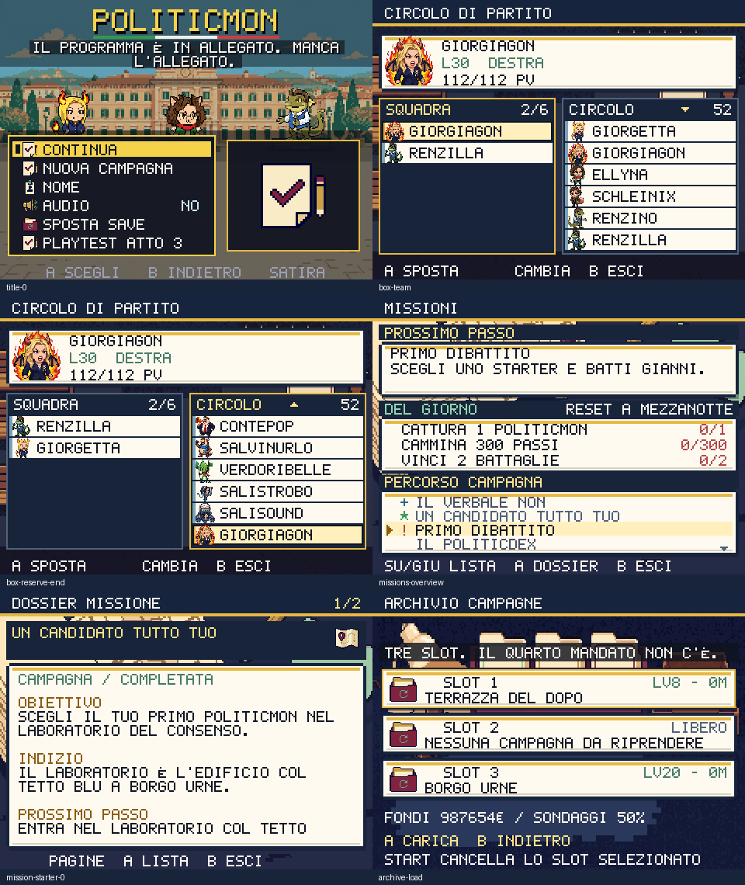

# Quartier generale — 1 ottobre 2026

Titolo, circolo, missioni e archivio salvataggi condividono ora la palette navy,
crema, menta, bordeaux e oro del nuovo mondo. Il round aggiunge sei icone
Higgsfield e tre ambienti, conserva salvataggi e regole dei trasferimenti e
rende consultabili informazioni prima abbreviate.

## Consultare prima di scegliere

Nel CIRCOLO il candidato evidenziato mostra nome completo, ritratto, livello,
tipi, PV e stato prima del trasferimento. Le colonne indicano quantità e
scorrimento; A sposta, sinistra/destra cambia colonna, B esce. I nomi nelle
righe usano lo spazio disponibile invece del taglio fisso a nove caratteri.
Restano il massimo di sei membri attivi e il divieto di depositare l'ultimo.

MISSIONI mantiene il prossimo passo, le attività del giorno e la lista della
campagna. **A apre il dossier della missione evidenziata**: titolo, obiettivo,
indizio e passo sono completi e paginati. Sinistra/destra sfoglia, A torna alla
lista, B esce. Consultare il dossier non modifica fondi, progressi o ricompense.
La prova controlla il testo effettivamente inviato al renderer per tutte le 47
missioni; 86 pagine contengono interamente descrizioni, indizi e passi.

L'ARCHIVIO mostra tre schede con livello, medaglie e zona; fondi e consenso
dello slot selezionato compaiono interamente sotto. Titoli e conferme non sono
tagliati. Il primo tocco evidenzia lo slot, il secondo carica quello selezionato;
uno slot vuoto non carica una partita. B annulla cancellazione e sovrascrittura.
START apre la conferma di cancellazione: il tocco di una scheda non cancella.

Il titolo usa nuove icone e slogan originali sugli allegati mancanti, sui
sondaggi e sui servizi guasti. Le vecchie anteprime costruite con piccoli
rettangoli sono eliminate. RIDUCI EFFETTI del save, oppure la preferenza di
sistema in assenza di salvataggio, congela gli elementi decorativi del titolo.

## Produzione e verifica

Cinque job Nano Banana Pro completati, incluso il rifacimento di un ambiente
che conteneva lettere generate sul biglietto. **10 crediti**, saldo verificato
**689,97 → 679,97**; cumulativo dei round Higgsfield **206 crediti** dal saldo
iniziale di 885,97. Nove PNG finali, senza scritte incorporate. Nessun acquisto
o abbonamento attivato.

`scripts/higgsfield-hq.json` conserva prompt, job, sorgenti, checksum, correzione
e addebito. `prepare-hq-assets.py --download` prepara in staging; `--install`
installa dopo la revisione. Le icone mantengono trasparenza, proporzioni e
dimensione 32×32; gli ambienti sono 240×135. Il renderer li carica quando servono.

- 254 test e typecheck superati.
- `shot:hq`: 99 viste, zero testo oltre il canvas; trasferimento di un candidato
  preciso, conservazione degli UID, limiti squadra, ultimo membro e riserva
  lunga; tutti i dossier; annullamento delle azioni distruttive e caricamento
  tramite due tocchi sullo slot corretto.
- Revisione visiva dei contrasti, compresi i titoli sulle illustrazioni chiare.
- Budget confermati senza aumentare i limiti: iniziale ≤250 KiB, totale ≤350 KiB
  gzip, p95 ≤33,4 ms sotto CPU Chromium ×4.
  Misura finale: **217,0/349,7 KiB**, p95 mondo/dex **18,5 ms**, lotta **18,5 ms**.
- I nove file del round entrano nel controllo del primo utilizzo offline della
  PWA, che ora comprende **413 asset Higgsfield**. Il verificatore del deploy
  controlla **304 checksum** per mondo e quartier generale e il codice dei dossier.

Gli screenshot campione non certificano tutti i flussi di rete o una campagna
completa. Continuano i round sulle altre interfacce, sui dialoghi delle zone,
sul ritmo delle lotte, sugli effetti e sulla verifica integrale del gioco.

Pubblicato nel commit `50b50ca`: CI riuscita e deploy verificato su
[politicmon.vercel.app](https://politicmon.vercel.app/). Tutti i 304 PNG del
verificatore corrispondono ai file locali; la PWA del sito pubblico passa il
primo utilizzo offline dei 413 asset e il ritorno dal background.

