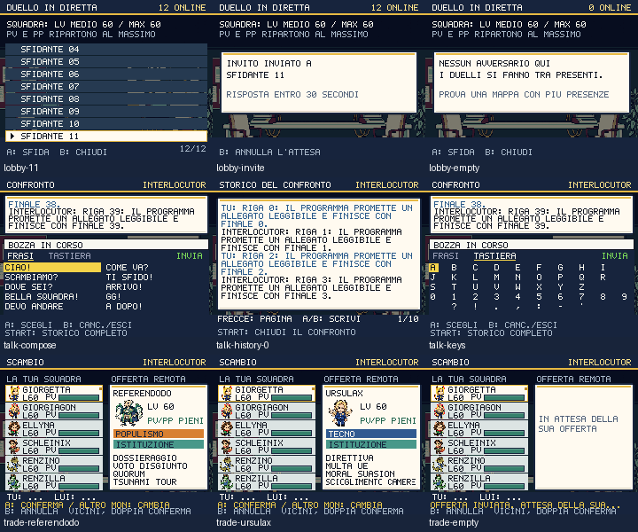

# Rete, emblemi e superfici coerenti — 2 ottobre 2026

Duello, dialogo fra giocatori e scambio condividono un nuovo ambiente Higgsfield:
il circolo con due terminali, collegamenti, una bacheca e una mappa. Carte chiare,
intestazioni navy e fasce opache dietro comandi e tastiera tengono leggibili i
contenuti, anche dove l'illustrazione ha dettagli chiari.

## Scelte leggibili e messaggi interi

La lobby del duello scorre seguendo il cursore: prima mostrava solo i primi
otto presenti, mentre il cursore poteva selezionare persone fuori dallo schermo.
La prova con dodici presenti controlla ogni nome evidenziato e l'invito al peer
corrispondente. Livello medio/massimo, ripristino di PV/PP e tempo di attesa sono
leggibili; B annulla l'attesa.

Nel CONFRONTO il riquadro mostra le ultime righe con testo a capo. **START apre
lo storico completo** dei quaranta messaggi conservati; le frecce sfogliano,
A/B torna alla scrittura, START dallo storico chiude il confronto. B nella
scrittura cancella un carattere oppure esce se la bozza è vuota. In attesa,
B/START continua ad annullare. Lo storico conserva la bozza e non invia messaggi.
Prima erano mostrati solo 37 caratteri di ciascuna riga: la parte finale poteva
sparire dall'interfaccia. Ora una prova verifica interamente quaranta messaggi
lunghi, su dieci pagine, compresi i termini finali. Il limite del protocollo e
il numero di messaggi conservati non cambiano.

Lo SCAMBIO mostra nome intero dell'offerta, ritratto, livello, PV/PP rigenerati,
ogni tipo su una riga e tutte e quattro le mosse. La squadra usa nomi completi
nello spazio disponibile; il bordo identifica l'offerta. Restano le due
conferme e l'annullamento con B. Consultare le 52 possibili offerte non altera
la campagna; le mosse e i tipi effettivamente disegnati sono controllati.

## Risorse e rimozioni

Otto nuovi emblemi Higgsfield per le ideologie; colori e testo dei chip nella
guida, nell'anteprima starter e nello scambio danno contrasto **4,52–8,53:1**.
Il fondale dei percorsi è nuovo, come la macchina del casinò. La prima proposta
del prato conteneva riquadri d'interfaccia incorporati: scartata e corretta con
un secondo job, prima del deploy. Il paesaggio finale è continuo, con una piccola
pompa di benzina e un ponte dominato dal nastro dell'inaugurazione.

Rimossi i quattro PNG del vecchio dialogo, della barra PV, della medaglia
inutilizzata e dell'etichetta della console. Barre PV e cornici hanno un renderer
moderno condiviso. Eliminati anche `setPanelImage`, `nineSlice` e il loader della
vecchia cornice; gli strumenti di screenshot usano lo stesso tema del gioco.
La provenienza dei file ritirati resta nel manifest storico.

La verifica estesa ha trovato un difetto del round mondo: i piccoli arredi
trasparenti di grotta e neve lasciavano visibile il nero del canvas. Ora hanno
il terreno della zona sotto, neve compresa. L'auditor distingue i dodici mezzi
68×68 dai personaggi e gli arredi trasparenti dalle texture che devono coprire
ogni pixel; non aumenta genericamente i limiti di ingombro.

Sei job Nano Banana Pro completati, registrati dal provider come `nano_banana_2`,
**12 crediti**, saldo **679,97 → 667,97**; cumulativo **218 crediti**. Undici PNG
finali. Nessun acquisto o abbonamento. `higgsfield-core-ui.json` conserva prompt,
job, sorgenti, checksum e proposta scartata; `prepare-core-ui-assets.py`
prepara in staging e installa solo dopo la revisione.

## Prove

- 254 test, typecheck, contenuti e contratti di input superati.
- `shot:social-ui`: 83 viste; dodici sfidanti, invito mirato e annullamento,
  timer, quaranta messaggi completi, bozza conservata, 52 offerte intere e zero
  testo fuori dal canvas. La prova dei dodici presenti usa dati controllati.
- `check:duel`: **rete reale**, due contesti browser separati, invito/accept/start,
  un turno con PV speculari, resa, ritorno al mondo, save preservati tranne i
  risultati/missioni dichiarati, vittorie trasmesse al profilo remoto. Nessuno SKIP.
- `shot-trade`: **rete reale**, invito, offerte e doppia conferma; trasferimento
  simmetrico, PV rigenerati, dex aggiornato e rimozione del ministero associato
  al candidato ceduto. Respinti dati con specie o mosse illegali; livello e
  statistiche ricostruiti localmente. Nessuno SKIP. Harness isolato dal titolo.
- 485 PNG non vuoti; texture core a copertura completa e dimensioni degli
  edifici/mezzi verificate. Matrice aggiornata: 66 mappe, 252 viste e 220 pose.
  Rivisti visivamente grotta e neve dopo la correzione del terreno.
- Passerella civica verificata con cammino reale, ricompensa unica, import del
  save e campagna separata; confermati i dieci ambienti PvE/PvP e 48 frame degli
  effetti degli otto tipi, inclusa RIDUCI EFFETTI.
- Budget invariati: **216,6/349,6 KiB gzip**, p95 mondo/lotta/dex **18,5 ms**
  sotto CPU Chromium ×4. I limiti restano 250/350 KiB e 33,4 ms.
- PWA Chromium/Pixel 7: **486 risorse Higgsfield** al primo utilizzo offline,
  migrazione, aggiornamento, riavvio e resume. Il verificatore pubblico
  comprende ora 377 checksum e il codice dello storico.

Le prove di rete dimostrano questi due flussi fra i browser testati, non ogni
rete mobile/NAT. La chat è verificata nell'interfaccia, con ricezione controllata;
non è ancora una conversazione reale fra due peer. Campagna completa, altre
scene sociali/politiche, audio e involucro esterno del gioco restano nel piano
attivo. Il progetto non è dichiarato completamente ridisegnato.

Pubblicato nel commit `e6132e8`: CI riuscita; tutti i 377 PNG finali e il codice
dello storico verificati su [politicmon.vercel.app](https://politicmon.vercel.app/).
La prova pubblica Chromium/Pixel 7 conferma il primo uso offline delle 486
risorse, migrazione, aggiornamento e resume.
