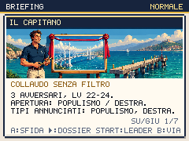
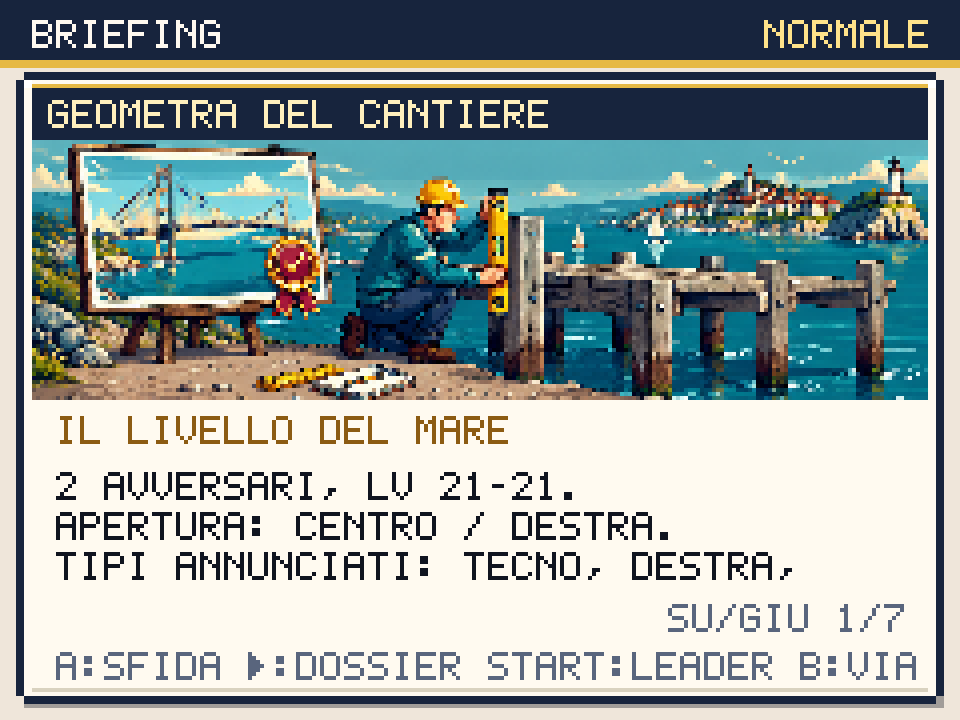

# Il rendering non attraversa

Round del 2 ottobre 2026. Lo Stretto diventa una deviazione leggibile e
volontaria dopo tre medaglie, utile per preparare la squadra prima del
Palazzo e del Colle. Cinque nuovi briefing illustrati raccontano la
distanza fra immagine approvata e passaggio collaudato.

Il Capitano taglia il nastro del rendering, il DJ tiene il microfono
scollegato, il Citofonista prepara la risposta prima della domanda.
L'attivista chiede il piano dei trasporti e il Geometra porta la livella
sul passaggio vero. Segnali, guida, ingegnere, Elevato, chiosco, introduzioni
e sconfitte condividono questa situazione, senza cronologie inventate.

La ricerca web ha consultato [Expectation vs. Reality](https://knowyourmeme.com/memes/expectation-vs-reality)
e [Task Failed Successfully](https://knowyourmeme.com/photos/861107-video-game-logic).
Sono riferimenti al meccanismo comico: le battute e le immagini del gioco
sono originali, senza incorporare i meme trovati.



## La deviazione ha un premio concreto

La vecchia missione indicava un viaggio Auto Blu verso lo Stretto che il
menu dei trasporti non offre. Ora indica il **marinaio del porto di Capitale**:
con tre medaglie consegna il Traghetto. L'imbarco sull'acqua e lo sbarco
sulla terra sono automatici. Il molo conduce allo Stretto; la darsena
riporta a Capitale anche prima della vittoria.

Lo sbarco non avvia più automaticamente la lotta del Capitano. A davanti
a lui apre il briefing; B lo annulla. Il ponte resta presidiato fino alla
vittoria, ma non impedisce il ritorno in città. Il bar a nord diventa
raggiungibile dopo il Capitano e recupera PV e PP. La traversata non cura.

La squadra normale del Capitano resta Salvinator 22, Vannaccix 22 e
Capitanone 24 con Caffettiera. Il dossier legge mosse, abilità, oggetto e
danni dalla squadra reale. La guida suggerisce anche gli oggetti
equipaggiabili acquistabili dall'ambulante di Capitale. Premio invariato:
3.000€ e una **Tessera Dorata**, utilizzabile per rami compatibili come
Salvinator → Capitanone, con confronto e conferma prima del consumo.

DJ, Citofonista, No-Ponte e Geometra sono prove avviate con A, tutte
facoltative. Il Geometra rimane presente anche dopo la vittoria sul
Capitano; prima spariva proprio quando il bar diventava accessibile.
L'artwork non trasforma queste quattro prove in boss con cure privilegiate:
il loro profilo IA ordinario e i livelli restano.



## Partite nuove e significato del morale

Il controller parte da NEW GAME, sceglie lo starter attraverso le scene,
cammina, compra cure, visita il bar, consulta il briefing e apprende le
mosse mediante input. La deviazione aggiunge il Capitano, quattro prove,
il dono dell'ingegnere e l'eventuale evoluzione da Tessera. Fondi, livelli,
specie evoluta ed esiti non vengono assegnati dal test.

Risultati finali con seed 20261002, modalità normale, archivio di supporto
e preparazione dei percorsi precedenti:

| Starter e preparazione | Capitano | Garante | Squadra finale | Fiducia / coesione |
|---|---|---|---|---|
| Ellyna, senza kit aggiunto | Vittoria al primo tentativo | Vittoria al primo tentativo | Schleinix 35, Movimenton 32, Generorso 29, Telecrate 29 | 62 / 66 |
| Renzino, Tessera su Salvinator | Vittoria al primo tentativo | Vittoria al primo tentativo | Capitanone 33, Renzilla 34, Movimenton 29, Generorso 29 | 74 / 72 |
| Giorgetta, due Gilet acquistati ed equipaggiati | Vittoria al primo tentativo | Vittoria al primo tentativo | Generorso 31, Giorgiagon 35, Telecrate 28, Conteblob 30 | 30 / 48 |
| Giorgetta, confronto senza kit | Due sconfitte | Due sconfitte | Generorso 30, Conteblob 28, Giorgiagon 32, Telecrate 27 | 40 / 54 |

Il risultato di Renzino affronta il limite del round archivio, nel quale
la stessa politica senza deviazione perdeva due volte al Garante. Questo
round aggiunge preparazione e una carriera realmente ottenuta, senza
abbassare i livelli del boss. Nella partita di Giorgetta il preventivo
reale per due Gilet costa complessivamente 3.240€, dopo gli aggiustamenti
del governo; vengono affidati a Giorgiagon e Generorso. La prova senza
kit termina senza errori del controller e documenta entrambe le sconfitte.

Gli esiti non isolano un unico fattore causale: cambiare equipaggiamento
cambia il numero di turni, i consumi, la crescita e la sequenza delle
scelte casuali. Sono partite native riproducibili, non una certificazione
statistica di equilibrio per ogni squadra e seed.

L'ingegnere apre anche la scelta civica sulla rampa del traghetto. Ellyna
e Renzino finanziano la riparazione, mantenendo la promessa. Giorgetta
sceglie una scadenza e non la finanzia: scadono sia il bus sia la rampa.
La vittoria finale lascia fiducia 30 e coesione 48 e il dialogo del Colle
legge questi impegni. La vittoria in lotta non sostituisce un servizio
promesso. I 2 Mojito del dono vengono ricevuti attraverso un successivo
dialogo, dopo la scelta civica.

Tre partite principali: Ellyna 32 lotte e nessuna sconfitta, Renzino 28
lotte e una sconfitta precedente al Capitano, Giorgetta 28 lotte e due
sconfitte precedenti al Capitano. Il tempo virtuale è accelerato e l'audio
disattivato nel controller. I dati compatti, gli hash dei report locali,
le scelte, gli eventi di equipaggiamento/evoluzione e i risultati sono in
[stretto-playtests.json](stretto-playtests.json).

## Asset e verifica

Cinque generazioni Higgsfield `gpt_image_2_5`, formato 21:9; originali
1344×576 ispezionati, ritagliati dall'alto e ridotti nearest a 224×78.
I cinque PNG occupano 174.758 byte. Fasce scure del briefing proteggono
il titolo, mentre volti e oggetti rimangono visibili nel ritaglio nativo.
Spesa effettiva **1,25 crediti**, saldo **615,22 → 613,97**; cumulativo
rispetto agli 885,97 iniziali **272,00 crediti**. Nessun acquisto di credito.
Prompt, job, URL e SHA in `scripts/higgsfield-stretto.json`.

Verifiche locali completate:

- 283 test, typecheck e build; validator per 52 specie, 78 mosse, 49 trainer,
  66 mappe, 49 missioni e 8 eventi meme.
- 8.449 layout briefing/dossier per motore, Chromium e WebKit: normale e
  difficile, squadre da uno a sei, scorrimenti, avversari e leader; nessun
  testo fuori limite o sovrapposto. Annullamento nativo verificato anche
  per i cinque nuovi allenatori.
- Navigazione attraverso input in entrambi i motori: dono del marinaio,
  imbarco/sbarco automatici, assenza di lotta allo sbarco, gate del bar,
  ritorno prima della vittoria e annullamento senza modifiche allo stato.
  Fixture separata verifica le quattro prove disponibili dopo il Capitano;
  le campagne nuove verificano le loro lotte senza esiti forzati.
- 105 viste HQ, dossier delle 49 missioni leggibili; regressioni del primo
  atto nei due motori, 86 approcci ai warp, bar e crescita dopo catture.
- Budget invariati: 187.227 byte gzip iniziali, 356.573 totali contro il
  limite di 358.400; p95 mondo/lotta/Dex 18,5 ms con CPU ×4. Il margine
  totale di 1.827 byte richiede modularità prima di altre grandi funzioni.
- Build locale: 433 checksum PNG e 542 risorse Higgsfield al primo uso
  offline in Chromium e WebKit, cache aggiornate e salvataggio/resume.
  Reload offline verificato in Chromium; Playwright WebKit non lo supporta.
- Sei configurazioni della cornice esterna (tre viewport per motore), con
  focus, pausa del titolo e ripresa degli input nativi.

Comandi riproducibili con Vite dev sulla porta 5188:

```sh
BASE_URL=http://127.0.0.1:5188 npm run check:stretto
BASE_URL=http://127.0.0.1:5188 CAMPAIGN_BROWSER=webkit npm run check:stretto
BASE_URL=http://127.0.0.1:5188 npm run shot:boss-briefing
BASE_URL=http://127.0.0.1:5188 BROWSER=webkit npm run shot:boss-briefing
BASE_URL=http://127.0.0.1:5188 STARTER=giorgetta RUN_PLAN=prepared \
  EU_PLAN=tactical CAP_PLAN=prepared COURT_PLAN=prepared ARCHIVE_PLAN=support \
  CIVIC_PLAN=pledge STRETTO_PLAN=prepared KIT_PLAN=defensive \
  END_AT=garante EXPECT_COMPLETE=1 npm run playtest:campaign:native
```

Questo round chiude gli interventi elencati sullo Stretto. L'obiettivo di
ridisegno completo resta attivo: audio, scrittura delle zone successive,
ritmo dei percorsi e campagna integrale in difficoltà elevata richiedono
ancora lavoro e verifiche. L'audit statico delle 48 scene non prova tutti
gli stati del gioco; solo 10 delle 52 specie hanno un PNG d'azione dedicato,
oltre ai fogli con quattro pose già verificati per il roster completo.
